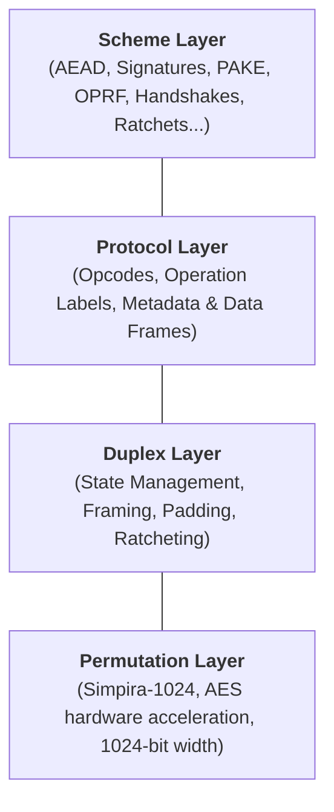
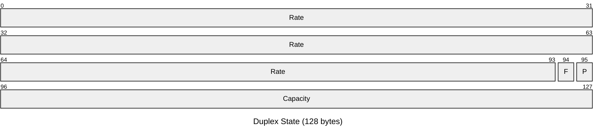
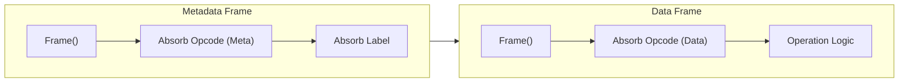
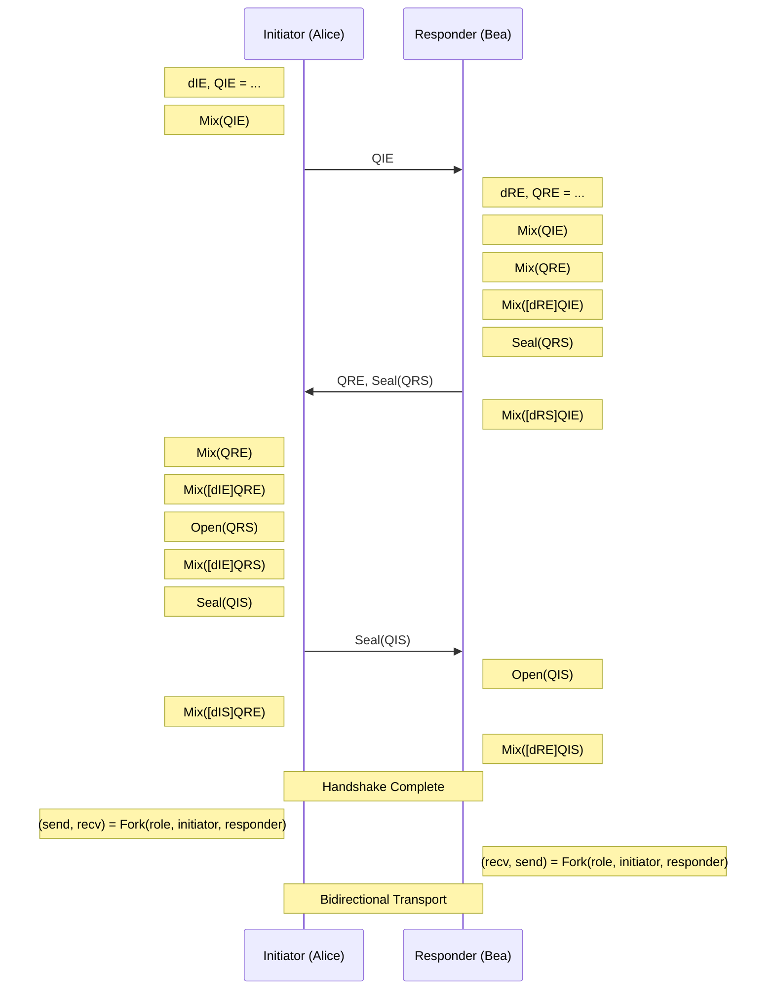

# The Newplex Framework

<!-- TOC -->
* [The Newplex Framework](#the-newplex-framework)
  * [Introduction](#introduction)
  * [Architecture at a Glance](#architecture-at-a-glance)
    * [Comparison with Related Frameworks](#comparison-with-related-frameworks)
    * [Design Goals](#design-goals)
    * [Security Assumptions](#security-assumptions)
      * [Safety in Implementation](#safety-in-implementation)
    * [Data Types and Conventions](#data-types-and-conventions)
        * [Data Types](#data-types)
        * [Integer Encoding](#integer-encoding)
        * [Conventions](#conventions)
  * [The Simpira-1024 Permutation](#the-simpira-1024-permutation)
    * [Security Claims](#security-claims)
    * [Cryptanalytic History](#cryptanalytic-history)
    * [Rationale](#rationale)
      * [Hardware Acceleration](#hardware-acceleration)
      * [Architectural Parity](#architectural-parity)
      * [Implementation Compactness](#implementation-compactness)
  * [The Duplex Construction](#the-duplex-construction)
    * [Parameters](#parameters)
    * [Framing](#framing)
    * [Constants](#constants)
    * [Variables And State Layout](#variables-and-state-layout)
      * [`state`](#state)
      * [`rateIdx`](#rateidx)
      * [`frameIdx`](#frameidx)
    * [Data Operations](#data-operations)
      * [`Absorb`](#absorb)
      * [`Squeeze`](#squeeze)
      * [`Encrypt`/`Decrypt`](#encryptdecrypt)
        * [IND-EAV (Indistinguishability against Eavesdropping)](#ind-eav-indistinguishability-against-eavesdropping)
        * [IND-CPA (Indistinguishability under Chosen Plaintext Attack)](#ind-cpa-indistinguishability-under-chosen-plaintext-attack)
        * [Plaintext Dependency](#plaintext-dependency)
    * [Control Operations](#control-operations)
      * [`Frame`](#frame)
      * [`Permute`](#permute)
    * [Worked Example: Domain Separation through Framing](#worked-example-domain-separation-through-framing)
      * [Sequence A: `Absorb(0xCA); Absorb(0xFE)`](#sequence-a-absorb0xca-absorb0xfe)
      * [Sequence B: `Absorb(0xCA); Frame(); Absorb(0xFE)`](#sequence-b-absorb0xca-frame-absorb0xfe)
    * [State Operations](#state-operations)
      * [`Ratchet`](#ratchet)
      * [`Clone`](#clone)
      * [`Clear`](#clear)
  * [The Protocol Framework](#the-protocol-framework)
    * [Operation Codes](#operation-codes)
    * [The Two-Frame Structure](#the-two-frame-structure)
    * [Operation Labels](#operation-labels)
    * [Transcript Security](#transcript-security)
    * [Operations](#operations)
      * [`Init`](#init)
      * [`Mix`](#mix)
      * [`Derive`](#derive)
        * [Random Oracle](#random-oracle)
        * [KDF Security](#kdf-security)
        * [KDF Chains](#kdf-chains)
      * [`Mask` / `Unmask`](#mask--unmask)
        * [Cryptographic Properties](#cryptographic-properties)
      * [`Seal`/`Open`](#sealopen)
        * [Cryptographic Properties](#cryptographic-properties-1)
      * [`Fork`](#fork)
      * [`Ratchet`](#ratchet-1)
  * [Basic Schemes](#basic-schemes)
    * [Message Digest](#message-digest)
      * [Cryptographic Properties](#cryptographic-properties-2)
      * [Security Analysis](#security-analysis)
    * [Message Authentication Code (MAC)](#message-authentication-code-mac)
      * [Cryptographic Properties](#cryptographic-properties-3)
      * [Security Analysis](#security-analysis-1)
    * [Stream Cipher](#stream-cipher)
      * [Cryptographic Properties](#cryptographic-properties-4)
      * [Security Analysis](#security-analysis-2)
    * [Authenticated Encryption with Associated Data (AEAD)](#authenticated-encryption-with-associated-data-aead)
      * [Cryptographic Properties](#cryptographic-properties-5)
      * [Security Analysis](#security-analysis-3)
    * [Deterministic Authenticated Encryption (SIV)](#deterministic-authenticated-encryption-siv)
      * [Cryptographic Properties](#cryptographic-properties-6)
      * [Security Analysis](#security-analysis-4)
    * [Streaming Authenticated Encryption](#streaming-authenticated-encryption)
      * [Cryptographic Properties](#cryptographic-properties-7)
      * [Security Analysis](#security-analysis-5)
    * [Memory-Hard Hash Function](#memory-hard-hash-function)
      * [Graph Routing Operations](#graph-routing-operations)
      * [Cryptographic Properties](#cryptographic-properties-8)
      * [Security Analysis](#security-analysis-6)
  * [Complex Schemes](#complex-schemes)
    * [Digital Signature](#digital-signature)
    * [Hybrid Public Key Encryption (HPKE)](#hybrid-public-key-encryption-hpke)
    * [Signcryption](#signcryption)
    * [Mutually Authenticated Handshake](#mutually-authenticated-handshake)
    * [Asynchronous Double Ratchet](#asynchronous-double-ratchet)
    * [Password-Authenticated Key Exchange (PAKE)](#password-authenticated-key-exchange-pake)
    * [Verifiable Random Function (VRF)](#verifiable-random-function-vrf)
    * [Oblivious Pseudorandom Function (OPRF) and Verifiable Pseudorandom Function (VOPRF)](#oblivious-pseudorandom-function-oprf-and-verifiable-pseudorandom-function-voprf)
    * [FROST Threshold Signature](#frost-threshold-signature)
  * [Security Analysis](#security-analysis-7)
    * [Assumptions](#assumptions)
    * [Duplex Security Bounds](#duplex-security-bounds)
    * [Protocol Framework Security](#protocol-framework-security)
    * [Reduction From Schemes To The Duplex](#reduction-from-schemes-to-the-duplex)
    * [Multi-User Security](#multi-user-security)
    * [Duplex Framing Injectivity](#duplex-framing-injectivity)
      * [Theorem](#theorem)
      * [Proof Strategy](#proof-strategy)
      * [Step 1: Unambiguous Block Delimitation](#step-1-unambiguous-block-delimitation)
      * [Step 2: Deterministic Metadata Extraction](#step-2-deterministic-metadata-extraction)
      * [Step 3: Recursive Frame Chain Resolution](#step-3-recursive-frame-chain-resolution)
      * [Step 4: Data Identification and Sequence Reconstruction](#step-4-data-identification-and-sequence-reconstruction)
      * [Step 5: Global Sequence Concatenation](#step-5-global-sequence-concatenation)
      * [Conclusion](#conclusion)
<!-- TOC -->

## Introduction

Newplex is a cryptographic framework that provides a unified interface for unkeyed and symmetric-key operations. It is
built on a duplex construction using the [Simpira-1024] permutation. Inspired by [STROBE], [Noise Protocol],
and [Xoodyak], Newplex is optimized for 64-bit architectures (x86-64 and ARM64) to provide 10+ Gb/second performance on
modern processors at a 128-bit security level.

Two design principles guide the framework. First, replacing separate hash functions, MACs, stream ciphers, and KDFs with
a single duplex construction simplifies the design and implementation of cryptographic schemes--from basic AEAD to
multi-party protocols like OPRFs and handshakes. Second, the security of every scheme reduces to the properties of the
underlying duplex (indifferentiability from a random oracle, pseudorandom function security, and collision resistance),
all bounded by the 256-bit capacity (`2**128` against generic attacks). A single security analysis of the duplex and
permutation layers covers the entire framework.

[Simpira-1024]: https://eprint.iacr.org/2016/122.pdf

[STROBE]: https://strobe.sourceforge.io

[Noise Protocol]: http://www.noiseprotocol.org

[Xoodyak]: https://keccak.team/xoodyak.html

## Architecture at a Glance

Newplex is structured as four layers, each building on the one below it.



1. **Permutation Layer ([Simpira-1024](#the-simpira-1024-permutation)):** A fixed-length, high-performance
   transformation of a 1024-bit state using hardware-accelerated AES instructions.
2. **Duplex Layer ([The Duplex Construction](#the-duplex-construction)):** Manages the 1024-bit state, partitioned into
   a 768-bit rate (752-bit effective rate) and a 256-bit capacity. Handles data absorption, pseudorandom squeezing, and
   internal framing.
3. **Protocol Layer ([The Protocol Framework](#the-protocol-framework)):** Wraps duplex operations in a strict grammar
   of opcodes and labels, ensuring unique transcript decodability and full context commitment (CMT-4).
4. **Scheme Layer ([Basic](#basic-schemes) & [Complex](#complex-schemes) Schemes):** Composes protocol operations into
   cryptographic tools, from hash functions and MACs to multi-party protocols like OPRFs and Double Ratchets.

### Comparison with Related Frameworks

The following table highlights the key architectural differences between Newplex and related frameworks:

| Feature            | Newplex            | STROBE             | Noise               | Xoodyak           |
|--------------------|--------------------|--------------------|---------------------|-------------------|
| **Permutation**    | Simpira-1024       | Keccak-f\[1600\]   | Mixed (e.g. ChaCha) | Xoodoo            |
| **State Width**    | 1024 bits          | 1600 bits          | 512+ bits           | 384 bits          |
| **Security Level** | 128-bit            | 128-bit            | 128-bit or 256-bit  | 128-bit           |
| **Primary Target** | 64-bit Performance | Embedded/Compact   | Network Handshakes  | Efficient Hashing |
| **Framing**        | STROBE-style Index | STROBE-style Index | Protocol-specific   | Cyclic Duplex     |
| **Key Property**   | Flexible/Universal | Flexible/Universal | Composable          | Lightweight       |

### Design Goals

Newplex is a high-performance, misuse-resistant cryptographic framework for modern systems. The primary design
philosophy is simplicity through unification. Replacing separate hash functions, MACs, stream ciphers, and KDFs with a
single duplex construction minimizes the complexity of both design and implementation. The result is a compact design
that is easier to audit, verify, and integrate into complex software stacks.

Security is enforced through a strict grammar of cryptographic intent, mandating domain separation at two levels. At
the protocol level, different applications (e.g., a file encryption tool vs. a network handshake) are domain-separated
by unique initialization strings. Individual operations within a protocol are bound to their semantic role,
distinguishing between key material, public metadata, and encrypted payloads. Absorbing this context into the duplex
state ensures full context commitment, preventing ambiguity attacks where valid data from one context is accepted in
another. The design also mandates constant-time execution for all secret-dependent operations and provides forward
secrecy via a ratchet mechanism, so that a compromise of the current state cannot expose past communications.

Newplex targets high performance on 64-bit architectures. By building on the Simpira-1024 permutation--which uses
AES hardware instructions (`AES-NI` on x86-64 and `FEAT_AES` on ARMv8)--the framework targets 10+ Gb/s throughput on
modern CPUs, making it suitable as a cryptographic layer for high-bandwidth network protocols.

### Security Assumptions

The security of Newplex rests on two assumptions. First, Simpira-1024 behaves as an ideal permutation with no
structural distinguishers below `2**128` complexity. Second, per the [flat sponge claim], a 256-bit capacity (`c=256`)
provides 128-bit generic security. In the unkeyed model (adversary has read access to the full state), the construction
is indifferentiable from a random oracle. In the keyed model (capacity is populated with secret entropy and hidden from
the adversary), the construction acts as a secure pseudorandom generator (PRG) or pseudorandom function (PRF). The
security model also assumes a constant-time implementation of Simpira-1024 to prevent side-channel leakage.

A full security analysis with concrete bounds, reduction arguments, and multi-user security follows in
[§Security Analysis](#security-analysis).

[flat sponge claim]: https://keccak.team/files/CSF-0.1.pdf

#### Safety in Implementation

Implementers **must** adhere to the following safety guidelines:

* **Constant-Time Execution:** All operations involving secret data (keys, plaintexts, internal state) must execute in
  constant time. Comparisons of authentication tags or session secrets **must** use constant-time comparison functions
  (e.g., `CT_EQ`), and the AES round implementation in Simpira-1024 **must** be constant time.
* **Memory Management:** Zero out buffers containing plaintexts, keys, and internal duplex state before deallocation.
* **In-Place Operations and Error Handling:** If an authentication check fails during in-place decryption (e.g.,
  `Open`), the provisional plaintext **must** be zeroed and never returned to the caller.
* **No Secret Logging:** Never log key material, plaintexts, or internal state. Debug logs should contain only public
  metadata. Safe debug representations can be obtained by cloning the protocol and performing a `Derive` on the clone.

### Data Types and Conventions

This section defines the data types, encoding rules, and notation used throughout the specification. Unless otherwise
noted, all operations act on arrays of 8-bit bytes.

##### Data Types

* **Bit**: A binary digit, having a value of either `0` or `1`.
* **Byte**: A sequence of eight bits.
* **Bytes**: A finite sequence of bytes, also referred to as a byte string. The length of a byte string `S` is denoted
  `|S|`.
* **String**: A sequence of UTF-8 encoded characters. In this specification, strings are treated as their underlying
  UTF-8 byte representation as normalized to NFC form.
* **Integer**: An element of the set of mathematical integers. Practically, these are constrained to 64-bit values, but
  the design can be extended.

##### Integer Encoding

* **Byte Order**: The default byte ordering for integers is little-endian. However, the system is primarily
  byte-oriented, processing input streams as opaque sequences.
* **LEB128**: Variable-length integers are encoded using the unsigned Little Endian Base 128 (LEB128) format. To ensure
  unique encoding (malleability resistance), implementations **must** use the canonically short encoding. This means
  that the last byte of the encoding must not be `0x00` (unless the integer is `0`, encoded as `0x00`), and the unused
  bits in the final byte must be `0`. For example, `1` **must** be coded as `[0x01]` and not `[0x81, 0x00]`.

> [!NOTE]
> LEB128 is only used to _encode_ values. It is never used to _decode_ data.

##### Conventions

The following notations are used throughout this document:

* Literal byte values are written in hexadecimal notation with a `0x` prefix (e.g., `0x1F`).
* `[ a, b, ..., n ]` denotes a string of bytes given in hexadecimal. For example `[0xCA, 0xFE]`.
* `[]` denotes an empty byte string.
* `|s|` denotes the length of a byte string `s`. For example, `|[0xFF, 0xFF]|` = `2`.
* `s[i]` denotes the `i`-th element of a byte string `s` with zero-based indexing.
* `s[n:m]` denotes the selection of bytes from `n` (inclusive) to `m` (exclusive) of a string `s`. The indexing of a
  byte string starts at `0`. For example, for `s` = `[0xA5, 0xC6, 0xD7]`, `s[0:1]` = `[0xA5]` and `s[1:3]` =
  `[0xC6, 0xD7]`. If the index `n` is elided (e.g., `s[:m]`), `n` is equal to `0`, the start of the byte string.
  If the index `m` is elided (e.g., `s[n:]`), `m` is equal to `|s|`.
* `X || Y` denotes the concatenation of two byte strings or two lists.
* `X * n` denotes the repetition of byte string `X`, `n` times. For example, `[0x00] * 3` is `[0x00, 0x00, 0x00]`.
* `X ^ Y` denotes the bitwise XOR of two equal-length byte strings.
* `for x in y` denotes the iteration through each element `x` in the sequence `y`.
* `for x in y..z` denotes the iteration through each integer `x` from `y` (inclusive) to `z` (exclusive).
* `while condition:` denotes a loop that continues as long as the condition is true.
* `if condition:` denotes a conditional block.
* `x = y` denotes `x` takes the value `y`.
* `a = b = c` denotes the simultaneous assignment of values from `c` to `a` and `b`.
* `x == y` denotes the comparison of `x` and `y`. `1 == 1` is true, `1 == 0` is false.
* `!x` denotes the logical negation of the boolean value `x`. `!(1 == 1)` is false, `!(1 == 0)` is true.
* `CT_EQ(x, y)` denotes the comparison of secret values `x` and `y` in constant time. Implementers **must** ensure no
  timing side-channels exist in this operation.
* `I2OSP` and `OSP2I` are used as defined in [RFC 8017](https://www.rfc-editor.org/rfc/rfc8017#section-4.1).
* `LEB128(x)` denotes the canonically short LEB128 encoding of integer `x` as a byte string.
* `"string"` denotes an NFC-normalized UTF-8 byte string with the characters `string`.
* `function Name(args):` defines a function or method.
* `return x` denotes the return of value `x` from a function.
* `// comment` denotes a comment that is ignored by the algorithm.

In the following, `x` and `y` are integers:

* `x + y` denotes addition.
* `x - y` denotes subtraction.
* `x * y` denotes multiplication.
* `x / y` denotes integer division.
* `x % y` denotes the remainder of integer division.
* `x += y` denotes `x` takes the value `x + y` (addition).
* `x ** y` denotes the exponentiation of `x` by `y`.
* `x | y` denotes the bitwise OR of `x` and `y`.
* `x ^ y` denotes the bitwise XOR of `x` and `y` (exclusive-OR).
* `x ^= y` denotes `x` takes the value `x ^ y` (exclusive-OR).

## The Simpira-1024 Permutation

The underlying permutation `f` used in Newplex is [Simpira-1024] (specifically Simpira v2 with `b=8`, where `b` is the
number of 128-bit sub-blocks). Simpira is a Generalized Feistel Structure (GFS) that operates on a block size of 1024
bits. The round function `F` consists of two full rounds of the Advanced Encryption Standard (AES) block cipher. The
permutation iterates this function over 18 rounds to achieve full diffusion and confusion.

### Security Claims

The design claims that there are no structural distinguishers for Simpira-1024 with a complexity below `2**128`. This
bound aligns with the generic security target of the Newplex framework.

### Cryptanalytic History

The security of Simpira has been analyzed since its introduction in 2016. While Simpira v1 was broken, Simpira v2
remains secure against full-round attacks. The following table summarizes known results against reduced-round variants
of the Simpira v2 family:

| Variant            | Width    | Full Rounds | Attack Type             | Rounds Broken | Reference                                                                                                    |
|--------------------|----------|-------------|-------------------------|---------------|--------------------------------------------------------------------------------------------------------------|
| **Simpira v1**     | Various  | Various     | Collision               | Full          | [Dobraunig et al. (2017)](https://doi.org/10.1007/978-3-319-69453-5_16)                                      |
| **Simpira v2 b=2** | 256-bit  | 15          | Collision               | 9             | [Ni et al. (2021)](https://doi.org/10.46586/tosc.v2021.i2.222-248)                                           |
| **Simpira v2 b=3** | 384-bit  | 21          | Boomerang               | 10            | [Tjuawinata et al. (2017)](https://doi.org/10.1007/978-3-319-60055-0_20)                                     |
| **Simpira v2 b=4** | 512-bit  | 15          | Collision               | 11            | [Ni et al. (2021)](https://doi.org/10.46586/tosc.v2021.i2.222-248)                                           |
| **Simpira v2 b=6** | 768-bit  | 15          | Impossible Differential | 9             | [Liu et al. (2022)](https://journal_xdxb.xidian.edu.cn/zh/article/doi/10.19665/j.issn1001-2400.2022.05.023/) |
| **Simpira v2 b=8** | 1024-bit | 18          | None                    | N/A           |                                                                                                              |

> [!WARNING]
> Simpira-1024 (`b=8`) has received significantly less cryptanalytic scrutiny than Keccak. Every smaller Simpira v2
> variant that has been studied has yielded reduced-round attacks (9–11 rounds broken out of 15–21), but no published
> cryptanalysis exists for `b=8`. The 18-round count provides a margin over the best reduced-round results on smaller
> variants (the best known attack reaches 11 of 15 rounds for `b=4`, giving an approximate 64% margin), but the absence
> of attacks on `b=8` reflects a lack of study rather than a proof of strength. Users requiring the highest level of
> cryptanalytic confidence should consider instantiating the framework with `Keccak-f[1600]` or `Keccak-p[1600,12]`.

### Rationale

Simpira-1024 is selected for performance and architectural consistency.

#### Hardware Acceleration

The permutation uses hardware AES instructions (`AES-NI` on x86-64 and `FEAT_AES` on ARMv8), which are available on
modern server, consumer, and mobile processors, providing high throughput and constant-time execution without
bit-slicing.

#### Architectural Parity

Simpira-1024 provides consistent performance across major architectures. While `Keccak-p[1600,12]` is efficient on
ARMv8 with `FEAT_SHA3`, it is less than half the speed of Simpira on x86-64 platforms lacking SHA-3 acceleration.
Simpira provides a high baseline speed on both platforms.

#### Implementation Compactness

Using standard AES intrinsics yields compact implementations compared to software-only permutations. A C implementation
using Intel intrinsics is about 30 lines; an optimized AMD64 assembly version is about 250 lines.

As noted, the design is modular and can be instantiated with `Keccak-f[1600]` or `Keccak-p[1600,12]` if additional
cryptanalytic margin or embedded device performance is preferred.

## The Duplex Construction

The duplex construction is the core primitive of Newplex. Introduced by Bertoni et al., the duplex is a stateful object
derived from the sponge construction. While a standard sponge absorbs a complete message before producing output, a
duplex allows interleaved absorption and squeezing. Every output is cryptographically bound to the entire history of
preceding operations.

A duplex requires three parameters: the permutation `f`, the capacity `c`, and a padding rule `pad`. These determine
the width `b` (the permutation width) and the rate `r = b - c`.

The construction maintains a `b`-bit state buffer, partitioned into the rate (first `r` bits) and capacity (remaining
`c` bits), initialized to all zeros. Input is XORed into the rate; if it exceeds the rate, it is processed in `r`-bit
blocks, each followed by a permutation of the full state. Output is read from the rate; if more than `r` bits are
needed, the permutation refreshes the rate before reading the next segment. The capacity is never directly modified by
user input or exposed in output; it is the entropy reservoir that ensures security.

Every input sequence must be uniquely identifiable and properly terminated. A formal padding rule ensures that messages
of different lengths do not produce the same internal state. Newplex extends this standard model with specialized
framing within the rate to enforce domain separation between protocol operations.

[duplex]: https://eprint.iacr.org/2011/499.pdf

### Parameters

The Newplex duplex is instantiated with the following parameters:

| Parameter   | Notation | Value                          |
|-------------|----------|--------------------------------|
| Permutation | `f`      | Simpira-1024                   |
| State Width | `b`      | 1024 bits                      |
| Capacity    | `c`      | 256 bits                       |
| Rate        | `r`      | 768 bits                       |
| Padding     | `pad`    | multi-rate padding (`pad10*1`) |

A 256-bit capacity provides 128-bit collision resistance (`2**(c/2)`), 128-bit output indistinguishability
(`2**(c/2)`), and 256-bit state recovery resistance (`2**c`).

These bounds are fundamental. Even if a higher-level component requests an output length `n` where `2**n > 2**c`, the
capacity caps effective security: preimage and state recovery resistance cannot exceed 256 bits, and collision and
distinguishing resistance cannot exceed 128 bits.

Newplex uses the `pad10*1` multi-rate padding rule for every block, ensuring that every sequence of inputs produces a
unique sequence of permutation inputs and preventing length-extension and collision attacks.

In bit-level terms, `pad10*1` appends a `1` bit, followed by as many `0` bits as necessary, and a final `1` bit at the
end of the rate. In the byte-oriented implementation of Newplex (assuming little-endian bit ordering within bytes):

1. The first `1` bit corresponds to the least significant bit of a byte, represented by the value `0x01`.
2. The final `1` bit corresponds to the most significant bit of the last byte of the rate (index 95), represented by the
   value `0x80`.

This ensures every input is uniquely decodable and every block boundary is cryptographically distinct. Because every
block is framed and padded, the padding consumes at least one bit and up to one full rate block.

### Framing

In a standard duplex, operations are concatenative: `Absorb(0x01)` followed by `Absorb(0x02)` produces the same state
as `Absorb(0x0102)`. This is acceptable for simple hashing but insufficient for protocols where operation boundaries
(e.g., between a public key and a nonce) must be cryptographically significant.

Many designs enforce boundaries by triggering a full permutation between every operation, but for wide-block
permutations like Simpira-1024 this is inefficient--many metadata elements are much smaller than the 96-byte rate.
Length-prefixing is an alternative but requires knowing the data length before an operation begins, which is
incompatible with streaming.

Newplex uses a STROBE-style framing mechanism for domain separation. It records the byte index marking the beginning of
a "frame" (a group of related duplex operations) and absorbs this index into the state. This provides:

* **Operational Boundaries:** Distinguishes between different sequences of duplex operations within a single permutation
  block and across block boundaries.
* **Streamability:** Framing is handled as data is processed, requiring no prior knowledge of the total data length.
* **Space Efficiency:** Only two bytes at the end of the rate are held in reserve from user operations: byte `95` always
  receives the final `0x80` padding bit, and byte `94` serves as the fallback position for the frame
  index when the rate is completely full.

By treating session semantics--the sequence and size of every operation--as data bound to the state, Newplex combines
metadata and raw data in a single process without risking concatenation attacks.

### Constants

Newplex is built on a 1024-bit permutation (`b=1024`) with a 256-bit capacity (`c=256`), leaving a rate of 768 bits (96
bytes). The final two bytes of the rate are not accessible to user operations (`Absorb`, `Squeeze`, `Encrypt`,
`Decrypt`), giving an effective user data rate of 94 bytes. This ensures every permutation block is cryptographically
delimited and padded without reducing security below 128 bits.

The following constants are defined:

| Constant       | Value | Description                                                                                                |
|----------------|-------|------------------------------------------------------------------------------------------------------------|
| MAX_RATE_IDX   | 94    | The upper bound of the effective rate and the fallback position for the frame index when the rate is full. |
| PAD_BYTE_IDX   | 95    | The byte index reserved for the final padding bit (`0x80`).                                                |
| CAPACITY_BYTES | 32    | The size of the capacity in bytes (`c/8`).                                                                 |

### Variables And State Layout

The construction maintains the following variables:

#### `state`

The internal state is a buffer of 128 bytes (`b=1024` bits), initialized to all zeros. It is logically divided into
three segments:



1. **Effective Rate:** The first 94 bytes (indices `0..93`). This area is used for user input and output.
2. **Reserved Metadata:** The 95th byte (index `94`) is the fallback position for the frame index when the rate is full;
   the 96th byte (index `95`) always receives the final padding bit.
3. **Capacity:** The final 32 bytes (indices `96..127`). This segment is never directly modified by user input or
   exposed in the output.

#### `rateIdx`

A byte-index tracking the current position within the rate (`0 <= rateIdx < 94`). It is initialized to `0`. This index
increments as data is absorbed or squeezed.

#### `frameIdx`

A byte-index tracking where the current frame began (`0 <= frameIdx < 94`). It is initialized to `0`. When a new frame
is opened, the current `rateIdx` is recorded here, ensuring the boundary is preserved even if the frame spans multiple
permutation blocks.

### Data Operations

These operations handle the flow of data into and out of the duplex state. Because the effective rate is 94 bytes, they
automatically trigger `Permute` when the rate boundary is reached, allowing data streams of arbitrary length.

#### `Absorb`

The `Absorb` operation injects data into the duplex state by XORing it byte-by-byte. If the input exceeds the available
space in the current block, the permutation is triggered to provide a fresh rate. The internal state becomes a
cryptographic digest of the entire input history.

```text
function Absorb(input):
  for b in input:
    state[rateIdx] ^= b
    rateIdx += 1
    if rateIdx == MAX_RATE_IDX:
      Permute()
```

#### `Squeeze`

`Squeeze` extracts pseudorandom bytes from the rate, used to generate keystreams, authentication tags, or derived keys.
If the permutation is indistinguishable from a random permutation, the output is indistinguishable from a random
bitstring, provided the capacity remains uncompromised.

```text
function Squeeze(n):
  output = []
  for _ in 0..n:
    output = output || state[rateIdx]
    state[rateIdx] = 0x00
    rateIdx += 1
    if rateIdx == MAX_RATE_IDX:
      Permute()
  return output
```

> [!NOTE]
> The used portion of the duplex's rate is overwritten with zeros to provide forward secrecy.

#### `Encrypt`/`Decrypt`

These operations implement the [DuplexWrap] technique, combining absorption and squeezing in a single pass.

[DuplexWrap]: https://competitions.cr.yp.to/round1/keyakv1.pdf

* `Encrypt` XORs the plaintext with the current rate to produce ciphertext. The ciphertext becomes the new rate state,
  absorbing the plaintext's influence into the transcript.
* `Decrypt` XORs the ciphertext with the current rate to recover the plaintext. The ciphertext (not the recovered
  plaintext) updates the state, so encrypter and decrypter maintain synchronized states when the plaintext is identical.

This technique provides IND-EAV security and can achieve IND-CPA security if the state is probabilistic (e.g., by
absorbing a unique nonce before encryption).

```text
function Encrypt(plaintext):
  ciphertext = []
  for p in plaintext:
    c = p ^ state[rateIdx]
    state[rateIdx] = c
    ciphertext = ciphertext || c
    rateIdx += 1
    if rateIdx == MAX_RATE_IDX:
      Permute()
  return ciphertext

function Decrypt(ciphertext):
  plaintext = []
  for c in ciphertext:
    p = c ^ state[rateIdx]
    state[rateIdx] = c
    plaintext = plaintext || p
    rateIdx += 1
    if rateIdx == MAX_RATE_IDX:
      Permute()
  return plaintext
```

##### IND-EAV (Indistinguishability against Eavesdropping)

DuplexWrap provides IND-EAV security by default. The plaintext is XORed with the current rate (a pseudorandom
keystream), so a passive adversary cannot distinguish between ciphertexts of two equal-length messages without access to
the duplex state. This holds as long as the capacity prevents state recovery and the permutation is indistinguishable
from a random permutation.

##### IND-CPA (Indistinguishability under Chosen Plaintext Attack)

To protect against adversaries with encryption oracle access (chosen plaintext attacks), the duplex state must be
probabilistic: a random IV or message counter must be absorbed before encryption. Without this, an adversary can recover
the keystream by encrypting an all-zero plaintext, and keystream reuse lets passive adversaries recover the XOR of any
two plaintexts by XORing their ciphertexts.

##### Plaintext Dependency

A key property of DuplexWrap is that the plaintext is absorbed into the duplex's state. If any ciphertext byte is
modified in transit, the receiver's state diverges from the sender's, so any later `Squeeze` produces a different
output, enabling detection of unauthorized modifications.

### Control Operations

Control operations manage the structural integrity of the duplex session. They enforce protocol semantics, ensuring that
the state is cryptographically bound to the sequence of operations.

#### `Frame`

`Frame` provides domain separation by grouping related duplex operations into a logical unit. It absorbs the `frameIdx`
(start of the previous frame) into the state, then sets `frameIdx` to the current `rateIdx` (start of the new frame).
Even if two different operation sequences involve the same raw data, the internal states diverge based on framing.

```text
function Frame():
  Absorb(I2OSP(frameIdx, 1)) // 0 <= frameIdx <= MAX_RATE_IDX, always a single byte
  frameIdx = rateIdx
```

#### `Permute`

`Permute` finalizes a block by absorbing the framing metadata at the current rate position, absorbing the final padding
bit at `PAD_BYTE_IDX`, and then transforming the state with the permutation `f`.

It operates in three phases: (1) XOR the current `frameIdx` into the next rate byte (which may be `FRAME_BYTE_IDX` if
the rate is full); (2) apply `pad10*1` padding; (3) run Simpira-1024 on the full state and reset `rateIdx` and
`frameIdx` to zero.

```text
function Permute():
  state[rateIdx] ^= frameIdx  // Absorb framing metadata
  rateIdx += 1
  state[rateIdx] ^= 0x01      // First bit of pad10*1
  state[PAD_BYTE_IDX] ^= 0x80 // Last bit of pad10*1 (same byte when rateIdx == PAD_BYTE_IDX)
  Simpira1024(state)          // Permute state and reset indexes
  rateIdx = frameIdx = 0
```

> [!NOTE]
> While the `pad10*1` scheme is defined in bits, in the context of Newplex's 96-byte rate, it is implemented as follows:
>
> * The first bit of padding (the `1`) is the least-significant bit of the byte at `state[rateIdx]`.
> * The last bit of padding (the final `1`) is the most-significant bit of the byte at `state[95]`.
> * In practice, this means XORing `0x01` at the current position and `0x80` at the end of the rate.
> * If the current position _is_ the end of the rate (i.e. `rateIdx=95` after framing), this means XORing the padding
> byte with `0x81`.

### Worked Example: Domain Separation through Framing

To illustrate how framing prevents concatenation attacks, consider a "Tiny-Newplex" with an effective rate of four bytes
(indices `0..3`) and two reserved bytes (index `4` as the fallback frame position, index `5` for padding).

Compare two operation sequences: `Absorb(0xCA); Absorb(0xFE)` and `Absorb(0xCA); Frame(); Absorb(0xFE)`.

#### Sequence A: `Absorb(0xCA); Absorb(0xFE)`

Both `Absorb` operations occur within a single frame (a single semantic unit, e.g., a two-byte message).

|                | `S[0]` | `S[1]` | `S[2]` | `S[3]` | `S[4]` | `S[5]` | `rateIdx` | `frameIdx` |
|----------------|--------|--------|--------|--------|--------|--------|-----------|------------|
| initial state  | `0x00` | `0x00` | `0x00` | `0x00` | `0x00` | `0x00` | `0`       | `0`        |
| `Absorb(0xCA)` | `0xCA` | `0x00` | `0x00` | `0x00` | `0x00` | `0x00` | `1`       | `0`        |
| `Absorb(0xFE)` | `0xCA` | `0xFE` | `0x00` | `0x00` | `0x00` | `0x00` | `2`       | `0`        |
| framed state   | `0xCA` | `0xFE` | `0x00` | `0x00` | `0x00` | `0x00` |           |            |
| padded state   | `0xCA` | `0xFE` | `0x00` | `0x01` | `0x00` | `0x80` |           |            |

The final input to the permutation is `[0xCA, 0xFE, 0x00, 0x01, 0x00, 0x80]`.

#### Sequence B: `Absorb(0xCA); Frame(); Absorb(0xFE)`

`Frame()` is called between the `Absorb` operations, signaling different logical units (e.g., a key byte and a value
byte).

|                | `S[0]` | `S[1]` | `S[2]` | `S[3]` | `S[4]` | `S[5]` | `rateIdx` | `frameIdx` |
|----------------|--------|--------|--------|--------|--------|--------|-----------|------------|
| initial state  | `0x00` | `0x00` | `0x00` | `0x00` | `0x00` | `0x00` | `0`       | `0`        |
| `Absorb(0xCA)` | `0xCA` | `0x00` | `0x00` | `0x00` | `0x00` | `0x00` | `1`       | `0`        |
| `Frame()`      | `0xCA` | `0x00` | `0x00` | `0x00` | `0x00` | `0x00` | `2`       | `2`        |
| `Absorb(0xFE)` | `0xCA` | `0x00` | `0xFE` | `0x00` | `0x00` | `0x00` | `3`       | `2`        |
| framed state   | `0xCA` | `0x00` | `0xFE` | `0x02` | `0x00` | `0x00` |           |            |
| padded state   | `0xCA` | `0x00` | `0xFE` | `0x02` | `0x01` | `0x80` |           |            |

The final input to the permutation is `[0xCA, 0x00, 0xFE, 0x02, 0x01, 0x80]`.

Both sequences process the same bytes (`[0xCA, 0xFE]`), but the permutation inputs differ. In Sequence A, the data
occupies contiguous indices and the frame metadata is zero. In Sequence B, `Frame` absorbed the previous `frameIdx` and
shifted the absorption position of `0xFE`. The duplex state captures not just the data but also its framing structure.

### State Operations

State operations manage the lifecycle of the duplex object, enabling forward secrecy and supporting protocol flows that
require state persistence or branching.

#### `Ratchet`

`Ratchet` provides forward secrecy by irreversibly modifying the duplex state. After a state compromise, an adversary
cannot recover past inputs or outputs by inverting the permutation.

`Ratchet` invokes `Permute`, then zeros the first 32 bytes of the rate and advances `rateIdx` past them. The 32-byte
size matches the 256-bit capacity: an attacker with the post-ratchet state must guess the 256 zeroed rate bits to invert
the permutation, requiring `2**256` work.

```text
function Ratchet():
  if rateIdx > 0: // Do not permute if the rate has not been touched.
    Permute()
  for i in 0..CAPACITY_BYTES:
    state[i] = 0x00
  rateIdx = CAPACITY_BYTES
```

The conditional `Permute` is an optimization: if `rateIdx == 0`, the state has already been permuted (either at
initialization or by a preceding operation that filled the rate). In this case, the state is already fully mixed and a
redundant permutation is unnecessary. The subsequent zeroing of 32 rate bytes is the irreversible step--it erases
information regardless of whether `Permute` was called, because the capacity already contains entropy from prior
operations.

Ratcheting the duplex reduces its available rate by 32 bytes for the next block of data.

#### `Clone`

`Clone` creates an independent copy of the current duplex session, including the full 128-byte `state`, `rateIdx`, and
`frameIdx`.

#### `Clear`

`Clear` overwrites the duplex state, rate index, and frame index with zeros.

## The Protocol Framework

The Protocol Framework sits atop the duplex engine, providing a high-level interface for building cryptographic schemes.
The duplex ensures data is processed securely; the Protocol Framework ensures it is processed unambiguously.

Every action--absorbing a public key, deriving a session secret, encrypting a payload--is explicitly tagged with its
semantic purpose.

### Operation Codes

Newplex defines seven operations: `Init`, `Mix`, `Derive`, `Mask`/`Unmask`, `Seal`/`Open`, `Fork`, and `Ratchet`. Each
has a unique base operation code (opcode).

| Operation       | Code                 | Description                                                           |
|-----------------|----------------------|-----------------------------------------------------------------------|
| `Init`          | `OP_INIT=0x01`       | Initializes the session with a protocol domain string.                |
| `Mix`           | `OP_MIX=0x02`        | Absorbs data (e.g., keys, nonces, AD, public keys).                   |
| `Derive`        | `OP_DERIVE=0x03`     | Squeezes data to produce pseudorandom output.                         |
| `Mask`/`Unmask` | `OP_CRYPT=0x04`      | Stream encryption/decryption without authentication.                  |
| `Seal`/`Open`   | `OP_AUTH_CRYPT=0x05` | Authenticated encryption/decryption.                                  |
| `Fork`          | `OP_FORK=0x06`       | Branches the current protocol into two independent protocols.         |
| `Ratchet`       | `OP_RATCHET=0x07`    | Irreversibly modify the protocol's state to prevent rollback attacks. |

### The Two-Frame Structure

Every operation uses two phases: a metadata frame and a data frame. The duplex `Frame` provides low-level delimitation;
the protocol framework uses these phases to distinguish cryptographic intent (metadata) from the primary payload (data).

In the metadata frame, the protocol absorbs the base opcode (high bit cleared) and a domain separation label. In the
data frame, it absorbs the modified opcode (high bit set) before executing the operation's primary logic.



| Frame Type | Flag          | Description                        |
|------------|---------------|------------------------------------|
| Metadata   | `F_META=0x00` | Absorbs the operation label.       |
| Data       | `F_DATA=0x80` | Performs operation-specific logic. |

### Operation Labels

Every operation requires an operation label which is cryptographically folded into the state, enforcing domain
separation. Labels should describe the specific purpose of the data (e.g., `"p256-public-key"`, `"session-nonce"`,
`"json-payload"`). Avoid generic labels like `"data"`, `"first"`, or `"1"`--they provide no semantic context and
increase the risk of domain confusion. Internally, labels are NFC-normalized UTF-8 byte strings.

### Transcript Security

Because Newplex binds the protocol domain string, the sequence of operations, their types, and their labels into the
duplex state, the transcript is uniquely decodable.

An adversary cannot reinterpret a `Mix` as a `Seal`, nor swap the contents of operations with different labels. Any
deviation causes the participants' internal states to diverge, so a final authentication check will fail.

This provides full context commitment (CMT-4). Unlike traditional AEAD constructions where a ciphertext commits only to
the key and nonce, a Newplex `Seal` commits to the entire session transcript. A ciphertext-tag pair is cryptographically
inseparable from the specific protocol instance and operation sequence that produced it.

### Operations

#### `Init`

`Init` is the required first operation. It takes a protocol domain string as its sole input and uses the standard
two-frame structure:

```text
function Init(domain):
  duplex.Frame()
  duplex.Absorb([OP_INIT | F_META])
  duplex.Absorb(domain)
  duplex.Frame()
  duplex.Absorb([OP_INIT | F_DATA])
```

Unlike other operations, it does not modify the duplex state in the data frame.

The BLAKE3 recommendations for KDF context strings apply equally to Newplex protocol domains:

> The context string should be hardcoded, globally unique, and application-specific. … The context string should not
> contain variable data, like salts, IDs, or the current time. (If needed, those can be part of the key material, or
> mixed with the derived key afterwards.) … The purpose of this requirement is to ensure that there is no way for an
> attacker in any scenario to cause two different applications or components to inadvertently use the same context
> string. The safest way to guarantee this is to prevent the context string from including input of any kind.

#### `Mix`

`Mix` accepts an operation label and an arbitrary byte sequence, making the protocol's state dependent on both. It works
for both secret and public data. During its data frame, it absorbs the input.

```text
function Mix(label, input):
  duplex.Frame()
  duplex.Absorb([OP_MIX | F_META])
  duplex.Absorb(label)
  duplex.Frame()
  duplex.Absorb([OP_MIX | F_DATA])
  duplex.Absorb(input)
```

Because the input is delimited within a duplex frame, its length does not need to be known in advance, making `Mix`
suitable for streaming data.

#### `Derive`

`Derive` extracts `n` pseudorandom bytes from the current protocol state, cryptographically dependent on the entire
preceding transcript, the operation label, and the requested output length.

```text
function Derive(label, n):
  duplex.Frame()
  duplex.Absorb([OP_DERIVE | F_META])
  duplex.Absorb(label)
  duplex.Frame()
  duplex.Absorb([OP_DERIVE | F_DATA])
  duplex.Absorb(LEB128(n))
  duplex.Permute()
  return duplex.Squeeze(n)
```

`Derive` absorbs the opcode and label in the metadata frame. In the data frame, it absorbs the output length (LEB128
encoded) and permutes the state, ensuring pseudorandomness and dependence on the output length, then squeezes `n` bytes.

##### Random Oracle

Assuming Simpira-1024 is indistinguishable from a random permutation (PRP), [the duplex is indistinguishable from a
random oracle][duplex security] up to the capacity bound. Including the output length before permuting and squeezing
allows `Derive` to serve as a random oracle.

[duplex security]: https://eprint.iacr.org/2022/1340.pdf

##### KDF Security

A sequence of `Mix` operations followed by an output operation (`Derive`, `Mask`, `Seal`, etc.) is equivalent to
absorbing a recoverably-encoded string into a duplex and squeezing a prefix-free output. This maps to [Backendal et
al.'s RO-KDF construction][n-KDFs], making a Newplex protocol a KDF-secure XOF-n-KDF.

[n-KDFs]: https://eprint.iacr.org/2025/657.pdf

##### KDF Chains

Because `Derive` is KDF-secure and replaces the protocol's state with permutation outputs, sequences of input/output
operations form a [KDF chain] when terminated with `Ratchet`. This gives Newplex protocols the following properties:

[KDF chain]: https://signal.org/docs/specifications/doubleratchet/doubleratchet.pdf

* **Resilience**: A protocol's outputs will appear random to an adversary as long as one of the inputs is secret, even
  if the other inputs to the protocol are adversary-controlled.
* **Forward Security**: A protocol's previous outputs will appear random to an adversary even if the protocol's state is
  disclosed at some point.
* **Break-in Recovery**: A protocol's future outputs will appear random to an adversary in possession of the protocol's
  state as long as one of the future inputs to the protocol is secret.

#### `Mask` / `Unmask`

`Mask` encrypts a plaintext using the current protocol state and operation label; `Unmask` reverses the process. Both
leave the protocol state dependent on the plaintext.

```text
function Mask(label, plaintext):
  duplex.Frame()
  duplex.Absorb([OP_CRYPT | F_META])
  duplex.Absorb(label)
  duplex.Frame()
  duplex.Absorb([OP_CRYPT | F_DATA])
  duplex.Permute()
  return duplex.Encrypt(plaintext)

function Unmask(label, ciphertext):
  duplex.Frame()
  duplex.Absorb([OP_CRYPT | F_META])
  duplex.Absorb(label)
  duplex.Frame()
  duplex.Absorb([OP_CRYPT | F_DATA])
  duplex.Permute()
  return duplex.Decrypt(ciphertext)
```

`Mask` absorbs the opcode and label in the metadata frame. In the data frame, it permutes the state, then calls
[`Encrypt`](#encryptdecrypt) to XOR the plaintext with the state, producing ciphertext and updating the state.
`Unmask` is identical but calls [`Decrypt`](#encryptdecrypt).

Unlike `Derive` and `Seal`, `Mask` does not require the plaintext length in advance and is suitable for streaming.

##### Cryptographic Properties

> [!WARNING]
> **`Mask` does not protect the authenticity of the ciphertext.**
> **If IND-CCA security is required, use [`Seal`](#sealopen).**
> An adversary can trivially flip bits and `Unmask` will return an inauthentic plaintext without an error. The resulting
> protocol state will diverge, however, which allows for schemes that use `Unmask` to decrypt unvalidated plaintexts but
> are followed with e.g., a [`Derive`](#derive) call to produce an authentication tag
> (see [the SIV DAE scheme](#deterministic-authenticated-encryption-siv) for an example).
>
> To ensure integrity in streaming contexts, `Mask` must be followed by an operation that authenticates the entire
> transcript (e.g., `Derive` or `Seal`).

`Mask` inherits the security properties of [`Encrypt`](#encryptdecrypt), which reduce to the duplex's PRF security
(advantage bounded by `N**2 / 2**256` for `N` queries to the underlying permutation):

* It offers IND-EAV security if the duplex state is secret.
* It offers IND-CPA security if the duplex state is probabilistic (e.g., includes a nonce).
* The resulting protocol state is dependent on the plaintext given to or returned by the operation.

#### `Seal`/`Open`

`Seal` and `Open` extend `Mask` and `Unmask` with a 16-byte authentication tag. `Open` verifies the tag, returning an
error if invalid.

```text
function Seal(label, plaintext):
  duplex.Frame()
  duplex.Absorb([OP_AUTH_CRYPT | F_META])
  duplex.Absorb(label)
  duplex.Frame()
  duplex.Absorb([OP_AUTH_CRYPT | F_DATA])
  duplex.Absorb(LEB128(|plaintext|))
  duplex.Permute()
  ciphertext = duplex.Encrypt(plaintext)
  duplex.Permute()
  tag = duplex.Squeeze(16)
  return ciphertext || tag

function Open(label, input):
  if |input| < 16:
    return ErrInvalidCiphertext
  ciphertext, receivedTag = input[:|input|-16], input[|input|-16:]
  duplex.Frame()
  duplex.Absorb([OP_AUTH_CRYPT | F_META])
  duplex.Absorb(label)
  duplex.Frame()
  duplex.Absorb([OP_AUTH_CRYPT | F_DATA])
  duplex.Absorb(LEB128(|ciphertext|))
  duplex.Permute()
  plaintext = duplex.Decrypt(ciphertext)
  duplex.Permute()
  expectedTag = duplex.Squeeze(16)
  if !CT_EQ(expectedTag, receivedTag): // CONST: do not leak information about expectedTag
    return ErrInvalidCiphertext
  return plaintext
```

`Seal` absorbs the opcode and label in the metadata frame. In the data frame, it absorbs the plaintext length (LEB128
encoded) and permutes the state. It then encrypts the plaintext, permutes again to enforce plaintext dependency, and
squeezes a 16-byte tag.

`Open` is identical but decrypts and compares the received tag to the expected tag using constant-time comparison.

Because `Seal` depends on the plaintext length, it is unsuitable for streaming. See
[streaming authenticated encryption](#streaming-authenticated-encryption) for a streaming alternative.

##### Cryptographic Properties

* `Seal` and `Open` provide IND-CCA2 security (confidentiality and integrity), given a probabilistic protocol state
  (e.g., includes a nonce). This reduces to the duplex's PRF security: the keystream is indistinguishable from random
  (IND-CPA), and the 16-byte tag provides INT-CTXT with forgery probability bounded by `2**(-128) + N**2 / 2**256`
  for `N` queries to the underlying permutation.
* The tag is derived from the duplex state after all preceding operations, so `Seal` commits to the entire session
  context (CMT-4). A ciphertext-tag pair cannot be validly decrypted under a different key, nonce, associated data, or
  protocol state, preventing partitioning oracle and context-confusion attacks.
* The 128-bit tag is resilient against multi-attempt online forgery. In protocols that reuse a single static key for
  many operations, an attacker making `2**q` verification attempts has forgery probability `2**q / 2**128`—still
  negligible for practical query volumes (e.g., `2**40` attempts yield `2**(-88)`). However, Newplex protocols use
  stateful session encryption: each `Seal` operation advances the duplex state via `Ratchet` or continued absorption,
  so every block is effectively authenticated under a distinct derived key. A multi-attempt online forgery requires the
  attacker to guess the correct tag for a *specific* stream position with a *specific* evolved state, and a failed
  attempt does not help with subsequent positions. The per-operation forgery probability therefore remains `2**(-128)`
  regardless of the total number of operations in a session.

#### `Fork`

`Fork` accepts a label and branch values, returning up to 255 independent cloned child protocols that have each absorbed
a branch-specific ID and their respective branch value. It additionally updates the root protocol with a root-specific
update, ensuring later operations are distinct.

```text
function Fork(label, ...values):
  // Create up to 255 branches.
  branches = []
  id = 1
  for value in values:
    branch = duplex.Clone()
    branch.Frame()
    branch.Absorb([OP_FORK | F_META])
    branch.Absorb(label)
    branch.Frame()
    branch.Absorb([OP_FORK | F_DATA])
    branch.Absorb(I2OSP(id, 1))
    branch.Absorb(value)
    branches = branches || [branch]
  
  protocol.Frame()
  protocol.Absorb([OP_FORK | F_META])
  protocol.Absorb(label)
  protocol.Frame()
  protocol.Absorb([OP_FORK | F_DATA])
  protocol.Absorb([0x00])
    
  return branches
```

Divergent branches are useful
for [bidirectional communication](#mutually-authenticated-handshake), [Fiat-Shamir transforms](#digital-signature), and
non-linear data flows (e.g., [SIV](#deterministic-authenticated-encryption-siv)).

> [!NOTE]
> Because each branch absorbs a distinct value after cloning, the resulting duplex transcripts diverge. By the duplex's
> PRF security, the branches are computationally independent: no adversary making fewer than `2**128` queries can
> correlate the outputs of one branch with those of another. This property is used in the SIV and signature schemes,
> where `Fork` provides the functional equivalent of deriving independent subkeys.

#### `Ratchet`

`Ratchet` accepts an operation label and irreversibly modifies the protocol's state, preventing rollback attacks and
establishing forward secrecy.

```text
function Ratchet(label):
  duplex.Frame()
  duplex.Absorb([OP_RATCHET | F_META])
  duplex.Absorb(label)
  duplex.Frame()
  duplex.Absorb([OP_RATCHET | F_DATA])
  duplex.Ratchet()
```

> [!NOTE]
> Ratcheting a protocol reduces its available rate by 32 bytes for the next block of data.

As in the duplex [`Ratchet`](#ratchet), this permutes the state, clears the first 32 bytes of the rate, and advances the
rate index by 32.

## Basic Schemes

The [protocol operations](#the-protocol-framework) provide a complete symmetric cryptography toolkit, replacing
standalone hash functions, MACs, stream ciphers, and AEADs.

The schemes in this section combine Newplex operations to construct standard cryptographic primitives. They are
self-contained, requiring no algorithms beyond the Newplex framework.

Each security analysis identifies the relevant duplex model (unkeyed or keyed), maps the scheme's operations to duplex
properties (random oracle indifferentiability, PRF security, or collision resistance), and derives concrete bounds from
the 256-bit capacity. Every basic scheme's security reduces to the duplex construction, with no additional assumptions
beyond the ideal-permutation model for Simpira-1024.

### Message Digest

A message digest maps an arbitrary-length input to a deterministic, fixed-length pseudorandom output. Initializing a
protocol, mixing in the message, and deriving output yields a secure hash function.

```text
function MessageDigest(message):
  protocol.Init("com.example.md")        // Initialize a protocol with a domain string.
  protocol.Mix("message", message)       // Mix the message into the protocol.
  digest = protocol.Derive("digest", 32) // Derive 32 bytes of output and return it.
  return digest

```

#### Cryptographic Properties

Hash function security is evaluated against three games:

* **Collision Resistance (CR):** Find any two distinct inputs `x`, `x'` with `H(x) = H(x')`. The birthday bound gives
  security `2**(n/2)` for an `n`-bit output.
* **Preimage Resistance (Pre):** Given a target `y`, find `x` such that `H(x) = y`.
* **Second Preimage Resistance (Sec):** Given a fixed input `x`, find a different `x'` with `H(x) = H(x')`.

#### Security Analysis

This scheme uses no secret key material and is evaluated in the unkeyed duplex model, where the adversary has full read
access to the internal state.

Since `Init`, `Mix`, and `Derive` are sequenced `Absorb` and `Squeeze` operations, the scheme inherits the
duplex's [indifferentiability from a random oracle](#assumptions) up to the 128-bit bound.

Preimage resistance is `min(2**256, 2**(n*8))` for an `n`-byte digest; collision resistance is
`min(2**128, 2**((n*8)/2))`. To meet the 128-bit security target, a digest must be at least 32 bytes (256 bits),
providing 256-bit preimage resistance and 128-bit collision resistance. Longer digests increase preimage resistance up
to the 256-bit capacity limit but do not increase collision resistance beyond 128 bits.

### Message Authentication Code (MAC)

A MAC provides data integrity and authenticity by binding a secret key, an arbitrary-length message, and a fixed-length
tag.

```text
function MAC(key, message):
  protocol.Init("com.example.mac") // Initialize a protocol with a domain string.
  protocol.Mix("key", key)         // Mix the key into the protocol.
  protocol.Mix("message", message) // Mix the message into the protocol.
  tag = protocol.Derive("tag", 16) // Derive 16 bytes of output and return it.
  return tag

```

#### Cryptographic Properties

MAC security is evaluated against two unforgeability games:

* **EUF-CMA (Existential Unforgeability):** The adversary queries an oracle for tags on chosen messages and must forge a
  valid tag for a new, unqueried message.
* **SUF-CMA (Strong Existential Unforgeability):** The adversary must produce either a tag for a new message or a new
  valid tag for an already-queried message. This precludes malleability attacks.

#### Security Analysis

The MAC scheme is evaluated in the keyed duplex model: the adversary cannot access the duplex state but can choose
inputs and observe outputs.

[As established](#assumptions), the keyed duplex acts as a secure PRF. A secure PRF satisfies both EUF-CMA and SUF-CMA
because its output is indistinguishable from random. The forgery probability for a `t`-byte tag is bounded by
`2**(-(t*8))` (guessing the tag) plus the PRF distinguishing advantage (`N**2 / 2**256` for `N` queries to the
underlying permutation). For the 16-byte tag used here, this yields `2**(-128) + N**2 / 2**256`.

The `key` must contain at least 16 bytes (128 bits) of entropy. A 32-byte (256-bit) key is recommended: it does not
increase the theoretical security bound (128-bit, due to the birthday bound on capacity) but provides a larger margin
against key-search and multi-target attacks.

The 16-byte (128-bit) tag provides the full 128-bit security level. Unlike collision resistance, MAC unforgeability is
not constrained by the birthday bound--forging requires guessing the exact output, costing `2**128`.

### Stream Cipher

A stream cipher provides confidentiality by combining plaintext with a pseudorandom keystream. Mixing a secret key and
unique nonce into the protocol state establishes a probabilistic, secret context. `Mask` and `Unmask` generate the
keystream on demand, encrypting or decrypting without block padding or prior knowledge of message length.

```text
function StreamEncrypt(key, nonce, plaintext):
  protocol.Init("com.example.stream")              // Initialize a protocol with a domain string.
  protocol.Mix("key", key)                         // Mix the key into the protocol.
  protocol.Mix("nonce", nonce)                     // Mix the nonce into the protocol.
  ciphertext = protocol.Mask("message", plaintext) // Encrypt the plaintext.
  return ciphertext

function StreamDecrypt(key, nonce, ciphertext):
  protocol.Init("com.example.stream")                // Initialize a protocol with a domain string.
  protocol.Mix("key", key)                           // Mix the key into the protocol.
  protocol.Mix("nonce", nonce)                       // Mix the nonce into the protocol.
  plaintext = protocol.Unmask("message", ciphertext) // Decrypt the ciphertext.
  return plaintext
```

#### Cryptographic Properties

Stream cipher security is evaluated with two games:

* **IND-EAV:** The adversary provides two equal-length messages and must determine which was encrypted. For stream
  ciphers, this is equivalent to the PRG game: distinguishing the keystream from a random string.
* **IND-CPA:** Extends IND-EAV by allowing encryption oracle queries. Security holds provided a unique nonce is used per
  session.

#### Security Analysis

Evaluated in the keyed duplex model. Absorbing the key populates the capacity with secret entropy; absorbing the nonce
makes the state probabilistic. The duplex then acts as a secure PRF, and `Mask` XORs plaintext with the PRF output (the
rate), approximating a one-time pad. For IND-EAV, the ciphertext is indistinguishable from random because the keystream
is a PRF output. IND-CPA holds when a unique nonce ensures each keystream is independent. The adversary's distinguishing
advantage is bounded by `N**2 / 2**256` for `N` queries to the underlying permutation, yielding 128-bit security.

### Authenticated Encryption with Associated Data (AEAD)

AEAD provides confidentiality for a plaintext while ensuring the integrity and authenticity of both the plaintext and
associated data. A secret key, unique nonce, and associated data are mixed into the protocol state. `Seal` encrypts the
plaintext and generates a tag bound to the entire transcript; `Open` verifies the tag.

```text
function AEADSeal(key, nonce, ad, plaintext):
  protocol.Init("com.example.aead")                       // Initialize a protocol with a domain string.
  protocol.Mix("key", key)                                // Mix the key into the protocol.
  protocol.Mix("nonce", nonce)                            // Mix the nonce into the protocol.
  protocol.Mix("ad", ad)                                  // Mix the associated data into the protocol.
  return protocol.Seal("message", plaintext)              // Seal the plaintext and return the result.

function AEADOpen(key, nonce, ad, ciphertext):
  protocol.Init("com.example.aead")                       // Initialize a protocol with a domain string.
  protocol.Mix("key", key)                                // Mix the key into the protocol.
  protocol.Mix("nonce", nonce)                            // Mix the nonce into the protocol.
  protocol.Mix("ad", ad)                                  // Mix the associated data into the protocol.
  return protocol.Open("message", ciphertext)             // Open the ciphertext.
```

#### Cryptographic Properties

AEAD security is evaluated with two games:

* **IND-CCA2:** The adversary has adaptive access to a decryption oracle. They submit two equal-length messages, receive
  a challenge ciphertext, and must determine which message was encrypted--even while continuing to query the oracle
  (excluding the challenge itself). A scheme is IND-CCA2 secure only if it is non-malleable.
* **CMT-4 (Full Context Commitment):** The adversary must find two distinct input tuples `(K, N, AD, M)` that produce
  the same ciphertext-tag pair. This prevents partitioning oracle attacks where a ciphertext could decrypt to different
  plaintexts under different contexts.

#### Security Analysis

Evaluated in the keyed duplex model. Absorbing the key populates the capacity with secret entropy; absorbing the nonce
and associated data makes the state probabilistic and context-specific. The duplex acts as a PRF, so the `Seal`
keystream
is indistinguishable from random (IND-CPA).

IND-CCA2 follows from INT-CTXT: `Seal` permutes the state after encrypting the plaintext, making the 16-byte tag a PRF
of the entire ciphertext and preceding transcript. Any ciphertext modification produces a divergent state, so the
expected tag changes. The probability of forging a valid tag is bounded by `2**(-128)` (guessing 16 bytes) plus the PRF
distinguishing advantage (`N**2 / 2**256` for `N` queries to the underlying permutation). INT-CTXT combined with IND-CPA
implies IND-CCA2.

CMT-4 follows from the duplex's collision resistance: the full context (key, nonce, associated data) is absorbed before
any output. Producing a duplicate `(C, T)` pair from different `(K, N, AD, M)` tuples requires an inner-state collision,
bounded by `2**128` (the birthday bound on the 256-bit capacity).

### Deterministic Authenticated Encryption (SIV)

DAE provides the same guarantees as AEAD but adds protection against nonce reuse (Misuse-Resistant Authenticated
Encryption, or MRAE). In a standard AEAD, nonce reuse catastrophically compromises the keystream. SIV mitigates this
with two passes over the data, making the keystream dependent on the plaintext.

This scheme uses `Fork` to branch the protocol into independent authentication and confidentiality contexts. The
authentication branch processes the plaintext to derive a deterministic tag, which is mixed into the confidentiality
branch before encryption. If a nonce is reused, ciphertexts leak only whether the plaintexts were identical.

```text
function SIVSeal(key, nonce, ad, plaintext):
  protocol.Init("com.example.siv")             // Initialize a protocol with a domain string.
  protocol.Mix("key", key)                     // Mix the key into the protocol.
  protocol.Mix("nonce", nonce)                 // Mix the nonce into the protocol.
  protocol.Mix("ad", ad)                       // Mix the associated data into the protocol.
  a, c = protocol.Fork("role", "auth", "conf") // Fork the protocol into authentication and confidentiality branches.
  a.Mix("message", plaintext)                  // Mix the plaintext into the auth branch.
  tag = a.Derive("tag", 16)                    // Use the auth branch to derive a tag.
  c.Mix("tag", tag)                            // Mix the tag into the conf branch.
  ciphertext = c.Mask("message", plaintext)    // Mask the plaintext with the conf branch.
  return ciphertext || tag

function SIVOpen(key, nonce, ad, input):
  ciphertext, receivedTag = input[:|input|-16], input[|input|-16:]
  protocol.Init("com.example.siv")             // Initialize a protocol with a domain string.
  protocol.Mix("key", key)                     // Mix the key into the protocol.
  protocol.Mix("nonce", nonce)                 // Mix the nonce into the protocol.
  protocol.Mix("ad", ad)                       // Mix the associated data into the protocol.
  a, c = protocol.Fork("role", "auth", "conf") // Fork the protocol into authentication and confidentiality branches.
  c.Mix("tag", receivedTag)                    // Mix the received tag into the conf branch.
  plaintext = c.Unmask("message", ciphertext)  // Unmask the protocol with the conf branch.
  a.Mix("message", plaintext)                  // Mix the plaintext into the auth branch.
  expectedTag = a.Derive("tag", 16)            // Use the auth branch to derive an expected tag.
  if !CT_EQ(expectedTag, receivedTag):         // CONST: If the tags don't match in constant time, return an error. 
    return ErrInvalidCiphertext
  return plaintext                             // Otherwise, return the plaintext.
```

> [!WARNING]
> `SIVOpen` decrypts the ciphertext **before** verifying its authenticity. Implementations of this scheme should treat
> the unverified plaintext as hazmat and take care to return it to the caller only after it has been successfully
> verified. If the caller has passed in a buffer to be used for the plaintext, it must be zeroed before `SIVOpen`
> returns.

#### Cryptographic Properties

DAE/MRAE security uses an "all-in-one" distinguishing game. The adversary has encryption and decryption oracles and
must distinguish the real scheme from an ideal one (encryption returns random strings; decryption always rejects).
Repeated queries are permitted since DAE is deterministic; the ideal oracle is also deterministic for identical inputs.

This captures both confidentiality (ciphertexts leak nothing beyond equality of identical queries) and authenticity (no
forgery is possible). With unique nonces, the scheme achieves standard AEAD security without leaking equality.

#### Security Analysis

Evaluated in the keyed duplex model. Security reduces to the [SIV composition][SIV] of Rogaway and Shrimpton, which
requires a secure PRF for tag generation and an IND-CPA cipher parameterized by the tag.

`Fork` with distinct `"auth"` and `"conf"` labels separates the parent PRF into two independent, domain-separated
functions, effectively deriving two subkeys from a single master sequence.

The `"auth"` branch absorbs the plaintext and squeezes a 16-byte tag--a deterministic, strongly unforgeable MAC over
`(key, nonce, ad, plaintext)`. The `"conf"` branch absorbs this tag as a synthetic IV before executing `Mask`, making
the keystream dependent on the plaintext.

If a nonce is reused with a different plaintext, the authentication branch produces a different tag, forcing a different
keystream and preventing two-time pad failure. Equality leaks only when the exact `(nonce, ad, plaintext)` tuple
repeats.

[SIV]: https://www.cs.ucdavis.edu/~rogaway/papers/keywrap.pdf

### Streaming Authenticated Encryption

`Seal` and `Open` require the plaintext length in advance, enforcing the principle of never revealing unauthenticated
plaintext. This is impractical for continuous streams or large files exceeding available memory.

This streaming scheme breaks plaintext into independently sealed blocks, ending with a zero-length block to signal
stream completion. The continuous protocol state binds each block's tag to all preceding blocks, preventing reordering
or truncation.

Because decrypted data is yielded incrementally, implementers **must** treat intermediate plaintext as provisional until
the final termination block is opened and verified.

```text
function AEStreamSend(key, nonce, pt):
  protocol.Init("com.example.aestream")
  protocol.Mix("key", key)
  protocol.Mix("nonce", nonce)
  ct = []
  while |pt| > 0:
    blockLen = min(|pt|, 65535)
    block, pt = pt[:blockLen], pt[blockLen:]             // Read a block of plaintext.
    cheader = protocol.Mask("header", I2OSP(|block|, 2)) // Seal the big-endian 2-byte block length header.
    cblock = protocol.Seal("block", block)               // Seal the block itself.
    protocol.Ratchet("block")                            // Ratchet the protocol state for forward secrecy.
    ct = ct || cheader || cblock                         // Append the sealed header and block to the ciphertext.
  ct = ct || protocol.Seal("header", I2OSP(0, 2))        // Append a header with a zero length.
  ct = ct || protocol.Seal("block", [])                  // Append an empty block.
  protocol.Ratchet("block")                              // Ratchet the protocol state for forward secrecy.
  return ct

function AEStreamRecv(key, nonce, ct):
  protocol.Init("com.example.aestream")
  protocol.Mix("key", key)
  protocol.Mix("nonce", nonce)
  pt = []
  while |ct| > 0:
    cheader, ct = ct[:2], ct[2:]                    // Read a masked header from the ciphertext.
    header = protocol.Unmask("header", cheader)     // Unmask the masked header.
    blockLen = OSP2I(header, 2)                     // Decode the header as an unsigned 2-byte big-endian integer.
    cblock, ct = ct[:blockLen+16], ct[blockLen+16:] // Read a sealed block from the ciphertext.
    block = protocol.Open("block", cblock)          // Open the sealed block.
    protocol.Ratchet("block")                       // Ratchet the protocol state for forward secrecy.
    if block == ErrInvalidCiphertext:               // Return an error if the ciphertext is not authenticated.
      return ErrInvalidCiphertext
    if |block| == 0:                                // Return the full plaintext if the block is empty.
      return pt
    pt = pt || block                                // Append the opened block to the plaintext.
  return ErrInvalidCiphertext                       // Return an error if the stream is truncated.
```

> [!NOTE]
> The use of a 2-byte big-endian integer (`I2OSP(|block|, 2)`) for the sealed header limits the maximum size of an
> individual block to `(2**16)-1` bytes, or exactly 16 KiB. This provides a balance between efficiency and protection
> against memory-exhaustion attacks.

#### Cryptographic Properties

Streaming authenticated encryption security is evaluated with the following notions:

* **Stateful Confidentiality (IND-sfCCA):** The adversary interacts with a stateful encryption oracle and a stateful
  decryption oracle. They submit messages and must distinguish real ciphertexts from random, even while adaptively
  querying the decryption oracle on ciphertexts of their choice (excluding challenge ciphertexts). The stateful variant
  requires that both oracles maintain synchronized sequence counters, so the adversary must submit queries in order.
* **Stateful Integrity (INT-sfCTXT):** The adversary has access to a stateful encryption oracle and must produce a
  ciphertext segment that the stateful decryption oracle accepts but that was not output by the encryption oracle at
  that position in the stream. The stateful framing (each block's tag depends on all prior state) means forgeries must
  target a specific stream position.
* **Boundary-Hiding Authenticated Encryption (BHAE):** The adversary must distinguish between encryptions of two
  plaintexts of equal total length but different block boundary positions. A scheme is BHAE-secure if the ciphertext
  reveals nothing about how the plaintext was segmented into blocks.
* **~~Length-Hiding Authenticated Encryption (LHAE)~~:** LHAE requires that ciphertexts reveal nothing about the length
  of individual plaintext segments. This scheme does **not** achieve LHAE: each block's ciphertext length is
  `2 + |block| + 16` (masked header plus sealed block), so an observer can determine the exact length of each plaintext
  block from the ciphertext. Only the header *value* is hidden by `Mask`; the per-block ciphertext size is not padded.
* **Denial-of-Service Resistance (DOS-sfCFA):** The adversary submits a corrupted ciphertext stream and wins if the
  decryption oracle processes a large amount of data before detecting the forgery. A scheme is DOS-sfCFA-secure if the
  receiver can detect tampering after reading at most one block of unauthenticated data.

#### Security Analysis

Evaluated in the keyed duplex model. Absorbing the key populates the capacity with secret entropy; absorbing the nonce
makes the state probabilistic.

**IND-sfCCA.** Each block is encrypted with `Seal`, which XORs the plaintext with a PRF-derived keystream and appends a
16-byte tag. The protocol state evolves after each block via `Ratchet`, so the keystream for block `i` is a PRF of the
key, nonce, and all preceding plaintext blocks. An adversary with a decryption oracle gains no advantage because each
`Open` call either rejects (tag mismatch) or advances the state identically to the sender. The distinguishing advantage
is bounded by `N**2 / 2**256` for `N` queries to the underlying permutation.

**INT-sfCTXT.** The tag for block `i` is a PRF of the cumulative transcript through block `i`. Modifying, reordering,
or truncating any block changes the protocol state, causing all subsequent tags to diverge. The termination sentinel (a
sealed zero-length header followed by a sealed empty block) is itself authenticated; omitting it causes `AEStreamRecv`
to return `ErrInvalidCiphertext`. The forgery probability for any single block is bounded by `2**(-128)` plus the PRF
distinguishing advantage.

**BHAE.** Block headers are encrypted with `Mask`, which XORs the 2-byte length with PRF output. The masked header is
indistinguishable from random, so an observer cannot determine where one block ends and the next begins without the key.
Two plaintexts of equal total length but different segmentations produce ciphertext streams of equal total length with
identically distributed bytes, because each header-block pair contributes `2 + |block| + 16` bytes regardless of the
boundary position, and all bytes are PRF-masked or PRF-sealed.

**Not LHAE.** Although header values are masked, the ciphertext length of each segment is `2 + |block| + 16`, which is
a deterministic function of the plaintext block length. An observer who knows the scheme's framing can parse the
ciphertext into segments and recover each block's exact length. Achieving LHAE would require padding all blocks to a
uniform size, which this scheme intentionally avoids to minimize bandwidth overhead.

**DOS-sfCFA.** The receiver reads exactly `2 + blockLen + 16` bytes per block before verifying the tag via `Open`. If
the tag check fails, decryption halts immediately. The maximum amount of unauthenticated plaintext the receiver can
buffer before detecting a forgery is one block (at most 65,535 bytes). The 16 KiB practical block limit further bounds
the damage. Header corruption is detected at the next `Open` call because the wrong `blockLen` causes a tag mismatch,
so the receiver never processes more than one block of attacker-controlled data before aborting.

### Memory-Hard Hash Function

A memory-hard hash function requires significant memory to evaluate, defending against brute-force attacks with
specialized hardware (ASICs and FPGAs) by making cost proportional to memory. This is critical for password hashing and
password-based encryption.

Newplex implements a data-dependent memory-hard function (dMHF) using the [DEGSample] construction from Blocki & Holman
(2025). DEGSample combines an indegree-reduced static graph (DRSample ∪ Grates) with a data-dependent dynamic challenge
chain. Unlike data-independent schemes (iMHFs), dMHFs use the secret input to determine some memory access patterns,
providing stronger resistance against ASIC-enabled attackers who could exploit fixed access patterns.

[DEGSample]: https://arxiv.org/pdf/2508.06795

The construction builds a DAG of `5N` blocks (`N = 2**cost`), where each block's value depends on its parents. Block
size is 1KiB (aligned with CPU cache lines). Total memory is `5 * 2**(cost+10)` bytes.

The DAG is divided into two phases:

* **Phase 1: Static Graph (`3N` nodes).** The first `3N` nodes form an indegree-reduced [EGSample] graph (the union of
  [DRSample] and [Grates]). Each original node in the `N`-node EGSample graph has up to three parents (chain, DRSample
  random, Grates grid). Indegree reduction expands each original node into 3 sub-nodes `{3v, 3v+1, 3v+2}`, each
  receiving at most one external parent edge and one internal chain edge. This ensures every sub-node has indegree at
  most 2. Parent selection for DRSample edges uses a data-independent protocol branch, making this phase's graph
  structure independent of the password.

* **Phase 2: Dynamic Challenge Chain (`2N` nodes).** The remaining `2N` nodes form a sequential challenge chain. Each
  node depends on the immediately preceding node (chain edge) and a data-dependent back-pointer into the static part.
  The back-pointer target is derived from the previous node's label: a pre-label is computed, and its value selects the
  last sub-node of a random original node (`3 * (preLabel mod N) + 2`). This data-dependent selection makes the graph
  unpredictable to an attacker, forcing them to store the actual block values rather than just the graph structure.

[EGSample]: https://arxiv.org/pdf/2508.06795

[DRSample]: https://eprint.iacr.org/2017/443.pdf

[Grates]: https://arxiv.org/pdf/2508.06795

```text
function MemoryHardHash(domain, cost, salt, password, n):
  // 1. Setup
  N = 2**cost
  totalNodes = 5 * N
  staticNodes = 3 * N
  gratesCols = numGratesCols(N)
  blocks = [[0x00] * 1024] * totalNodes

  // Initialize the root protocol and mix in the public parameters.
  root.Init(domain)
  root.Mix("cost", [cost])
  root.Mix("salt", salt)

  // Fork into data-independent and data-dependent branches.
  id, dd = root.Fork("data", "independent", "dependent")

  // Mix the password into the data-dependent branch.
  dd.Mix("password", password)

  // 2. Phase 1: Static Graph (3N nodes of indegree-reduced EGSample)

  // Source node.
  blocks[0] = dd.Derive("source", 1024)

  for v in 1..staticNodes-1:
    p1, p2 = staticParents(id.Clone(), gratesCols, v)
    h = dd.Clone()
    h.Mix("node", LEB128(v))
    if p1 >= 0:
      h.Mix("required", blocks[p1])
    if p2 >= 0:
      h.Mix("optional", blocks[p2])
    blocks[v] = h.Derive("static", 1024)

  // 3. Phase 2: Dynamic Challenge Chain (2N nodes)

  for v in staticNodes..totalNodes-1:
    prev = v - 1

    h = dd.Clone()
    h.Mix("prev", blocks[prev])

    // Step 1: Compute pre-label to discover dynamic back-edge.
    preLabel = h.Derive("pre-label", 8)

    // Step 2: Derive the back-pointer into the static part.
    r = LE64(preLabel) % N
    target = 3 * r + 2   // last sub-node of original node r

    // Step 3: Compute final dynamic label.
    h.Mix("back-pointer", blocks[target])
    blocks[v] = h.Derive("dynamic", 1024)

  // 4. Finalization
  dd.Mix("final", blocks[totalNodes-1])
  return dd.Derive("output", n)
```

#### Graph Routing Operations

The static graph uses helper functions to determine parents for each sub-node:

* **`staticParents(id, gratesCols, v)`**: Returns the parent indices `(p1, p2)` for sub-node `v` in the
  indegree-reduced static graph. Each original node `v/3` has up to three parents: a chain edge (`v-1`, for `v >= 1`),
  a DRSample random edge (`drsParent(v)`, for `v >= 2`), and a Grates grid edge (`gratesParent(v)`, for `v >= cols`).
  Indegree reduction maps these onto three sub-nodes:
  * Sub-node `3v`: one external parent → last sub-node of parent[0]
  * Sub-node `3v+1`: internal chain from `3v`, plus external parent → last sub-node of parent[1]
  * Sub-node `3v+2`: internal chain from `3v+1`, plus external parent → last sub-node of parent[2]

  The "last sub-node" of original node `u` is `3u+2`. If a parent slot is unused, the sub-node gets only its internal
  chain edge.

* **`drsParent(id, v)`**: Computes the DRSample random parent for original node `v` using the data-independent protocol
  branch. It uses geometric buckets: a level `j` is drawn uniformly from `{1, …, ⌊log₂(v-1)⌋+1}`, and the parent is
  selected uniformly from `[v - 2^j, v - 2^(j-1))`. Randomness is derived deterministically by mixing the node index
  into the protocol state and deriving two 64-bit values for the level and offset.

* **`gratesParent(v, cols)`**: Returns the Grates grid parent for original node `v`. The Grates graph arranges `N` nodes
  as a grid with `rows = ⌈N^ε⌉` and `cols = N / rows` (where `ε = 0.2`). Nodes in rows > 0 have a cross-edge from the
  same column one row up (`v - cols`). Row 0 nodes have no Grates parent.

* **`numGratesCols(N)`**: Returns the number of columns in the Grates grid, approximately `N^(1-ε)`.

#### Cryptographic Properties

Memory-hard functions are evaluated on two metrics:

* **Cumulative Memory Cost (CMC):** The sum of memory held at each time step (area under the memory-usage curve). High
  CMC means an attacker cannot avoid a large total memory × time cost, directly determining the amortized cost of
  brute-force search on parallel hardware.

* **Sustained Space Complexity (SSC):** The minimum memory held simultaneously during a sustained fraction of execution.
  High SSC prevents strategies where an attacker briefly frees memory and recomputes.

In addition:

* **SSC/CMC Trade-offs:** The metrics are not interchangeable. DEGSample is strong on both: the depth-robust static
  graph provides high SSC, while the data-dependent challenge chain raises CMC by creating unpredictable back-pointers.

* **Data-Dependency:** Phase 2 back-pointers depend on intermediate block labels (derived from `password` and `salt`),
  preventing attackers from pre-computing graph structure to optimize memory.

* **Side-Channel Mitigation:** Phase 1 is data-independent (edges depend only on `cost`), leaking no password
  information. Only Phase 2 back-pointers are data-dependent.

#### Security Analysis

Security relies on the DEGSample graph structure and the cryptographic strength of Newplex primitives.

Each block's value is a cryptographic commitment to its parent history (via `Mix` and `Derive` acting as a random
oracle). An adversary cannot compute a block without the exact values of all its parents.

Producing the final output requires computing (and storing) a constant fraction of the memory graph. Using less memory
requires super-linear recomputations, making the attack infeasible compared to honest execution.

> [!NOTE]
> The potential for side-channel leakage, where a co-located adversary observes memory access patterns, only affects the
> Phase 2 challenge-chain back-pointers, not the secret inputs themselves. The Phase 1 static graph is fully
> data-independent, so it leaks nothing about the password.
>
> Even given a perfect side-channel, an attacker will not be able to gain information about the data being hashed (e.g.,
> the password), as the duplex's preimage resistance precludes that. For Newplex, preimage resistance is `2**256`
> (bounded by the capacity).
>
> However, a side-channel that reveals the Phase 2 memory access pattern effectively reduces the dMHF to an iMHF.
> Once an attacker knows which back-pointers were chosen, the graph structure is fully determined and no longer depends
> on the secret input--exactly the situation of a data-independent MHF. This matters primarily for CMC: iMHFs are
> subject to tight upper bounds on cumulative memory cost (Alwen & Blocki, 2016, show that any iMHF on `N` nodes has
> CMC at most `O(N² log log N / log N)`), whereas dMHFs can achieve `Ω(N²)` CMC because the attacker cannot
> pre-compute an optimal pebbling strategy without knowing the graph. Consequently, a perfect side-channel degrades
> DEGSample's CMC from its optimal `Ω(N²)` dMHF bound down to the sub-quadratic iMHF bound. SSC, by contrast, is a
> graph-theoretic property that does not depend on whether the attacker knows the edge structure in advance, so the
> depth-robust guarantees of the static graph survive side-channel exposure intact.

## Complex Schemes

Applied cryptography often requires composing operations into multi-stage protocols: handshakes, asymmetric key
exchanges, VOPRFs, and more. Traditional implementations coordinate multiple algorithms (hash function, KDF, AEAD),
and managing state across these components introduces complexity and risk.

This section shows how Newplex's continuous duplex state replaces these separate primitives. Sequential `Mix`, `Derive`,
`Mask`, `Seal`, and `Fork` operations handle complex data flows, with the framework's transcript authentication and
context binding providing security without inter-primitive boundaries.

For asymmetric operations, this section uses the [Ristretto255 group from RFC 9496][RFC 9496], which provides a
prime-order group, non-malleable canonical encodings, and well-defined scalar reduction and element derivation
functions.
This is recommended as it eliminates point malleability and cofactor concerns.

[RFC 9496]: https://www.rfc-editor.org/rfc/rfc9496.html

The following notations are used throughout this section:

* A lowercase variable (e.g., `c`) denotes a scalar; an uppercase variable (e.g., `R`) denotes an element.
* `G` denotes the generator element; `O` denotes the identity element.
* `[d]P` denotes the multiplication of the element `P` by the scalar `d`.
* `Rand(n)` denotes the generation of an `n`-byte string of uniformly random bytes.
* `ScalarReduce(b)` denotes the reduction of a byte string `b` to a scalar. For Ristretto255, `b` must be exactly 64
  bytes.
* `ElementDerive(b)` denotes the mapping of a byte string `b` to an element. For Ristretto255, `b` must be exactly 64
  bytes.
* `ElementEncode(X)` denotes the canonical encoding of element `X` as a byte string; `ElementDecode(b)` denotes the
  canonical decoding of byte string `b` as an element, potentially returning an error if `b` is malformed.
* `ScalarEncode(x)` denotes the canonical encoding of scalar `x` as a byte string; `ScalarDecode(b)` denotes the
  canonical decoding of byte string `b` as a scalar, potentially returning an error if `b` is malformed.
* `Receive()` denotes a blocking IO call reading a message; `Send(x)` denotes a blocking IO call sending a message `x`.
* `ECDH(d, Q)` denotes the calculation of `[d]Q` while checking that `Q` is not equal to the identity element. If `Q` is
  equal to the identity element, the function implicitly aborts.

### Digital Signature

A digital signature proves a message's authenticity and integrity, ensuring it was generated by the holder of a specific
private key.

This scheme implements a Schnorr signature over Ristretto255. Schnorr signatures are an interactive zero-knowledge
proof made non-interactive via the Fiat-Shamir transform: the signer uses the duplex state as a random oracle to derive
the challenge from the transcript (public key, message, commitment).

The scheme uses hedged deterministic signing. The private key is mixed into the `prover` branch, so the commitment
scalar is deterministically derived from the message and key, eliminating the risk of key recovery from nonce reuse.
Optional random data hedges against fault-injection attacks.

```text
function Sign(d, message):
  // Initialize the protocol, mixing in the signer's public key and the message. 
  protocol.Init("com.example.sig")
  protocol.Mix("signer", ElementEncode([d]G))
  protocol.Mix("message", message)
  
  // Fork the state to model the interactive proof roles.
  prover, verifier = protocol.Fork("role", "prover", "verifier")
  
  // The prover derives a hedge deterministic commitment scalar and point.
  prover.Mix("signer-private", ScalarEncode(d))
  prover.Mix("hedged-rand", Rand(64))
  k = ScalarReduce(prover.Derive("commitment", 64))
  R = [k]G
  
  // The verifier absorbs the public commitment and generates the challenge scalar.
  verifier.Mix("commitment", ElementEncode(R))
  c = ScalarReduce(verifier.Derive("challenge", 64))
  
  // Calculate the proof scalar.
  s = k + d*c
  
  // The signature is the encoded commitment point and the proof scalar.
  return ElementEncode(R) || ScalarEncode(s)

function Verify(Q, signature, message):
  receivedR = signature[:32]
 
  // Initialize the protocol, mixing in the signer's public key and the message. 
  protocol.Init("com.example.sig")
  protocol.Mix("signer", ElementEncode(Q))
  protocol.Mix("message", message)
  
  // Fork the state, keeping only the verifier branch.
  _, verifier = protocol.Fork("role", "prover", "verifier")
  
  // The verifier absorbs the public commitment and regenerates the challenge scalar.
  verifier.Mix("commitment", receivedR)
  expectedC = ScalarReduce(verifier.Derive("challenge", 64))
  
  // Decode the proof scalar.
  s = ScalarDecode(signature[32:])
  if s == ErrInvalidScalar:
    return false
    
  // Calculate the expected commitment point.
  expectedR = [s]G + [-expectedC]Q
  
  // The signature is valid if the calculated point matches the provided point.
  return ElementEncode(expectedR) == receivedR
```

The continuous duplex state binds the message and signer's public key to the challenge scalar, resisting
context-confusion and malleability attacks without rigid serialization formats.

Security reduces to the discrete logarithm problem in the Ristretto255 group and the duplex's indifferentiability from a
random oracle (advantage bounded by `N**2 / 2**256`). The `Derive` call in the `verifier` branch acts as a random oracle
for the Fiat-Shamir transform: the challenge scalar is derived from the full transcript (signer identity, message,
commitment). `Fork` isolates the prover's secret from the public transcript. This achieves sUF-CMA security in the
random oracle model: the prime-order Ristretto255 group ensures each `(R, s)` pair is unique for a given challenge, and
forging any valid pair requires solving a discrete logarithm. The `verifier` branch mirrors the state a third-party
verifier constructs, ensuring synchronization.

### Hybrid Public Key Encryption (HPKE)

HPKE allows a sender to transmit a message to a receiver using the receiver's public key.

This authenticated variant incorporates the sender's static private key alongside a fresh ephemeral key, providing
confidentiality, forward secrecy, and sender authentication.

```text
function HPKESeal(dS, QR, plaintext):
  // Generate an ephemeral keypair.
  dE = ScalarReduce(Rand(64))
  QE = [dE]G

  // Initialize the protocol and mix in the public keys and shared secrets.
  protocol.Init("com.example.hpke")
  protocol.Mix("sender", ElementEncode([dS]G))
  protocol.Mix("receiver", ElementEncode(QR))
  protocol.Mix("ephemeral", ElementEncode(QE))
  protocol.Mix("ephemeral ecdh", ElementEncode(ECDH(dE, QR))
  protocol.Mix("static ecdh", ElementEncode(ECDH(dS, QR))

  // Seal the payload and prepend the unencrypted ephemeral public key.
  return ElementEncode(QE) || protocol.Seal("message", plaintext)

function HPKEOpen(dR, QS, ciphertext):
  // Decode the ephemeral public key.
  QE = ElementDecode(ciphertext[:32])
  if QE == ErrInvalidElement:
    return ErrInvalidCiphertext

  // Initialize the protocol and mix in the public keys and shared secrets.
  protocol.Init("com.example.hpke")
  protocol.Mix("sender", ElementEncode(QS))
  protocol.Mix("receiver", ElementEncode([dR]G))
  protocol.Mix("ephemeral", ciphertext[:32])
  protocol.Mix("ephemeral ecdh", ElementEncode(ECDH(dR, QE))
  protocol.Mix("static ecdh", ElementEncode(ECDH(dR, QS))

  // Open the payload.
  return protocol.Open("message", ciphertext[32:])
```

Standard HPKE (e.g., RFC 9180) requires three algorithms: KEM, KDF, and DEM. Newplex replaces this composite
structure. The `Mix` operations map to the [RO-KDF][n-KDFs] construction, absorbing the public keys and shared secrets.

Security reduces to the Gap Diffie-Hellman assumption in the Ristretto255 group and the duplex's PRF security (advantage
bounded by `N**2 / 2**256`). Absorbing both ECDH shared secrets makes the duplex state secret and probabilistic; `Seal`
then provides IND-CCA2 with forgery probability bounded by `2**(-128) + N**2 / 2**256` (see [Seal](#sealopen)). Because
all inputs (including sender and receiver identities) are absorbed into the transcript, the context is CMT-4 committing.
Any modification to the keys or ciphertext produces a divergent state, so `Open` fails.

### Signcryption

Signcryption provides confidentiality and authenticity in the public key model. Only the receiver's private key can
decrypt; only the sender's private key could have authored the message.

This scheme integrates the Fiat-Shamir signature and an HPKE-style Diffie-Hellman exchange into a single protocol,
stronger than generic Encrypt-then-Sign or Sign-then-Encrypt compositions.

```text
function SigncryptSeal(dS, QR, message):
  // Initialize the protocol and mix in the static public identities.
  protocol.Init("com.example.signcrypt")
  protocol.Mix("receiver", ElementEncode(QR))
  protocol.Mix("sender", ElementEncode([dS]G))

  // Fork the protocol into sender and receiver roles.
  sender, receiver = protocol.Fork("role", "sender", "receiver")

  // Absorb the sender's private key, random data, and the message into the sender branch.
  sender.Mix("sender-private", ScalarEncode(dS))
  sender.Mix("rand", Rand(64))
  sender.Mix("message", message)
  
  // Derive an ephemeral public key and a commitment scalar and point. 
  dE = ScalarReduce(sender.Derive("ephemeral-private", 64))
  QE = [dE]G
  k = ScalarReduce(sender.Derive("commitment", 64))
  R = [k]G

  // The receiver branch acts as the shared transcript, absorbing the public ephemeral key and the ECDH shared secret.
  receiver.Mix("ephemeral", ElementEncode(QE))
  receiver.Mix("ecdh", ElementEncode(ECDH(dE, QR))

  // Mask the message for confidentiality.
  ciphertext = receiver.Mask("message", message)

  // Mask the commitment point. This provides signer confidentiality and makes the protocol state dependent on the commitment.
  encR = receiver.Mask("commitment", ElementEncode(R))

  // Derive the Fiat-Shamir challenge scalar from the unified transcript.
  c = ScalarReduce(receiver.Derive("challenge", 64))

  // Calculate the proof scalar and mask it.
  s = k + dS*c
  encS = receiver.Mask("proof", ScalarEncode(s))
  
  return ElementEncode(QE) || ciphertext || encR || encS

function SigncryptOpen(dR, QS, payload):
  // Initialize the protocol and mix in the static public identities.
  protocol.Init("com.example.signcrypt")
  protocol.Mix("receiver", ElementEncode([dR]G))
  protocol.Mix("sender", ElementEncode(QS))

  // Fork the protocol, discarding the sender branch.
  _, receiver = protocol.Fork("role", "sender", "receiver")

  // Extract and mix the unencrypted ephemeral public key.
  encQE, payload = payload[:32], payload[32:]
  QE = ElementDecode(encQE)
  if QE == ErrInvalidElement:
    return ErrInvalidCiphertext
  receiver.Mix("ephemeral", encQE)

  // Mix the ECDH shared secret.
  receiver.Mix("ecdh", ElementEncode(ECDH(dR, QE))

  // Unmask the message, the commitment point, and the proof scalar.
  message = receiver.Unmask("message", payload[:|payload|-64])
  encR = receiver.Unmask("commitment", payload[|payload|-64:|payload|-32])
  encS = receiver.Unmask("proof", payload[|payload|-32:])
  
  // Derive the expected challenge scalar from the transcript.
  expectedC = ScalarReduce(receiver.Derive("challenge", 64))

  // Decode the proof scalar.
  s = ScalarDecode(encS)
  if s == ErrInvalidScalar:
    return ErrInvalidCiphertext

  // CONST: Calculate the expected commitment point in constant-time.
  expectedR = [s]G + [-expectedC]QS

  // CONST: The signature is valid if the calculated point matches the received point.
  if !CT_EQ(ElementEncode(expectedR), encR):
    return ErrInvalidCiphertext

  return message
```

The scheme provides both outsider and insider security. An outsider (with only public keys) cannot read plaintexts or
forge ciphertexts. The sender cannot read messages sent to other receivers (insider confidentiality), and the receiver
cannot forge messages from the sender (insider authenticity).

The integration of confidentiality and authenticity provides stronger guarantees than generic composition methods.
Unlike `EtS` (Encrypt-then-Sign), the signature covers all protocol inputs including the ECDH shared secret, not just
the ciphertext. An adversary cannot replace the signature without knowing the shared secret, providing non-malleability
and CMT-4 security. Unlike `StE` (Sign-then-Encrypt), both parties' public keys and shared secret are in the protocol
state, preventing re-encryption attacks. Security reduces to the discrete logarithm problem in the Ristretto255 group
and the duplex's indifferentiability from a random oracle (advantage bounded by `N**2 / 2**256`). Confidentiality
reduces to the duplex's PRF security after absorbing the ECDH shared secret; authenticity reduces to the Fiat-Shamir
transform in the random oracle model.

### Mutually Authenticated Handshake

A mutually authenticated handshake (e.g., the Noise `XX` pattern) establishes secure, independent communication
channels between an initiator and a responder using long-term static keys. Ephemeral and static Diffie-Hellman exchanges
provide forward secrecy and KCI resistance. Static public identities are encrypted before transmission, preventing
identity harvesting without committing ephemeral key material.

Standard implementations coordinate a hash function (transcript integrity), a KDF (entropy extraction), and an AEAD
(payload encryption), with nonce management across all three. Newplex collapses this into a single duplex state that
serves as transcript hash, KDF, and AEAD simultaneously. Shared secrets are absorbed via `Mix`; sealed identities are
implicitly authenticated by the full preceding transcript.

After the handshake, `Ratchet` provides a forward-secrecy boundary, and `Fork` splits the state into independent
sending and receiving channels--no standalone symmetric key derivation or management required.



### Asynchronous Double Ratchet

The Double Ratchet provides asynchronous messaging with forward secrecy and post-compromise recovery, even when messages
are dropped or reordered. Key material is continuously updated on both channels: compromising the current state cannot
decrypt past messages, and a new asymmetric exchange restores security.

Standard implementations maintain three synchronized KDF chains (root, sending, receiving), each feeding into an AEAD.
Newplex replaces this with independent duplex pipes and protocol cloning. New shared secrets are absorbed via `Mix`;
each message uses a cloned pipe with the header mixed in before sealing, providing CMT-4 per-message security.

`Ratchet` irreversibly advances each pipe after cloning a message state, providing forward secrecy equivalent to
hash-based KDF chains without managing discrete keys. The 32-byte ratchet provides 128-bit post-compromise security
once a new shared secret is mixed in.

### Password-Authenticated Key Exchange (PAKE)

A PAKE allows two parties sharing a low-entropy password to establish a high-entropy shared state. The protocol
prevents offline dictionary attacks from network observation; an attacker is limited to one online guess per execution.

Standard PAKEs (e.g., CPace) require coordinating Hash-to-Curve, transcript hashing, and KDF operations. Newplex uses
the continuous duplex state for all of these. Session identifiers, participant IDs, and the password are absorbed via
`Mix`. The `Derive` operation's random oracle property extracts 64 bytes to map (via `ElementDerive`) to a
session-specific Ristretto255 base point, replacing a standalone Hash-to-Curve suite.

Participants generate random scalars, exchange elements, and mix the shared secret back into the duplex. Because every
step is absorbed into the same continuous state, the transcript is bound to the password and session identifiers. Any
password deviation produces a divergent state.

### Verifiable Random Function (VRF)

A VRF is a public-key keyed hash: only the private key holder can compute the pseudorandom output, but anyone with the
public key can verify correctness. VRFs are used for cryptographic sortition, leader election, and similar tasks.

Standard VRFs require Hash-to-Curve, a DLEQ proof (Fiat-Shamir), and a KDF, each with separate hash contexts. Newplex
unifies these into a single flow. `Derive` maps the input to a curve point via `ElementDerive` (replacing
Hash-to-Curve).
The prover evaluates the point with their private key and derives the pseudorandom output, all bound to the transcript.

The DLEQ proof uses the same `Fork` technique as the digital signature scheme: the prover branch absorbs the private
key and hedging data to generate commitments; the verifier branch absorbs the public points and derives the challenge.
Verification reconstructs the same state machine. If valid, the state outputs the verified pseudorandom bytes directly.

### Oblivious Pseudorandom Function (OPRF) and Verifiable Pseudorandom Function (VOPRF)

An OPRF allows a client to compute a pseudorandom function using their private input and a server's secret key. The
client learns only the output; the server learns nothing about the input. A VOPRF adds a proof that the server used a
specific public key, preventing silent key swapping.

Standard implementations (e.g., RFC 9497) require Hash-to-Curve, DLEQ proofs with multiple hash contexts, and a
separate KDF. Newplex uses a single duplex state. The client `Fork`s into element and PRF branches; `Derive` maps the
input to a curve point via `ElementDerive`. After blinding, evaluation, and unblinding, the result is mixed into the PRF
branch for final output derivation.

For VOPRF, the server mixes blinded and evaluated elements into the protocol state to derive weighting scalars and the
challenge scalar. The client mirrors this flow to verify. This replaces separate hashing routines with a unified
cryptographic context.

### FROST Threshold Signature

A threshold signature lets `t` of `n` participants produce a valid signature; fewer than `t` cannot. FROST is a
two-round threshold Schnorr protocol: participants broadcast nonce commitments, then compute signature shares using
binding factors derived from all commitments. Shares aggregate into a standard Schnorr signature.

Standard FROST requires three separate hash instantiations (nonce generation, challenge, binding factors). Newplex
derives all three from the same duplex state. Binding factor computation absorbs the group key, message, and all
commitments (sorted by identifier), then sequentially derives each factor via `Mix` and `Derive`.

```text
function ComputeBindingFactors(domain, groupKey, message, commitments):
  protocol.Init(domain)
  protocol.Mix("frost-binding", ElementEncode(groupKey))
  protocol.Mix("message", message)

  // Absorb all commitments in sorted order.
  for (id, hiding, binding) in commitments:
    protocol.Mix("identifier", I2OSP(id, 2))
    protocol.Mix("hiding", hiding)
    protocol.Mix("binding", binding)

  // Derive binding factors sequentially from the same state.
  factors = {}
  for (id, _, _) in commitments:
    c = protocol.Clone()
    c.Mix("binding-participant", I2OSP(id, 2))
    factors[id] = ScalarReduce(c.Derive("binding-factor", 64))
  return factors
```

Challenge derivation reuses the single-signer transcript structure (`Mix("signer", ...)`, `Mix("message", ...)`,
`Fork("role", ...)`, `Mix("commitment", ...)`, `Derive("challenge", 64)`), so FROST signatures are standard Schnorr
signatures verifiable by the single-signer `Verify` function.

```text
function Sign(signingShare, identifier, domain, nonce, message, commitments):
  bindingFactors = ComputeBindingFactors(domain, groupKey, message, commitments)
  groupCommitment = Σ(D_i + [rho_i]E_i) for each participant i
  challenge = ComputeChallenge(domain, groupKey, message, groupCommitment)
  lambda = LagrangeCoefficient(identifier, participantIDs)

  // Produce the signature share.
  z = nonce.hiding + (nonce.binding * bindingFactors[identifier]) + (lambda * signingShare * challenge)
  return ScalarEncode(z)

function Aggregate(domain, groupKey, message, commitments, sigShares):
  // Recompute group commitment and sum shares.
  bindingFactors = ComputeBindingFactors(domain, groupKey, message, commitments)
  groupCommitment = Σ(D_i + [rho_i]E_i) for each participant i
  z = Σ z_i
  return ElementEncode(groupCommitment) || ScalarEncode(z)
```

Nonce generation uses the same hedged deterministic approach as the single-signer scheme, protecting against both nonce
reuse and weak randomness. Individual signature shares can be verified before aggregation using each participant's
verifying share, identifying misbehaving signers without revealing secrets.

## Security Analysis

This section consolidates the security argument for Newplex: assumptions, concrete bounds, and reductions from schemes
to the duplex construction.

### Assumptions

Newplex's security rests on two assumptions: the duplex construction's properties and Simpira-1024's
indistinguishability from an ideal permutation.

The analysis assumes Simpira-1024 has no structural distinguishers below `2**128` complexity. Per the [flat sponge
claim], the 256-bit capacity provides 128-bit generic security: an adversary making `N < 2**128` queries cannot
distinguish duplex output from random or force a capacity collision. In the unkeyed model, the construction is
indifferentiable from a random oracle. In the keyed model, it acts as a secure PRG/PRF. These properties hold while
Simpira-1024 is a secure PRP and total queries across all instances remain below `2**128`.

### Duplex Security Bounds

With a 256-bit capacity, the duplex provides these bounds for an adversary making at most `N` queries:

| Property                          | Bound                     | Applicable Model |
|-----------------------------------|---------------------------|------------------|
| State recovery                    | `2**256`                  | All              |
| Collision resistance              | `2**128` (birthday bound) | Unkeyed          |
| Random oracle indifferentiability | `N**2 / 2**256`           | Unkeyed          |
| PRF distinguishing advantage      | `N**2 / 2**256`           | Keyed            |
| PRG indistinguishability          | `N**2 / 2**256`           | Keyed            |

These are ceilings for every scheme. No scheme exceeds `2**128` collision resistance or `2**256` state-recovery
resistance, regardless of output length or key size.

### Protocol Framework Security

Protocol security relies on the injectivity of operation framing and metadata. Each operation absorbs a unique frame
index, ensuring distinct input sequences produce distinct permutation inputs. Operation types use distinct opcodes, and
all operations require domain separation labels. Any attack against the protocol implies a collision or distinguishing
attack against the duplex or permutation. The protocol is CMT-4: every output bit is bound to the full session history,
including all metadata and secret material.

### Reduction From Schemes To The Duplex

Because the protocol's framing and labeling ensure each transcript is uniquely decodable and CMT-4, every scheme's
security reduces to the duplex bounds:

* **Unkeyed schemes** (e.g., Message Digest) inherit the duplex's indifferentiability from a random oracle, providing
  collision resistance up to `min(2**128, 2**((n*8)/2))` and preimage resistance up to `min(2**256, 2**(n*8))` for an
  `n`-byte output.
* **Keyed schemes** (e.g., MAC, Stream Cipher, AEAD, Streaming AE) inherit the duplex's PRF security. Unforgeability,
  IND-CPA, and IND-CCA2 are bounded by the PRF distinguishing advantage (`N**2 / 2**256` for `N` queries to the
  underlying permutation) plus the probability of guessing the tag (`2**(-(t*8))` for a `t`-byte tag), yielding 128-bit
  security for 16-byte tags and keys with at least 128 bits of entropy.
* **Composite schemes** (e.g., SIV, Signatures, HPKE, Signcryption, Handshakes, PAKE, VRF, OPRF) combine duplex
  reductions with standard cryptographic assumptions (e.g., the discrete logarithm problem, the SIV composition theorem,
  or the Fiat-Shamir transform in the random oracle model). In each case, the symmetric component of the security proof
  reduces to the duplex bounds above.

### Multi-User Security

The single-user bounds extend to the multi-user setting via the standard hybrid argument: the adversary's advantage
against `U` users is at most `U` times the single-user advantage.

For keyed schemes, the multi-user PRF distinguishing advantage becomes `U * N**2 / 2**256`, where `N` is the
per-user query count. The following table illustrates how the bound degrades with increasing query volume
for `U = 2**32` users:

| Per-User Queries (`N`) | `N**2`   | Multi-User Advantage                  | Effective Security |
|------------------------|----------|---------------------------------------|--------------------|
| `2**40` (~1 trillion)  | `2**80`  | `2**32 * 2**80 / 2**256 = 2**(-144)`  | 144 bits           |
| `2**48`                | `2**96`  | `2**32 * 2**96 / 2**256 = 2**(-128)`  | 128 bits           |
| `2**56`                | `2**112` | `2**32 * 2**112 / 2**256 = 2**(-112)` | 112 bits           |
| `2**64`                | `2**128` | `2**32 * 2**128 / 2**256 = 2**(-96)`  | 96 bits            |

At `N = 2**48` per user (281 trillion permutation calls), the bound meets the 128-bit target exactly, leaving
no margin. At `N = 2**64` per user, the advantage degrades to `2**(-96)`--still safe, but noticeably below
the nominal 128-bit level. Deployments expecting very high per-user query volumes should account for this
degradation.

These are *upper bounds* derived from a generic birthday-style analysis. They represent the worst-case advantage
an adversary could achieve; the actual advantage may be significantly lower. A bound of exactly `2**(-128)` does
not mean the scheme is on the verge of failure--it means the proof technique cannot guarantee more than 128 bits
of security at that query volume. In practice, reaching `2**48` permutation calls per user requires sustained
throughput far beyond typical deployment scenarios.

Keys with at least 256 bits of entropy are recommended for multi-user deployments. With 128-bit keys, the
multi-target key search advantage is `U / 2**128`, which degrades to `2**(-96)` for `2**32` users--still
safe but with a reduced margin. A 256-bit key ensures that multi-target key search is bounded by
`U / 2**256`, which remains negligible for any practical number of users.

For unkeyed schemes (e.g., Message Digest), the collision resistance bound of `2**128` is a property of the output
space and is unaffected by the number of users. Multi-collision resistance (finding collisions among digests produced
by different users) is similarly bounded by the birthday limit on the output length.

### Duplex Framing Injectivity

Below is a formal proof of injectivity for the Newplex framing mechanism.

#### Theorem

Let $S$ be the set of all valid finite sequences of user operations, where an operation is either $\text{Absorb}(b)$ for
a byte $b$ or $\text{Frame}()$. Let $P$ be the sequence of fixed-length inputs provided to the permutation $f$. The
mapping $M : S \to P$ generated by the Newplex construction is injective.

#### Proof Strategy

To prove that $M(A) = M(B) \implies A = B$, we will construct a deterministic inverse function $M^{-1} : P \to S$.
If every sequence of permutation blocks $P$ can be unambiguously parsed back into exactly one sequence of
operations $S$, the mapping is injective.

#### Step 1: Unambiguous Block Delimitation

Let the sequence of permutation inputs be $P = (B_1, B_2, \dots, B_n)$. Each block is exactly 128 bytes, with the first
96 bytes constituting the rate $R$.

By definition of the $\text{pad10*1}$ padding rule applied in $\text{Permute}()$:

1. $R[95]$ always contains the terminal padding bit $0\text{x}80$.
2. There exists a unique index $p \le 94$ containing the initial padding byte $0\text{x}01$. Because the state is
   initialized to zero and only updated sequentially, $p$ is the highest index in $R[0 \dots 94]$ modified during the
   padding phase.

For any block $B_i$, the exact number of bytes consumed by operations prior to $\text{Permute}()$ is strictly defined
as $L = p - 1$. The bytes $R[0 \dots L]$ contain all data and framing metadata for that block.

#### Step 2: Deterministic Metadata Extraction

The $\text{Permute}()$ function enforces the following operation order before applying the padding byte at index $p$:

$$R[L] = R[L] \oplus frameIdx$$

Because the base state of $R[L]$ before this step is $0\text{x}00$ (as the rate index has just advanced to it, and it
has not been absorbed into), the byte at $R[L]$ strictly equals the terminal frame index for the block.
Let $F_{terminal} = R[L]$.

#### Step 3: Recursive Frame Chain Resolution

Within any block $B_i$, the operations can be reconstructed in reverse order by tracing the $\text{frameIdx}$ values. We
define a recursive parsing algorithm starting with $F_{current} = F_{terminal}$:

1. **Base Case:** If $F_{current} == 0$, there are no preceding $\text{Frame}()$ operations in the remaining unparsed
   segment of the block $R[0 \dots L-1]$. All remaining bytes are strictly the result of $\text{Absorb}(b)$ operations.
2. **Recursive Step:** If $F_{current} > 0$, a $\text{Frame}()$ operation occurred.

* By definition, $\text{Frame}()$ absorbs the *previous* $\text{frameIdx}$ as a single byte at the
  current $\text{rateIdx}$, then updates $\text{frameIdx}$ to $\text{rateIdx}+1$.

* Therefore, the byte representing the preceding $\text{frameIdx}$ is located exactly at $R[F_{current}-1]$.
* We log a $\text{Frame}()$ operation at position $F_{current}-1$.
* We update $F_{current} = R[F_{current}-1]$ and repeat the evaluation.

Because $F_{current}$ strictly decreases with each recursive step (a frame must encompass at least zero bytes of data,
meaning $\text{rateIdx}$ always advances), this chain is guaranteed to terminate at $0$.

#### Step 4: Data Identification and Sequence Reconstruction

Once the set of all indices containing framing metadata is identified for $B_i$:

1. Any index $k \in \{0, \dots, L-1\}$ that is not in the set of framing metadata indices contains user data.
2. The exact sequence of operations for $B_i$ is reconstructed by iterating $k$ from $0$ to $L-1$:

* If $k$ is a metadata index, emit $\text{Frame}()$.
* If $k$ is a data index, emit $\text{Absorb}(R[k])$.

#### Step 5: Global Sequence Concatenation

The protocol guarantees that $\text{rateIdx}=0$ and $\text{frameIdx}=0$ at the beginning of every block $B_i$.
Therefore, the state machine has no memory of structural metadata across block boundaries.

Because each block $B_i$ can be deterministically and independently parsed into a distinct subsequence of
operations $S_i$, the global sequence of operations is exactly the concatenation:

$$S = S_1 \parallel S_2 \parallel \dots \parallel S_n$$

#### Conclusion

Since the mapping $P$ from $S$ to relies entirely on fixed padding rules and deterministic backward resolution of state
variables, there exists exactly one valid inverse for any permutation sequence generated by the construction. Therefore,
no two distinct operation sequences can produce the same sequence of permutation inputs. The framing mechanism is
strictly injective.
