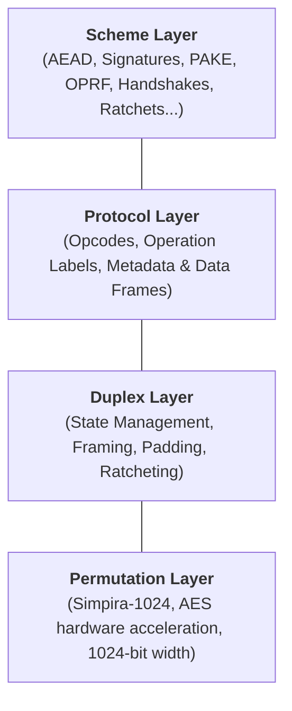
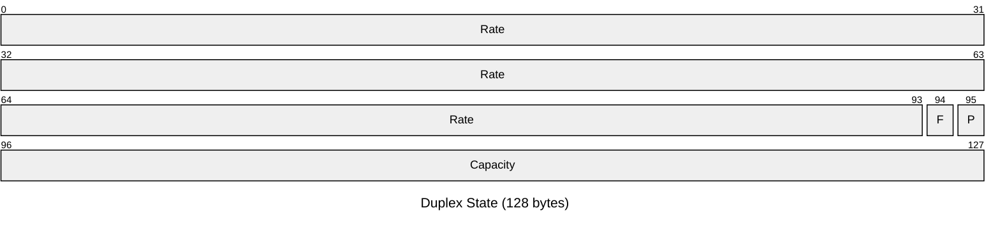
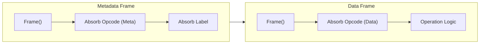
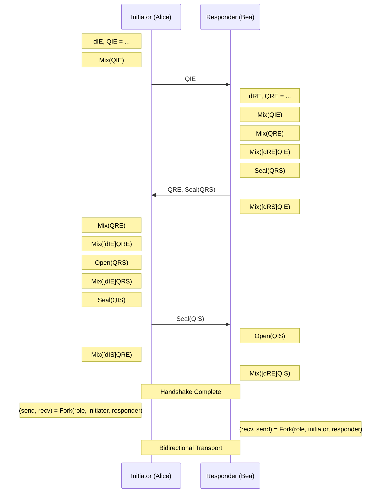

# The Newplex Framework

<!-- TOC -->
* [The Newplex Framework](#the-newplex-framework)
  * [Introduction](#introduction)
  * [Architecture at a Glance](#architecture-at-a-glance)
    * [Comparison with Related Frameworks](#comparison-with-related-frameworks)
    * [Design Goals](#design-goals)
    * [Security Model](#security-model)
      * [Safety in Implementation](#safety-in-implementation)
    * [Data Types and Conventions](#data-types-and-conventions)
        * [Data Types](#data-types)
        * [Integer Encoding](#integer-encoding)
        * [Conventions](#conventions)
  * [The Simpira-1024 Permutation](#the-simpira-1024-permutation)
    * [Security Claims](#security-claims)
    * [Cryptanalytic History](#cryptanalytic-history)
    * [Rationale](#rationale)
      * [Hardware Acceleration](#hardware-acceleration)
      * [Architectural Parity](#architectural-parity)
      * [Implementation Compactness](#implementation-compactness)
  * [The Duplex Construction](#the-duplex-construction)
    * [Parameters](#parameters)
    * [Framing](#framing)
    * [Constants](#constants)
    * [Variables And State Layout](#variables-and-state-layout)
      * [`state`](#state)
      * [`rateIdx`](#rateidx)
      * [`frameIdx`](#frameidx)
    * [Data Operations](#data-operations)
      * [`Absorb`](#absorb)
      * [`Squeeze`](#squeeze)
      * [`Encrypt`/`Decrypt`](#encryptdecrypt)
        * [IND-EAV (Indistinguishability against Eavesdropping)](#ind-eav-indistinguishability-against-eavesdropping)
        * [IND-CPA (Indistinguishability under Chosen Plaintext Attack)](#ind-cpa-indistinguishability-under-chosen-plaintext-attack)
        * [Plaintext Dependency](#plaintext-dependency)
    * [Control Operations](#control-operations)
      * [`Frame`](#frame)
      * [`Permute`](#permute)
    * [Worked Example: Domain Separation through Framing](#worked-example-domain-separation-through-framing)
      * [Sequence A: `Absorb(0xCA); Absorb(0xFE)`](#sequence-a-absorb0xca-absorb0xfe)
      * [Sequence B: `Absorb(0xCA); Frame(); Absorb(0xFE)`](#sequence-b-absorb0xca-frame-absorb0xfe)
    * [State Operations](#state-operations)
      * [`Ratchet`](#ratchet)
      * [`Clone`](#clone)
      * [`Clear`](#clear)
  * [The Protocol Framework](#the-protocol-framework)
    * [Operation Codes](#operation-codes)
    * [The Two-Frame Structure](#the-two-frame-structure)
    * [Operation Labels](#operation-labels)
    * [Transcript Security](#transcript-security)
    * [Operations](#operations)
      * [`Init`](#init)
      * [`Mix`](#mix)
      * [`Derive`](#derive)
        * [Random Oracle](#random-oracle)
        * [KDF Security](#kdf-security)
        * [KDF Chains](#kdf-chains)
      * [`Mask` / `Unmask`](#mask--unmask)
        * [Cryptographic Properties](#cryptographic-properties)
      * [`Seal`/`Open`](#sealopen)
        * [Cryptographic Properties](#cryptographic-properties-1)
      * [`Fork`](#fork)
      * [`Ratchet`](#ratchet-1)
  * [Basic Schemes](#basic-schemes)
    * [Message Digest](#message-digest)
      * [Cryptographic Properties](#cryptographic-properties-2)
      * [Security Analysis](#security-analysis)
    * [Message Authentication Code (MAC)](#message-authentication-code-mac)
      * [Cryptographic Properties](#cryptographic-properties-3)
      * [Security Analysis](#security-analysis-1)
    * [Stream Cipher](#stream-cipher)
      * [Cryptographic Properties](#cryptographic-properties-4)
      * [Security Analysis](#security-analysis-2)
    * [Authenticated Encryption with Associated Data (AEAD)](#authenticated-encryption-with-associated-data-aead)
      * [Cryptographic Properties](#cryptographic-properties-5)
      * [Security Analysis](#security-analysis-3)
    * [Deterministic Authenticated Encryption (SIV)](#deterministic-authenticated-encryption-siv)
      * [Cryptographic Properties](#cryptographic-properties-6)
      * [Security Analysis](#security-analysis-4)
    * [Streaming Authenticated Encryption](#streaming-authenticated-encryption)
      * [Cryptographic Properties](#cryptographic-properties-7)
      * [Security Analysis](#security-analysis-5)
  * [Complex Schemes](#complex-schemes)
    * [Digital Signature](#digital-signature)
    * [Hybrid Public Key Encryption (HPKE)](#hybrid-public-key-encryption-hpke)
    * [Signcryption](#signcryption)
    * [Mutually Authenticated Handshake](#mutually-authenticated-handshake)
    * [Asynchronous Double Ratchet](#asynchronous-double-ratchet)
    * [Password-Authenticated Key Exchange (PAKE)](#password-authenticated-key-exchange-pake)
    * [Verifiable Random Function (VRF)](#verifiable-random-function-vrf)
    * [Oblivious Pseudorandom Function (OPRF) and Verifiable Pseudorandom Function (VOPRF)](#oblivious-pseudorandom-function-oprf-and-verifiable-pseudorandom-function-voprf)
  * [Security Summary](#security-summary)
<!-- TOC -->

## Introduction

Newplex is a cryptographic framework that provides a unified interface for unkeyed and symmetric-key operations. It is
built on a duplex construction using the [Simpira-1024] permutation. Inspired by [STROBE], [Noise Protocol],
and [Xoodyak], Newplex is optimized for 64-bit architectures (x86-64 and ARM64) to provide 10+ Gb/second performance on
modern processors at a 128-bit security level.

[Simpira-1024]: https://eprint.iacr.org/2016/122.pdf

[STROBE]: https://strobe.sourceforge.io

[Noise Protocol]: http://www.noiseprotocol.org

[Xoodyak]: https://keccak.team/xoodyak.html

## Architecture at a Glance

Newplex is structured as a stack of four distinct layers, each building on the security and functionality of the one
below it.



1. **Permutation Layer ([Simpira-1024](#the-simpira-1024-permutation)):** The foundation of the framework. It provides a
   fixed-length, high-performance transformation of a 1024-bit state, leveraging hardware-accelerated AES instructions
   for maximum efficiency.
2. **Duplex Layer ([The Duplex Construction](#the-duplex-construction)):** The stateful engine. It manages the 1024-bit
   state, logically partitioning it into a 768-bit rate and a 256-bit capacity. It handles data absorption, pseudorandom
   squeezing, and internal framing boundaries.
3. **Protocol Layer ([The Protocol Framework](#the-protocol-framework)):** The semantic enforcement layer. It wraps
   duplex operations in a strict grammar of opcodes and labels, ensuring unique transcript decodability and providing.
4. **Scheme Layer ([Basic](#basic-schemes) & [Complex](#complex-schemes) Schemes):** The application layer. It composes
   protocol operations into interoperable cryptographic tools, ranging from simple hash functions and MACs to complex
   multi-party protocols like OPRFs and Double Ratchets.

### Comparison with Related Frameworks

Newplex draws inspiration from several foundational cryptographic frameworks. The following table highlights the key
architectural differences:

| Feature            | Newplex            | STROBE             | Noise               | Xoodyak           |
|--------------------|--------------------|--------------------|---------------------|-------------------|
| **Permutation**    | Simpira-1024       | Keccak-f\[1600\]   | Mixed (e.g. ChaCha) | Xoodoo            |
| **State Width**    | 1024 bits          | 1600 bits          | 512+ bits           | 384 bits          |
| **Security Level** | 128-bit            | 128-bit            | 128-bit or 256-bit  | 128-bit           |
| **Primary Target** | 64-bit Performance | Embedded/Compact   | Network Handshakes  | Efficient Hashing |
| **Framing**        | STROBE-style Index | STROBE-style Index | Protocol-specific   | Cyclic Duplex     |
| **Key Property**   | Flexible/Universal | Flexible/Universal | Composable          | Lightweight       |

### Design Goals

Newplex is engineered to be a high-performance, misuse-resistant cryptographic framework for modern systems. The primary
design philosophy is simplicity through unification. By reducing the number of distinct primitives--replacing separate
hash functions, MACs, stream ciphers, and KDFs with a single duplex construction--Newplex minimizes the complexity of
both the design and implementation of a cryptographic scheme. This reduction allows for a compact design that is easier
to audit, formally verify, and integrate into complex software stacks without sacrificing versatility.

Security in Newplex is enforced through a strict grammar of cryptographic intent which mandates domain separation at two
distinct levels. At the protocol (or scheme) level, different applications (e.g., a file encryption tool vs. a network
handshake) are domain-separated by unique initialization strings. Individual operations within a protocol are bound to
their semantic role, distinguishing between key material, public metadata, and encrypted payloads. By absorbing this
context into the duplex state, Newplex ensures full context commitment, preventing ambiguity attacks where valid data
from one context is accepted in another. Furthermore, the design mandates constant-time execution for all
secret-dependent operations and provides forward secrecy via a ratchet mechanism, ensuring that a compromise of the
current state cannot retroactively expose past communications.

Finally, Newplex targets exceptional performance on 64-bit architectures. By building on the Simpira-1024
permutation--which leverages ubiquitous AES hardware instructions (`AES-NI` on x86-64 and `FEAT_AES` on ARMv8)--the
framework aims for a throughput target of 10+ Gb/s on modern CPUs. This performance profile allows Newplex to serve as a
universal cryptographic layer for high-bandwidth network protocols, removing the traditional trade-off between security
and speed.

### Security Model

The security analysis of Newplex can be divided into two layers: the generic cryptographic properties of the underlying
duplex construction and the semantic security provided by the protocol framework.

The duplex construction is instantiated with the Simpira-1024 permutation. The analysis assumes that Simpira-1024
behaves as an ideal permutation and exhibits no structural distinguishers with a complexity below `2**128`. Based on
the [flat sponge claim][], a capacity of 256 bits (`c=256`) provides a generic security level of 128 bits against all
generic attacks: a probabilistic polynomial-time adversary making `N < 2**128` queries to the permutation cannot
distinguish the output of the duplex from a random bitstream or force a collision in its internal capacity. In the
unkeyed model, where the adversary has read access to the full state, the construction is indifferentiable from a random
oracle. In the keyed model, where the capacity is populated with secret entropy and hidden from the adversary, the
construction acts as a cryptographically secure pseudorandom generator (PRG) or pseudorandom function (PRF). These
properties hold as long as the underlying permutation Simpira-1024 is a secure Pseudorandom Permutation (PRP) and the
total number of queries across all protocol instances does not approach the birthday bound of the capacity (`2**128`).

[flat sponge claim]: https://keccak.team/files/CSF-0.1.pdf

The security of the protocol framework relies on the injectivity of the operation framing and metadata. Each protocol
operation absorbs a unique frame index into the duplex state to ensure that distinct sequences of variable-length inputs
result in distinct sequences of inputs to the underlying permutation. In addition, protocol operation types are
disambiguated with distinct operation codes, and all operations require domain separation labels. Because the framing
and metadata preclude ambiguity between operations and enforce domain separation at the state level, any successful
attack against the protocol implies a collision or distinguishing attack against the duplex construction or permutation
itself. Furthermore, this construction ensures the protocol is full context committing (CMT-4): every bit of squeezed
output is cryptographically bound to the entire history of the session, including all metadata and secret material.

Finally, the security model assumes a constant-time implementation of Simpira-1024. A lookup table-based implementation
of the AES round function could leak secret data via side channels. The use of AES hardware instructions largely
mitigates this concern on common architectures.

#### Safety in Implementation

To ensure the security of the Newplex framework, implementers **must** adhere to the following safety guidelines:

* **Constant-Time Execution:** All operations involving secret data (keys, plaintexts, internal state) must be executed
  in constant time. Specifically, comparisons of authentication tags or session secrets **must** use constant-time
  comparison functions (e.g., `CT_EQ`) to prevent timing side-channel attacks, and the AES round implementation in
  Simpira-1024 **must** be constant time.
* **Memory Management:** Secret data should be cleared from memory as soon as possible. This includes zeroing out
  buffers containing plaintexts, keys, and the internal duplex state before they are deallocated.
* **In-Place Operations and Error Handling:** When performing in-place decryption (such as in `Open`), implementers
  **must** ensure that if an authentication check fails, the provisional plaintext is immediately zeroed out and never
  returned to the caller.
* **No Secret Logging:** Never log key material, plaintexts, or internal state. Debug logs should only contain public
  metadata and non-sensitive operation info. Safe debug representations of protocols can be obtained via cloning the
  protocol and performing a `Derive` operation on the clone.

### Data Types and Conventions

This section defines the data types, encoding rules, and notation used throughout the specification. Unless otherwise
noted, all operations act on arrays of 8-bit bytes.

##### Data Types

* **Bit**: A binary digit, having a value of either `0` or `1`.
* **Byte**: A sequence of eight bits.
* **Bytes**: A finite sequence of bytes, also referred to as a byte string. The length of a byte string `S` is denoted
  `|S|`.
* **String**: A sequence of UTF-8 encoded characters. In this specification, strings are treated as their underlying
  UTF-8 byte representation as normalized to NFC form.
* **Integer**: An element of the set of mathematical integers. Practically, these are constrained to 64-bit values, but
  the design can be extended.

##### Integer Encoding

* **Byte Order**: The default byte ordering for integers is little-endian. However, the system is primarily
  byte-oriented, processing input streams as opaque sequences.
* **LEB128**: Variable-length integers are encoded using the unsigned Little Endian Base 128 (LEB128) format. To ensure
  unique encoding (malleability resistance), implementations **must** use the canonically short encoding. This means
  that the last byte of the encoding must not be `0x00` (unless the integer is `0`, encoded as `0x00`), and the unused
  bits in the final byte must be `0`. For example, `1` **must** be coded as `[0x01]` and not `[0x81, 0x00]`.

##### Conventions

The following notations are used throughout this document:

* Literal byte values are written in hexadecimal notation with a `0x` prefix (e.g., `0x1F`).
* `[ a, b, ..., n ]` denotes a string of bytes given in hexadecimal. For example `[0xCA, 0xFE]`.
* `|s|` denotes the length of a byte string `s`. For example, `|[0xFF, 0xFF]|` = `2`.
* `s[i]` denotes the `i`-th element of a byte string `s` with zero-based indexing.
* `s[n:m]` denotes the selection of bytes from `n` (inclusive) to `m` (exclusive) of a string `s`. The indexing of a
  byte string starts at `0`. For example, for `s` = `[0xA5, 0xC6, 0xD7]`, `s[0:1]` = `[0xA5]` and `s[1:3]` =
  `[0xC6, 0xD7]`. If the index `n` is elided (e.g., `s[:m]`), `n` is equal to `0`, the start of the byte string.
  If the index `m` is elided (e.g., `s[n:]`), `m` is equal to `|s|`.
* `X || Y` denotes the concatenation of byte string `X` followed by byte string `Y`. For example, `[0xDE] || [0xAD]` is
  `[0xDE, 0xAD]`.
* `for x in y` denotes the iteration through each element `x` in the sequence `y`.
* `for x in y..z` denotes the iteration through each integer `x` from `y` (inclusive) to `z` (exclusive).
* `x = y` denotes `x` takes the value `y`.
* `x == y` denotes the comparison of `x` and `y`. `1 == 1` is true, `1 == 0` is false.
* `!x` denotes the logical negation of the boolean value `x`. `!(1 == 1)` is false, `!(1 == 0)` is true.
* `CT_EQ(x, y)` denotes the comparison of secret values `x` and `y` in constant time. Implementers **must** ensure no
  timing side-channels exist in this operation.
* `I2OSP` and `OSP2I` are used as defined in [RFC 8017](https://www.rfc-editor.org/rfc/rfc8017#section-4.1).
* `"string"` denotes an NFC-normalized UTF-8 byte string with the characters `string`.

In the following, `x` and `y` are integers:

* `x+=y` denotes `x` takes the value `x + y` (addition).
* `x**y` denotes the exponentiation of `x` by `y`.
* `x | y` denotes the bitwise OR of `x` and `y`.
* `x^y` denotes the bitwise XOR of `x` and `y` (exclusive-OR).
* `x^=y` denotes `x` takes the value `x ^ y` (exclusive-OR).

## The Simpira-1024 Permutation

The underlying permutation `f` used in Newplex is [Simpira-1024] (specifically Simpira v2 with `b=8`, where `b` is the
number of 128-bit sub-blocks). Simpira is a Generalized Feistel Structure (GFS) that operates on a block size of 1024
bits. The round function `F` consists of two full rounds of the Advanced Encryption Standard (AES) block cipher. The
permutation iterates this function over 18 rounds to achieve full diffusion and confusion.

### Security Claims

The design claims that there are no structural distinguishers for Simpira-1024 with a complexity below `2**128`. This
bound aligns with the generic security target of the Newplex framework.

### Cryptanalytic History

The security of Simpira has been analyzed since its introduction in 2016. While Simpira v1 was broken, Simpira v2
remains secure against full-round attacks. The following table summarizes known results against reduced-round variants
of the Simpira v2 family:

| Variant            | Width    | Full Rounds | Attack Type             | Rounds Broken | Reference                                                                                                    |
|--------------------|----------|-------------|-------------------------|---------------|--------------------------------------------------------------------------------------------------------------|
| **Simpira v1**     | Various  | Various     | Collision               | Full          | [Dobraunig et al. (2017)](https://doi.org/10.1007/978-3-319-69453-5_16)                                      |
| **Simpira v2 b=2** | 256-bit  | 15          | Collision               | 9             | [Ni et al. (2021)](https://doi.org/10.46586/tosc.v2021.i2.222-248)                                           |
| **Simpira v2 b=3** | 384-bit  | 21          | Boomerang               | 10            | [Tjuawinata et al. (2017)](https://doi.org/10.1007/978-3-319-60055-0_20)                                     |
| **Simpira v2 b=4** | 512-bit  | 15          | Collision               | 11            | [Ni et al. (2021)](https://doi.org/10.46586/tosc.v2021.i2.222-248)                                           |
| **Simpira v2 b=6** | 768-bit  | 15          | Impossible Differential | 9             | [Liu et al. (2022)](https://journal_xdxb.xidian.edu.cn/zh/article/doi/10.19665/j.issn1001-2400.2022.05.023/) |
| **Simpira v2 b=8** | 1024-bit | 18          | None                    | N/A           |                                                                                                              |

### Rationale

The selection of Simpira-1024 is driven by performance and architectural consistency.

#### Hardware Acceleration

The permutation leverages hardware AES instructions (`AES-NI` on x86-64 and `FEAT_AES` on ARMv8). These instructions are
ubiquitous on modern server, consumer, and mobile processors, ensuring high throughput and constant-time execution
without complex bit-slicing.

#### Architectural Parity

Simpira-1024 provides consistent performance across major architectures. In contrast, while `Keccak-p[1600,12]` is
highly efficient on ARMv8 processors with `FEAT_SHA3`, it performs significantly slower on x86-64 platforms lacking
dedicated SHA-3 acceleration (less than half the speed of Simpira). Simpira bridges this gap, providing a high baseline
speed on both platforms.

#### Implementation Compactness

The reliance on standard AES intrinsics allows for a compact implementation code size compared to software-only
permutations. A straightforward C implementation using Intel intrinsics is approximately 30 lines of code. An
extensively optimized AMD64 assembly version is approximately 90 lines of code.

While Simpira has received less cryptanalytic scrutiny than Keccak, the results on reduced-round variants suggest a
comfortable security margin. Furthermore, the Newplex framework is designed to be modular; the design does not strictly
require Simpira and can be instantiated with `Keccak-f[1600]` or `Keccak-p[1600,12]` if additional security margin or
embedded device performance is preferred.

## The Duplex Construction

The duplex construction serves as the foundational primitive of the Newplex framework. Formally introduced by Bertoni et
al., the duplex is a stateful object derived from the sponge construction. While a standard sponge absorbs a complete
message before producing an output, a duplex allows for the interleaved absorption of input and squeezing of output.
This enables a continuous, interactive session where every output is cryptographically bound to the entire history of
preceding operations.

To implement a duplex construction, three primary parameters must be selected: the underlying permutation `f`, the
capacity `c`, and a padding rule `pad`. These choices then dictate the derived parameters of the construction: the width
`b` (which is the width of the selected permutation) and the rate `r` (calculated as `r = b - c`).

The construction maintains a state buffer of `b` bits, which is logically partitioned into the rate (the first `r` bits)
and the capacity (the remaining `c` bits). This state is initialized to all zeros. Input data is XORed into the rate
portion of the state. If the input exceeds the rate, it is processed in blocks of `r` bits. Each block is XORed into the
state, followed by a transformation of the entire `b`-bit state using the permutation `f`. Output is produced by reading
bits directly from the rate. If more than `r` bits are required, the permutation `f` is applied to the state to refresh
the rate before the next segment is read. The capacity portion of the state is never directly modified by user input and
is never exposed in the squeezed output. It serves as a reservoir of entropy that ensures the security of the
construction.

To maintain the security proofs associated with the construction, every input sequence must be uniquely identifiable and
properly terminated. This requires the use of a formal padding rule to ensure that messages of different lengths do
not result in the same internal state. Newplex builds upon this standard duplex model by introducing specialized framing
within the rate to enforce domain separation between different high-level protocol operations.

[duplex]: https://eprint.iacr.org/2011/499.pdf

### Parameters

The Newplex duplex is instantiated with the following parameters:

| Parameter   | Notation | Value                          |
|-------------|----------|--------------------------------|
| Permutation | `f`      | Simpira-1024                   |
| State Width | `b`      | 1024 bits                      |
| Capacity    | `c`      | 256 bits                       |
| Rate        | `r`      | 768 bits                       |
| Padding     | `pad`    | multi-rate padding (`pad10*1`) |

The choice of a 256-bit capacity provides a generic security level of 128 bits. Specifically, the construction offers
128-bit resistance against collisions (`2**(c/2)`) and 128-bit security against output indistinguishability
(`2**(c/2)`). Resistance against full state recovery is 256 bits (`2**c`).

These bounds are fundamental to the construction. Even if a higher-level component (such as a hash function) requests an
output length `n` where `2**n > 2**c`, the effective security of the scheme has an upper bound set by the capacity.
Specifically, resistance to preimage attacks and state recovery attacks will not exceed 256 bits, and resistance to
collision and distinguishing attacks will not exceed 128 bits.

To satisfy the security requirements of the duplex construction, Newplex uses the `pad10*1` multi-rate padding rule for
every block. This rule ensures that every sequence of inputs results in a unique sequence of permutation inputs,
preventing length-extension and collision attacks.

In bit-level terms, `pad10*1` appends a `1` bit, followed by as many `0` bits as necessary, and a final `1` bit at the
end of the rate. In the byte-oriented implementation of Newplex (assuming little-endian bit ordering within bytes):

1. The first `1` bit corresponds to the least significant bit of a byte, represented by the value `0x01`.
2. The final `1` bit corresponds to the most significant bit of the last byte of the rate (index 95), represented by the
   value `0x80`.

This ensures the input is always uniquely decodable and that the boundary of every block is cryptographically distinct.
Because every block in Newplex is framed and padded, the padding always consumes at least one bit and up to one full
rate block.

### Framing

In a standard duplex construction, operations are naturally concatenative; for example, `Absorb(0x01)` followed by
`Absorb(0x02)` results in the same internal state as a single `Absorb(0x0102)`. While this is acceptable for simple
hashing, it is insufficient for complex protocols where the boundary between operations (such as a public key versus a
nonce) must be cryptographically significant.

To enforce these boundaries, many designs trigger a full permutation between every operation. However, for wide-block
permutations like Simpira-1024, this approach is inefficient, as many protocol metadata elements are significantly
smaller than the 96-byte rate. Standard length-prefixing is an alternative, but it requires the length of data to be
known before an operation begins, which is incompatible with streaming data.

Newplex uses a STROBE-style framing mechanism to enforce domain separation. This mechanism records the byte index
marking the beginning of a "frame" (a group of related duplex operations) and ensures this index is absorbed into the
state. This approach provides several key advantages:

* **Operational Boundaries:** It distinguishes between different sequences of duplex operations within a single
  permutation block, as well as across block boundaries.
* **Streamability:** Because framing is handled as data is processed, it does not require prior knowledge of the total
  data length.
* **Space Efficiency:** The logic requires only two reserved bytes of the rate: one for the padding rule and one to
  absorb the framing metadata.

By treating the semantics of the session--the sequence and size of every operation--as data bound to the state, Newplex
can combine metadata and raw data into a single, efficient process without risking concatenation attacks.

### Constants

Newplex is built on a 1024-bit permutation (`b=1024`) with a 256-bit capacity (`c=256`). This leaves a total rate of 768
bits (or exactly 96 bytes). To maintain the structural integrity of the duplex and the semantic integrity of the
protocol, Newplex reserves the final two bytes of this rate for metadata. Consequently, the effective rate available for
user data is 94 bytes. This design ensures that every permutation block is cryptographically delimited and properly
padded without reducing the security level below the target 128 bits.
The following constants are defined based on these parameters:

| Constant       | Value | Description                                                                                               |
|----------------|-------|-----------------------------------------------------------------------------------------------------------|
| MAX_RATE_IDX   | 94    | The upper bound of the effective rate. This represents the total bytes available for user data per block. |
| FRAME_BYTE_IDX | 94    | The byte index reserved for absorbing the frame index.                                                    |
| PAD_BYTE_IDX   | 95    | The byte index reserved for the final padding bit (`0x80`).                                               |
| CAPACITY_BYTES | 32    | The size of the capacity in bytes (`c/8`).                                                                |

### Variables And State Layout

To manage the duplex state and the framing logic, the construction maintains the following variables:

#### `state`

The internal state is a buffer of 128 bytes (`b=1024` bits), initialized to all zeros. It is logically divided into
three segments:



1. **Effective Rate:** The first 94 bytes (indices `0..93`). This area is used for user input and output.
2. **Reserved Metadata:** The 95th byte (index `94`) is reserved for framing, and the 96th byte (index `95`) is
   reserved for padding.
3. **Capacity:** The final 32 bytes (indices `96..127`). This segment is never directly modified by user input or
   exposed in the output.

#### `rateIdx`

A byte-index tracking the current position within the rate (`0 <= rateIdx < 94`). It is initialized to `0`. This index
increments as data is absorbed or squeezed.

#### `frameIdx`

A byte-index tracking where the current frame began (`0 <= frameIdx < 94`). It is initialized to `0`. When a new frame
is opened, the current `rateIdx` is recorded here, ensuring the boundary is preserved even if the frame spans multiple
permutation blocks.

### Data Operations

These operations facilitate the primary flow of information into and out of the duplex state. Because the effective rate
is limited to 94 bytes, these operations automatically trigger the internal `Permute` function whenever the boundary of
the effective rate is reached, ensuring the construction can handle data streams of arbitrary length.

#### `Absorb`

The `Absorb` operation is the fundamental method for injecting data into the duplex state. It XORs the input data into
the state byte-by-byte. If the input exceeds the available space in the current block, the permutation is triggered to
provide a fresh rate for the remaining data. This process ensures that the internal state becomes a cryptographic digest
of the entire input history.

```text
function Absorb(input):
  for b in input:
    state[rateIdx] ^= b
    rateIdx += 1
    if rateIdx == MAX_RATE_IDX:
      Permute()
```

#### `Squeeze`

The `Squeeze` operation extracts pseudorandom bytes from the rate portion of the state. It is used to generate
keystreams, authentication tags, or derived keys. If the underlying permutation is indistinguishable from a random
permutation, the squeezed output is indistinguishable from a random bitstring, provided the capacity remains
uncompromised.

```text
function Squeeze(n):
  output = []
  for _ in 0..n:
    output = output || state[rateIdx]
    rateIdx += 1
    if rateIdx == MAX_RATE_IDX:
      Permute()
  return output
```

#### `Encrypt`/`Decrypt`

These operations implement the [DuplexWrap] technique, combining the mechanics of absorption and squeezing into a
single pass.

[DuplexWrap]: https://competitions.cr.yp.to/round1/keyakv1.pdf

* `Encrypt` XORs the plaintext with the current rate to produce ciphertext. The ciphertext is then treated as the
  new state of the rate, effectively "absorbing" the plaintext's influence into the transcript.
* `Decrypt` XORs the ciphertext with the current rate to recover the plaintext. Crucially, the ciphertext (not the
  recovered plaintext) is used to update the state, ensuring that both the encrypter and decrypter maintain synchronized
  states if the underlying plaintext is identical.

This technique provides IND-EAV security and can achieve IND-CPA security if the state is probabilistic (e.g., by
absorbing a unique nonce before encryption).

```text
function Encrypt(plaintext):
  ciphertext = []
  for p in plaintext:
    c = p ^ state[rateIdx]
    state[rateIdx] = c
    ciphertext = ciphertext || c
    rateIdx += 1
    if rateIdx == MAX_RATE_IDX:
      Permute()
  return ciphertext

function Decrypt(ciphertext):
  plaintext = []
  for c in ciphertext:
    p = c ^ state[rateIdx]
    state[rateIdx] = c
    plaintext = plaintext || p
    rateIdx += 1
    if rateIdx == MAX_RATE_IDX:
      Permute()
  return plaintext
```

##### IND-EAV (Indistinguishability against Eavesdropping)

By default, the DuplexWrap technique provides IND-EAV security. Because the plaintext is XORed with the current rate (a
pseudorandom keystream), a passive adversary cannot distinguish between the ciphertexts of two equal-length messages
without access to the duplex state. This property holds as long as the capacity `c` is large enough to prevent state
recovery, and the permutation `f` is indistinguishable from a random permutation.

##### IND-CPA (Indistinguishability under Chosen Plaintext Attack)

To protect against adversaries with access to an encryption oracle (i.e., the ability to choose plaintexts), the duplex
state must be probabilistic, with a random IV or message counter having been absorbed into the state before encryption.
Without this, an adversary will be able to recover the keystream by encrypting an all-zero plaintext, allowing them to
decrypt other ciphertexts. In addition, the keystream reuse will allow passive adversaries to recover the XOR of any two
plaintexts by XORing any two ciphertexts.

##### Plaintext Dependency

A defining characteristic of DuplexWrap is that the plaintext is effectively absorbed into the duplex's state. This
property ensures that if any ciphertext byte is modified in transit, the receiver's state will immediately diverge from
the sender's. This provides the foundational mechanism for message integrity; any later `Squeeze` operation will produce
a different output, allowing for the detection of unauthorized modifications.

### Control Operations

Control operations manage the structural integrity of the duplex session. Unlike data operations, which process
payloads, control operations enforce the semantics of the protocol, ensuring that the state is cryptographically bound
to the sequence of operations.

#### `Frame`

The `Frame` operation provides domain separation by grouping related duplex operations into a single logical unit. It
works by using the current state of the duplex as an internal delimiter: it absorbs the `frameIdx` (the start of the
previous frame) into the state and then updates `frameIdx` to the current `rateIdx` (the start of the new frame). This
ensures that even if two different sequences of operations involve the same raw data, the internal states will diverge
based on how those operations were framed.

```text
function Frame():
  Absorb(frameIdx)
  frameIdx = rateIdx
```

#### `Permute`

The `Permute` operation is the finalization step for a block of data. It is responsible for injecting the framing
metadata and the padding bits into the reserved bytes of the rate before transforming the state with the underlying
permutation `f`.

`Permute` operates in three phases. First, it XORs the current `frameIdx` into the next available byte of the rate,
potentially being absorbed into the reserved framing byte (`FRAME_BYTE_IDX`) if the rate is full (i.e.,
if `rateIdx = MAX_RATE_IDX`). Second, it applies the `pad10*1` scheme to the framed rate. Finally, it performs the
permutation `f` (Simpira-1024) on the entire state and resets `rateIdx` and `frameIdx` to zero.

```text
function Permute():
  state[rateIdx] ^= frameIdx  // Absorb framing metadata
  rateIdx += 1
  state[rateIdx] ^= 0x01      // Apply pad10*1 padding
  state[PAD_BYTE_IDX] ^= 0x80
  Simpira1024(state)          // Permute state and reset indexes
  rateIdx = 0
  frameIdx = 0
```

> [!NOTE]
> While the `pad10*1` scheme is defined in bits, in the context of Newplex's 96-byte rate, it is implemented as follows:
>
> * The first bit of padding (the `1`) is the least-significant bit of the byte at `state[rateIdx]`.
> * The last bit of padding (the final `1`) is the most-significant bit of the byte at `state[95]`.
> * In practice, this means XORing `0x01` at the current position and `0x80` at the end of the rate.

### Worked Example: Domain Separation through Framing

To visualize how framing prevents concatenation attacks, consider a hypothetical "Tiny-Newplex" with an effective rate
of only four bytes (indices `0..3`) and two reserved bytes (index `4` for framing, index `5` for padding).

Suppose we want to distinguish between two different sequences of operations: `Absorb(0xCA); Absorb(0xFE)` and
`Absorb(0xCA); Frame(); Absorb(0xFE)`.

#### Sequence A: `Absorb(0xCA); Absorb(0xFE)`

In this sequence, the two `Absorb` operations are performed within a single frame, signaling that they belong to a
single semantic unit (e.g., a two-byte message).

|                | `S[0]` | `S[1]` | `S[2]` | `S[3]` | `S[4]` | `S[5]` | `rateIdx` | `frameIdx` |
|----------------|--------|--------|--------|--------|--------|--------|-----------|------------|
| initial state  | `0x00` | `0x00` | `0x00` | `0x00` | `0x00` | `0x00` | `0`       | `0`        |
| `Absorb(0xCA)` | `0xCA` | `0x00` | `0x00` | `0x00` | `0x00` | `0x00` | `1`       | `0`        |
| `Absorb(0xFE)` | `0xCA` | `0xFE` | `0x00` | `0x00` | `0x00` | `0x00` | `2`       | `0`        |
| framed state   | `0xCA` | `0xFE` | `0x00` | `0x00` | `0x00` | `0x00` |           |            |
| padded state   | `0xCA` | `0xFE` | `0x00` | `0x01` | `0x00` | `0x80` |           |            |

The final input to the permutation is `[0xCA, 0xFE, 0x00, 0x01, 0x00, 0x80]`.

#### Sequence B: `Absorb(0xCA); Frame(); Absorb(0xFE)`

Unlike in the first sequence, `Frame()` is called between the `Absorb` operations, signaling that they belong to
different logical units (e.g., a key byte and a value byte).

|                | `S[0]` | `S[1]` | `S[2]` | `S[3]` | `S[4]` | `S[5]` | `rateIdx` | `frameIdx` |
|----------------|--------|--------|--------|--------|--------|--------|-----------|------------|
| initial state  | `0x00` | `0x00` | `0x00` | `0x00` | `0x00` | `0x00` | `0`       | `0`        |
| `Absorb(0xCA)` | `0xCA` | `0x00` | `0x00` | `0x00` | `0x00` | `0x00` | `1`       | `0`        |
| `Frame()`      | `0xCA` | `0x00` | `0x00` | `0x00` | `0x00` | `0x00` | `2`       | `2`        |
| `Absorb(0xFE)` | `0xCA` | `0x00` | `0xFE` | `0x00` | `0x00` | `0x00` | `3`       | `2`        |
| framed state   | `0xCA` | `0x00` | `0xFE` | `0x02` | `0x00` | `0x00` |           |            |
| padded state   | `0xCA` | `0x00` | `0xFE` | `0x02` | `0x01` | `0x80` |           |            |

The final input to the permutation is `[0xCA, 0x00, 0xFE, 0x02, 0x01, 0x80]`.

Even though both sequences processed the same input bytes in the same order (`[0xCA, 0xFE]`), the final permutation
inputs are distinct. In Sequence A, the data occupies contiguous indices and the frame metadata is zero. In Sequence B,
the `Frame` operation absorbed the previous `frameIdx` into the state and moved the absorption position of the second
data byte (`0xFE`). This mechanism ensures that the duplex state is not just a transcript of the data but of the
metadata as well.

### State Operations

State operations manage the lifecycle and security posture of the duplex object. These functions allow the duplex to
provide advanced properties like forward secrecy and to support complex protocol flows that require state persistence or
branching.

#### `Ratchet`

The `Ratchet` operation provides forward secrecy by irreversibly modifying the duplex state. In the event of a total
state compromise, an adversary should ideally be unable to recover past inputs or outputs by inverting the permutation
to a previous state.

`Ratchet` achieves this by invoking `Permute` and then zeroing out the initial portion of the rate. Advancing the
`rateIdx` ensures that the next data operation begins after the zeroed-out memory. The 32-byte depth is mathematically
chosen to match the 256-bit capacity (`c`). An attacker in possession of the post-ratchet state will be unable to invert
the permutation without the missing `c` bits of the rate. Since recovering these bits requires `2**256` work (matching
the cost of a full state recovery attack), the ratchet provides robust forward secrecy that aligns with the framework's
maximum security bound.

```text
function Ratchet():
  if rateIdx > 0: // Do not permute if the rate has not been touched.
    Permute()
  for i in 0..CAPACITY_BYTES:
    state[i] = 0x00
  rateIdx = CAPACITY_BYTES
```

Ratcheting the duplex reduces its available rate by 32 bytes for the next block of data.

#### `Clone`

The `Clone` operation creates an exact, independent copy of the current duplex session. This includes the full 128-byte
`state`, the current `rateIdx`, and the `frameIdx`.

#### `Clear`

The `Clear` operation overwrites the duplex state, rate index, and frame index with zeros.

## The Protocol Framework

The Newplex Protocol Framework sits atop the duplex engine, providing a high-level interface for building secure,
interoperable cryptographic schemes. While the duplex engine ensures that data is processed securely, the Protocol
Framework ensures that data is processed unambiguously.

This is achieved through a strict grammar of cryptographic intent. Every action taken--whether absorbing a public
key, deriving a session secret, or encrypting a payload--is explicitly denoted with its semantic purpose.

### Operation Codes

Newplex defines seven fundamental operations: `Init`, `Mix`, `Derive`, `Mask`/`Unmask`, `Seal`/`Open`, `Fork`, and
`Ratchet`. Each operation is assigned a unique base operation code (opcode) which distinguishes them in the duplex
state.

| Operation       | Code                 | Description                                                           |
|-----------------|----------------------|-----------------------------------------------------------------------|
| `Init`          | `OP_INIT=0x01`       | Initializes the session with a protocol domain string.                |
| `Mix`           | `OP_MIX=0x02`        | Absorbs data (e.g., keys, nonces, AD, public keys).                   |
| `Derive`        | `OP_DERIVE=0x03`     | Squeezes data to produce pseudorandom output.                         |
| `Mask`/`Unmask` | `OP_CRYPT=0x04`      | Stream encryption/decryption without authentication.                  |
| `Seal`/`Open`   | `OP_AUTH_CRYPT=0x05` | Authenticated encryption/decryption.                                  |
| `Fork`          | `OP_FORK=0x06`       | Branches the current protocol into two independent protocols.         |
| `Ratchet`       | `OP_RATCHET=0x07`    | Irreversibly modify the protocol's state to prevent rollback attacks. |

### The Two-Frame Structure

To enforce domain separation at the operation level, every operation (except `Init`) performs duplex operations within
two distinct **operation phases**: the metadata frame and the data frame. While the duplex engine uses the term `Frame`
to describe the low-level delimitation of data, the protocol framework uses these phases to distinguish between
cryptographic intent (metadata) and the primary payload (data).

During the metadata frame, the protocol absorbs the base
opcode (with the high bit cleared) and a domain separation label with the duplex. This binds the intent of the operation
to the transcript. During the data frame, it absorbs the modified opcode (with the high bit set) with the duplex before
executing the primary logic of the operation.



| Frame Type | Flag          | Description                        |
|------------|---------------|------------------------------------|
| Metadata   | `F_META=0x00` | Absorbs the operation label.       |
| Data       | `F_DATA=0x80` | Performs operation-specific logic. |

### Operation Labels

Every protocol operation requires a descriptive operation label. These labels act as internal documentation to be
cryptographically folded into the state, enforcing domain separation between different operations. The purpose of an
operation label is to provide clarity for human readers and cryptographic distinctness for the duplex; each should
describe the specific purpose of the data (e.g., `"p256-public-key"`, `"session-nonce"`, or `"json-payload"`). Generic
or sequential labels like `"data"`, `"first"`, or `"1"` should be avoided, as they provide no semantic context and
increase the risk of domain confusion. Internally, operation labels are implemented as Unicode strings with an
NFC-normalized UTF-8 byte representation.

### Transcript Security

Because Newplex binds the protocol domain string, the sequence of all previous operations, the operation types, and
their operation labels into the duplex state, the resulting transcript is uniquely decodable.

An adversary cannot take a valid `Mix` operation from one part of a protocol and present it as a `Seal` operation in
another, nor can they swap the contents of two operations with different operation labels. Any deviation from the
established sequence causes the internal state of the participants to diverge, ensuring that a final authentication
check will fail.

These properties collectively provide full context commitment (CMT-4). Unlike traditional AEAD constructions where a
ciphertext might only be a commitment to the key and nonce, a Newplex `Seal` is a commitment to the entire session
transcript. This ensures that a ciphertext and tag pair is cryptographically inseparable from the specific protocol
instance and sequence of operations that produced it.

### Operations

#### `Init`

The `Init` operation is the required first operation for a protocol. As its only input is a protocol domain string for
the entire protocol, it consists of a single metadata frame:

```text
function Init(domain):
  duplex.Frame()
  duplex.Absorb(OP_INIT | F_META)
  duplex.Absorb(domain)
```

The BLAKE3 recommendations for KDF context strings apply equally to Newplex protocol domains:

> The context string should be hardcoded, globally unique, and application-specific. … The context string should not
> contain variable data, like salts, IDs, or the current time. (If needed, those can be part of the key material, or
> mixed with the derived key afterwards.) … The purpose of this requirement is to ensure that there is no way for an
> attacker in any scenario to cause two different applications or components to inadvertently use the same context
> string. The safest way to guarantee this is to prevent the context string from including input of any kind.

#### `Mix`

The `Mix` operation accepts an operation label and an arbitrary byte sequence as inputs, and makes the protocol's state
dependent on both. It can be used for both secret and public data alike. During its data frame, it absorbs the input.

```text
function Mix(label, input):
  duplex.Frame()
  duplex.Absorb(OP_MIX | F_META)
  duplex.Absorb(label)
  duplex.Frame()
  duplex.Absorb(OP_MIX | F_DATA)
  duplex.Absorb(input)
```

Because the input is internally delimited within a duplex frame, the length of the input does not need to be known in
advance, making `Mix` suitable for streaming data.

#### `Derive`

The `Derive` operation extracts a pseudorandom byte string of length `n` from the current protocol state. This output is
cryptographically dependent on the entire preceding transcript, the operation label, and the requested output length.

```text
function Derive(label, n):
  duplex.Frame()
  duplex.Absorb(OP_DERIVE | F_META)
  duplex.Absorb(label)
  duplex.Frame()
  duplex.Absorb(OP_DERIVE | F_DATA)
  duplex.Absorb(LEB128(n))
  duplex.Permute()
  prf = duplex.Squeeze(n)
  return prf
```

`Derive` absorbs the operation code and operation label in the metadata frame. In the data frame, it absorbs the output
length (encoded with LEB128) and permutes the duplex state, ensuring both its pseudorandomness and its cryptographic
dependence on the output length. Finally, it squeezes `n` bytes from the duplex state.

##### Random Oracle

Assuming the Simpira-1024 permutation is indistinguishable from a random permutation (a Pseudorandom Permutation, or
PRP), [the duplex is indistinguishable from a random oracle][duplex security] up to the capacity bound. The inclusion of
the output length prior to permutation and squeezing allows for `Derive` to be used in cryptographic schemes where a
random oracle is required.

[duplex security]: https://eprint.iacr.org/2022/1340.pdf

##### KDF Security

A sequence of `Mix` operations followed by an operation which produces output (e.g., `Derive`, `Mask`, `Seal`, etc.)
is equivalent to constructing a string using a recoverable encoding, absorbing it into a duplex, then squeezing a
prefix-free output string. This maps directly to [Backendal et al.'s RO-KDF construction][n-KDFs], meaning a Newplex
protocol is a KDF-secure XOF-n-KDF.

[n-KDFs]: https://eprint.iacr.org/2025/657.pdf

##### KDF Chains

Because `Derive` is KDF-secure with respect to the protocol's state and replaces the protocol's state with KDF-derived
output (i.e., permutation outputs), sequences of operations which accept input and output in a protocol form
a [KDF chain] if terminated with a `Ratchet` operation. Consequently, Newplex protocols have the following security
properties:

[KDF chain]: https://signal.org/docs/specifications/doubleratchet/doubleratchet.pdf

* **Resilience**: A protocol's outputs will appear random to an adversary as long as one of the inputs is secret, even
  if the other inputs to the protocol are adversary-controlled.
* **Forward Security**: A protocol's previous outputs will appear random to an adversary even if the protocol's state is
  disclosed at some point.
* **Break-in Recovery**: A protocol's future outputs will appear random to an adversary in possession of the protocol's
  state as long as one of the future inputs to the protocol is secret.

#### `Mask` / `Unmask`

The `Mask` operation encrypts a plaintext using the current protocol state and operation label, while `Unmask` reverses
the process. Both operations result in a protocol state dependent on the operation's plaintext.

```text
function Mask(label, plaintext):
  duplex.Frame()
  duplex.Absorb(OP_CRYPT | F_META)
  duplex.Absorb(label)
  duplex.Frame()
  duplex.Absorb(OP_CRYPT | F_DATA)
  duplex.Permute()
  ciphertext = duplex.Encrypt(plaintext)
  return ciphertext

function Unmask(label, ciphertext):
  duplex.Frame()
  duplex.Absorb(OP_CRYPT | F_META)
  duplex.Absorb(label)
  duplex.Frame()
  duplex.Absorb(OP_CRYPT | F_DATA)
  duplex.Permute()
  plaintext = duplex.Decrypt(ciphertext)
  return plaintext
```

`Mask` absorbs the operation code and operation label in the metadata frame. In the data frame, it first permutes the
duplex's state to ensure its pseudorandomness. It then calls the [`Encrypt`](#encryptdecrypt) operation, which XORs the
plaintext with the duplex's state to produce both the ciphertext and the duplex's new state.

`Unmask` is identical except it calls the [`Decrypt`](#encryptdecrypt) duplex operation.

Unlike [`Derive`](#derive) and [`Seal`](#sealopen), `Mask` does not require the length of the plaintext to be known in
advance, and is suitable for streaming operations.

##### Cryptographic Properties

> [!WARNING]
> **`Mask` does not protect the authenticity of the ciphertext.**
> **If IND-CCA security is required, use [`Seal`](#sealopen).**
> An adversary can trivially flip bits and `Unmask` will return an inauthentic plaintext without an error. The resulting
> protocol state will diverge, however, which allows for schemes that use `Unmask` to decrypt unvalidated plaintexts but
> are followed with e.g., a [`Derive`](#derive) call to produce an authentication tag
> (see [the SIV DAE scheme](#deterministic-authenticated-encryption-siv) for an example).
>
> To ensure integrity in streaming contexts, `Mask` must be followed by an operation that authenticates the entire
> transcript (e.g., `Derive` or `Seal`).

`Mask` inherits the security properties of [`Encrypt`](#encryptdecrypt):

* It offers IND-EAV security if the duplex state is secret.
* It offers IND-CPA security if the duplex state is probabilistic (e.g., includes a nonce).
* The resulting protocol state is dependent on the plaintext given to or returned by the operation.

#### `Seal`/`Open`

`Seal` and `Open` operations extend the `Mask` and `Unmask` operations with the inclusion of a 16-byte authentication
tag. The `Open` operation verifies the tag, returning an error if the tag is invalid.

```text
function Seal(label, plaintext):
  duplex.Frame()
  duplex.Absorb(OP_AUTH_CRYPT | F_META)
  duplex.Absorb(label)
  duplex.Frame()
  duplex.Absorb(OP_AUTH_CRYPT | F_DATA)
  duplex.Absorb(LEB128(|plaintext|))
  duplex.Permute()
  ciphertext = duplex.Encrypt(plaintext)
  duplex.Permute()
  tag = duplex.Squeeze(16)
  return ciphertext || tag
  
function Open(label, input):
  ciphertext, receivedTag = input[:|input|-16], input[|input|-16:]
  duplex.Frame()
  duplex.Absorb(OP_AUTH_CRYPT | F_META)
  duplex.Absorb(label)
  duplex.Frame()
  duplex.Absorb(OP_AUTH_CRYPT | F_DATA)
  duplex.Absorb(LEB128(|ciphertext|))
  duplex.Permute()
  plaintext = duplex.Decrypt(ciphertext)
  duplex.Permute()
  expectedTag = duplex.Squeeze(16)
  if !CT_EQ(expectedTag, receivedTag): // CONST: do not leak information about expectedTag
    return ErrInvalidCiphertext
  return plaintext
```

`Seal` absorbs the operation code and operation label in the metadata frame. In the data frame, it absorbs the length of
the plaintext (as encoded with LEB128) and permutes the duplex's state to ensure its pseudorandomness. It then calls
the [`Encrypt`](#encryptdecrypt) operation, which XORs the plaintext with the duplex's state to produce both the
ciphertext and the duplex's new state. Next, it permutes the duplex's state again to enforce the dependency on the
plaintext and squeezes a 16-byte authentication tag from the duplex.

`Open` is identical but uses the duplex to decrypt the data and compares the received tag to an expected tag derived
from the received plaintext. If the two are equal (using a constant-time comparison function), the plaintext is
returned. Otherwise, an error is returned.

The ciphertext is dependent on the length of the plaintext, making `Seal` unsuitable for streaming operations. See
the [streaming authenticated encryption](#streaming-authenticated-encryption) scheme for a solution.

##### Cryptographic Properties

* `Seal` and `Open` provide IND-CCA2 security if one of the protocol's inputs includes a probabilistic value, like a
  nonce.
* The derived tag is dependent on every prior operation and its inputs, making `Seal` strongly context-committing.

* `Seal` and `Open` provide indistinguishability under adaptive chosen-ciphertext attack (IND-CCA2), ensuring both
  confidentiality and integrity, provided the protocol state is probabilistic (e.g., includes a nonce).
* Because the authentication tag is derived from the duplex state after every preceding operation (including the domain
  string, all previous labels, and all previous data), `Seal` provides a binding commitment to the entire session
  context. Full context commitment (CMT-4) prevents partitioning oracle attacks and context-confusion vulnerabilities,
  as a ciphertext and tag pair cannot be validly decrypted under a different key, nonce, associated data, or protocol
  state.

#### `Fork`

`Fork` accepts a label and a variable number of branch values, returning a tuple (or array) of independent, cloned child
protocols that have each absorbed their respective branch value.

```text
function Fork(label, ...values):
  branches = []
  for value in values:
    branch = duplex.Clone()
    branch.Frame()
    branch.Absorb(OP_FORK | F_META)
    branch.Absorb(label)
    branch.Frame()
    branch.Absorb(OP_FORK | F_DATA)
    branch.Absorb(value)
    branches.append(branch)
  return branches
```

The ability to create two divergent branches is useful
for [bidirectional communication](#mutually-authenticated-handshake), [Fiat-Shamir transforms](#digital-signature), and
any scheme in which data flow is non-linear (e.g. [SIV](#deterministic-authenticated-encryption-siv)).

#### `Ratchet`

`Ratchet` accepts an operation label and irreversibly modifies the protocol's state, preventing rollback attacks and
establishing forward secrecy in the event of a state compromise.

```text
function Ratchet(label):
  duplex.Frame()
  duplex.Absorb(OP_RATCHET | F_META)
  duplex.Absorb(label)
  duplex.Frame()
  duplex.Absorb(OP_RATCHET | F_DATA)
  duplex.Ratchet()
```

> [!NOTE]
> Ratcheting a protocol reduces its available rate by 32 bytes for the next block of data.

As described in the duplex [`Ratchet`](#ratchet) operation, this permutes the state, clears the first 32 bytes of the
rate, and advances the duplex's rate index by 32.

## Basic Schemes

The operations defined in the Newplex [protocol](#the-protocol-framework) provide a complete toolkit for symmetric
cryptography. Because Newplex is designed to be fundamentally flexible, it can seamlessly replace a wide variety of
traditional, single-purpose cryptographic primitives—including standalone hash functions, message authentication codes
(MACs), stream ciphers, and AEADs.

The schemes detailed in this section demonstrate how to combine Newplex's operations to construct standard, high-level
cryptographic protocols. Crucially, these basic schemes are self-contained; they require no cryptographic algorithms or
primitives other than the Newplex framework. By relying solely on the stateful duplex engine and the structure of the
protocol operations, designers and implementers can achieve clear, secure, and auditable cryptographic schemes.

### Message Digest

A message digest (or cryptographic hash function) maps an input message of arbitrary length to a deterministic,
fixed-length pseudorandom output. By initializing a Newplex protocol, mixing in the message, and deriving an output, the
framework trivially implements a secure hash function.

```text
function MessageDigest(message):
  protocol.Init("com.example.md")        // Initialize a protocol with a domain string.
  protocol.Mix("message", message)       // Mix the message into the protocol.
  digest = protocol.Derive("digest", 32) // Derive 32 bytes of output and return it.
  return digest

```

#### Cryptographic Properties

The security of a hash function is formally evaluated against three games: Collision Resistance (CR), Preimage
Resistance (Pre), and Second Preimage Resistance (Sec).

* **Collision Resistance:** In the CR game, an adversary wins if they can find any two distinct inputs `x` and `x'` such
  that `H(x) = H(x')` within a polynomial time frame; because of the Birthday Paradox, this is generally considered the
  hardest property to maintain, as the security bound is `2**(n/2)` for an `n`-bit output.
* **Preimage Resistance** The Pre game (the "one-way" property) challenges the adversary to find an input `x` that maps
  to a specific, randomly chosen target `y`.
* **Second Preimage Resistance**: In the Sec game, the adversary must find a different input `x'` that hashes to the
  same value as a fixed, given input `x`.

#### Security Analysis

Because this scheme does not incorporate secret key material, it is evaluated in the unkeyed duplex model. The adversary
is assumed to have full read access to the internal state and the sequence of operations.

The security of this scheme reduces directly to the security of the underlying duplex construction. Since `Init`, `Mix`,
and `Derive` are strictly sequenced `Absorb` and `Squeeze` operations, the scheme inherits the
duplex's [indifferentiability from a random oracle](#security-model) up to the 128-bit security bound, provided the
Simpira-1024 permutation has no structural weaknesses.

In a random oracle model, resistance to preimage attacks requires an effort of `2**(n*8)`, where `n` is the length of
the digest in bytes. However, in the duplex construction, this is capped by the capacity `c`. For Newplex, preimage
resistance is `min(2**256, 2**(n*8))`. Due to the birthday bound, resistance to collision attacks requires an effort of
`min(2**128, 2**((n*8)/2))`.

To align with Newplex's baseline security target of `2**128`, a message digest must be at least 32 bytes (256 bits)
long. This provides 256-bit preimage resistance and 128-bit collision resistance. Requesting a longer digest (e.g., 64
bytes) will increase resistance to brute-force preimage attacks up to the 256-bit capacity limit, but will not increase
collision resistance beyond the 128-bit construction bound.

### Message Authentication Code (MAC)

A Message Authentication Code (MAC) provides both data integrity and authenticity. By mixing a secret key into the
protocol state before processing the message, Newplex creates a cryptographically secure binding between the secret key,
the arbitrary-length message, and the resulting fixed-length tag.

```text
function MAC(key, message):
  protocol.Init("com.example.mac") // Initialize a protocol with a domain string.
  protocol.Mix("key", key)         // Mix the key into the protocol.
  protocol.Mix("message", message) // Mix the message into the protocol.
  tag = protocol.Derive("tag", 16) // Derive 16 bytes of output and return it.
  return tag

```

#### Cryptographic Properties

The security of a MAC is formally evaluated against two unforgeability games: Existential Unforgeability under
Chosen-Message Attacks (EUF-CMA) and Strong Existential Unforgeability under Chosen-Message Attacks (SUF-CMA).

* **Existential Unforgeability:** In this game, an adversary can query an oracle to get valid tags for multiple messages
  of their choosing. A scheme is EUF-CMA secure if the adversary remains computationally unable to generate a valid tag
  for any new, previously unqueried message. This is the baseline level of security for a MAC.
* **Strong Existential Unforgeability:** In the SUF-CMA game, the adversary's winning condition is expanded: they
  succeed not only by forging a tag for a new message, but also by producing a new, alternative valid tag for a message
  they have already queried. This is a higher level of security that precludes malleability attacks.

#### Security Analysis

Unlike the Message Digest scheme, the MAC scheme is evaluated in the keyed duplex model. The adversary is assumed to not
have access to the duplex's state but is limited to choosing inputs and seeing outputs.

[As previously mentioned](#security-model), in the keyed model the duplex construction acts as a secure pseudorandom
function (PRF) as a result of the unexposed capacity portion of its state. A secure PRF natively satisfies the
requirements for both EUF-CMA and SUF-CMA because its output is computationally indistinguishable from a truly random
string to any polynomial-time adversary. In the EUF-CMA model, an attacker who queries a PRF-based MAC for various
messages `M_i` cannot produce a valid tag for any new message `M_*` because the PRF's output on an unseen input is, by
definition, unpredictable and appears as a random draw from the output space `{0,1}**n`. Furthermore, the PRF's property
as a deterministic function inherently grants it SUF-CMA security; since a specific message can only map to one unique,
pseudorandom tag `T`, an adversary cannot produce a "new" valid tag for a previously queried message. Consequently, the
probability of an adversary successfully forging a tag is effectively bounded by the probability of guessing a random
`n`-bit string, which is `2**(-n)`, plus the negligible advantage of distinguishing the PRF from a random oracle (which
is bounded by `N**2 / 2**256` for `N` queries).

To maintain the framework's baseline security target of `2**128` even in multi-target scenarios, the `key` must contain
at least 16 bytes (128 bits) of cryptographic entropy. A 32-byte (256-bit) key is strongly recommended; while it does
not increase the theoretical security bound of the duplex construction (which remains 128-bit due to the birthday bound
on the capacity), it provides a significantly larger margin against key-search and multi-target attacks with effectively
no performance penalty.

The `Derive` operation requests a 16-byte (128-bit) tag. Unlike collision resistance in hash functions, MAC
unforgeability is not constrained by the birthday bound. To forge a tag for a specific message, an attacker must guess
the exact 128-bit output, which requires a computational effort of `2**128`. Therefore, a 16-byte tag provides the full
128-bit security level.

### Stream Cipher

A stream cipher provides confidentiality for arbitrary-length data by combining the plaintext with a pseudorandom
keystream. In Newplex, a secure stream cipher is constructed by initializing a protocol and mixing a secret key and a
unique nonce into the state. This establishes a probabilistic, secret context. The `Mask` and `Unmask` operations then
use the duplex to generate the keystream on demand, encrypting or decrypting the data continuously without the need for
block padding or prior knowledge of the message length.

```text
function StreamEncrypt(key, nonce, plaintext):
  protocol.Init("com.example.stream")              // Initialize a protocol with a domain string.
  protocol.Mix("key", key)                         // Mix the key into the protocol.
  protocol.Mix("nonce", nonce)                     // Mix the nonce into the protocol.
  ciphertext = protocol.Mask("message", plaintext) // Encrypt the plaintext.
  return ciphertext

function StreamDecrypt(key, nonce, ciphertext):
  protocol.Init("com.example.stream")                // Initialize a protocol with a domain string.
  protocol.Mix("key", key)                           // Mix the key into the protocol.
  protocol.Mix("nonce", nonce)                       // Mix the nonce into the protocol.
  plaintext = protocol.Unmask("message", ciphertext) // Decrypt the ciphertext.
  return plaintext
```

#### Cryptographic Properties

Formal evaluation of a stream cipher is done with two indistinguishability games: Indistinguishability under
Eavesdropping (IND-EAV) and Indistinguishability under Chosen-Plaintext Attack (IND-CPA).

* **Indistinguishability under Eavesdropping:** In the IND-EAV game (often referred to as the semantic security game),
  the adversary provides two equal-length messages, `m0` and `m1`, and must determine which was encrypted by a challenge
  ciphertext; success requires the cipher to hide all partial information against a passive observer. For stream
  ciphers, this is equivalent to the Pseudorandom Generator (PRG) game, where a distinguisher tries to differentiate the
  keystream from a truly random string.
* **Indistinguishability under Chosen-Plaintext Attack:** IND-CPA extends IND-EAV by allowing the adversary to query an
  encryption oracle for chosen messages, a scenario where stateful stream ciphers must remain secure provided a unique
  initialization vector or nonce is used for every session. In this context, the security goal is to ensure that even
  with multiple ciphertexts, the underlying "mask" remains pseudorandom, preventing any linear or statistical leakage
  that could compromise the plaintext.

#### Security Analysis

Like the MAC scheme, the stream cipher scheme is evaluated in the keyed duplex model. The adversary is assumed
to not have access to the duplex's state but is limited to choosing inputs and seeing outputs.

[As previously mentioned](#security-model), in the keyed model the duplex construction acts as a secure pseudorandom
function (PRF) as a result of the unexposed capacity portion of its state. A secure PRF combined with the XOR operation
achieves IND-EAV and IND-CPA security by effectively approximating a One-Time Pad. For IND-EAV, the PRF's output is
computationally indistinguishable from a truly random string (a Random Oracle). XORing the plaintext with this keystream
produces a ciphertext that is also indistinguishable from random noise, thereby leaking zero information to a passive
adversary. This security extends to IND-CPA provided that a unique nonce or initialization vector is used for every
encryption query. By inputting the unique nonce into the PRF, the sender ensures that each keystream is independent and
fresh; even an adversary with oracle access cannot predict the keystream for a new challenge because they cannot
distinguish the PRF's output from a fresh random draw. Thus, the advantage of any adversary in these games is strictly
bounded by the PRF's own security margin against distinguishing attacks.

### Authenticated Encryption with Associated Data (AEAD)

Authenticated Encryption with Associated Data (AEAD) provides confidentiality for a plaintext while simultaneously
ensuring the integrity and authenticity of both the plaintext and any additional unencrypted information (associated
data). In Newplex, an AEAD scheme is constructed by sequentially mixing a secret key, a unique nonce, and the associated
data into the protocol state to establish a fully authenticated, probabilistic context. The Seal operation then encrypts
the plaintext and generates an authentication tag bound to the entire transcript, while the Open operation verifies this
tag to ensure the ciphertext and associated data have not been tampered with.

```text
function AEADSeal(key, nonce, ad, plaintext):
  protocol.Init("com.example.aead")                       // Initialize a protocol with a domain string.
  protocol.Mix("key", key)                                // Mix the key into the protocol.
  protocol.Mix("nonce", nonce)                            // Mix the nonce into the protocol.
  protocol.Mix("ad", ad)                                  // Mix the associated data into the protocol.
  ciphertext||tag = protocol.Seal("message", plaintext) // Seal the plaintext.
  return ciphertext||tag

function AEADOpen(key, nonce, ad, ciphertext||tag):
  protocol.Init("com.example.aead")                       // Initialize a protocol with a domain string.
  protocol.Mix("key", key)                                // Mix the key into the protocol.
  protocol.Mix("nonce", nonce)                            // Mix the nonce into the protocol.
  protocol.Mix("ad", ad)                                  // Mix the associated data into the protocol.
  plaintext = protocol.Open("message", ciphertext||tag) // Open the ciphertext.
  return plaintext                                        // Return the plaintext or an error.
```

#### Cryptographic Properties

The formal evaluation of an AEAD scheme uses the Indistinguishability under Adaptive Chosen-Ciphertext Attack (IND-CCA2)
game. IND-CCA2 focuses on confidentiality and integrity, but it does not strictly guarantee that a ciphertext is "tied"
uniquely to a specific key, nonce, or associated data. The notion of Context Commitment addresses partitioning attacks,
where a single ciphertext could potentially decrypt to two different valid plaintexts under two different contexts and
is formally evaluated with the Full Context Commitment (CMT-4) game.

* **Indistinguishability under Adaptive Chosen-Ciphertext Attack:** The IND-CCA2 game evaluates a scheme's resilience
  against an adversary with continuous, stateful access to a decryption oracle. In this game, an adversary is first
  permitted to submit arbitrary ciphertexts to an oracle and receive their corresponding plaintexts (the "pre-challenge"
  phase). The adversary then provides two equal-length messages, `M_0` and `M_1`, and receives a challenge ciphertext
  corresponding to one of them selected at random. Unlike the weaker IND-CCA1 model, the IND-CCA2 adversary retains
  access to the decryption oracle even after receiving `C*`, allowing them to adaptively query any ciphertext provided
  it is not bitwise identical to the challenge itself. To win, the adversary must determine which message was encrypted
  with a probability non-negligibly greater than a random guess; thus, a scheme is IND-CCA2 secure only if it is
  non-malleable, ensuring that even minor, strategic manipulations of a ciphertext yield no useful information about the
  underlying plaintext.
* **Full Context Commitment:** The CMT-4 game extends the traditional notion of key commitment to encompass the entire
  input tuple of an AEAD scheme. In this game, an adversary is tasked with finding two distinct sets of
  inputs--consisting of the secret key `K`, the nonce `N`, the associated data `AD`, and the message `M`--that map to
  the same ciphertext/tag pair `(C, T)`. Formally, the scheme is considered context-committing if it is computationally
  infeasible for an adversary to output `(K1, N1, AD1, M1)` and `(K2, N2, AD2, M2)` such that
  `AEAD(K1...) = AEAD(K2...)` while ensuring the two input tuples are not identical. Achieving this property is critical
  for preventing partitioning oracle attacks and "invisible salamander" exploits, where a single ciphertext could
  otherwise be cryptographically misattributed to different senders or contexts. This effectively requires the AEAD
  function to behave as a collision-resistant commitment to all its inputs.

#### Security Analysis

Like the stream cipher scheme, the AEAD scheme is evaluated in the keyed duplex model. The adversary is assumed
to not have access to the duplex's state but is limited to choosing inputs and seeing outputs.

The IND-CCA2 security of this scheme is fundamentally derived from the properties of the underlying duplex construction
and the strict enforcement of a nonce-based, authenticated-encryption-then-decryption flow. By absorbing the key, nonce,
and associated data into the duplex state before producing any output, it effectively ensures that the initial state is
unpredictable to an adversary. During the encryption phase, the scheme maintains a synchronized state that serves as a
stream cipher for confidentiality while simultaneously functioning as a rolling MAC for integrity. The IND-CCA2
guarantee is achieved because the construction provides INT-CTXT through its tag-generation mechanism; if an adversary
attempts to adaptively submit a manipulated ciphertext to the decryption oracle, the duplex state's collision-resistant
properties ensure that the resulting tag will, with overwhelming probability, fail to match. Since INT-CTXT combined
with IND-CPA (provided by the secrecy of the duplex's inner state) implies IND-CCA2, this scheme remains secure even
against adversaries who can adaptively query the decryption oracle with ciphertexts related to the challenge.

The CMT-4 security of this scheme is rooted in the collision resistance of the underlying duplex and the fact that the
entire input context--key, nonce, and associated data--is fully absorbed into the duplex state before the first
ciphertext or tag bits are squeezed. Because the duplex operates as a sequence of permutations on a fixed-width state,
the resulting ciphertext and tag are deterministic functions of the cumulative input history; thus, producing a
duplicate `(C, T)` pair from two different `(K, N, AD, M)` tuples would require finding a collision within the inner
state of the permutation. In a duplex with a 256-bit capacity, the probability of such a collision is bounded by the
birthday bound relative to that capacity (`2**128`). Consequently, this scheme acts as a binding commitment to its full
context up to the 128-bit security level, preventing an adversary from finding a single ciphertext that validly decrypts
under different keys or metadata, thereby satisfying the CMT-4 requirement.

### Deterministic Authenticated Encryption (SIV)

Deterministic Authenticated Encryption (DAE) provides the same confidentiality and integrity guarantees as a standard
AEAD but adds robust protection against nonce reuse (commonly referred to as Misuse-Resistant Authenticated Encryption,
or MRAE). In a standard stream cipher or AEAD scheme, reusing a nonce with the same key catastrophically compromises the
keystream. SIV, a common DAE construction, mitigates this by requiring two passes over the data, ensuring the keystream
is dependent on the plaintext itself.

To achieve these goals, this scheme leverages Newplex's `Fork` operation to branch the protocol state into independent
authentication and confidentiality contexts. The authentication branch processes the entire plaintext to derive a
deterministic authentication tag. This tag is then mixed into the confidentiality branch before the plaintext is
encrypted. Consequently, if a nonce is accidentally reused, ciphertexts will only leak whether the underlying plaintexts
were identical, preserving confidentiality for all unique messages.

```text
function SIVSeal(key, nonce, ad, plaintext):
  protocol.Init("com.example.siv")             // Initialize a protocol with a domain string.
  protocol.Mix("key", key)                     // Mix the key into the protocol.
  protocol.Mix("nonce", nonce)                 // Mix the nonce into the protocol.
  protocol.Mix("ad", ad)                       // Mix the associated data into the protocol.
  a, c = protocol.Fork("role", "auth", "conf") // Fork the protocol into authentication and confidentiality branches.
  a.Mix("message", plaintext)                  // Mix the plaintext into the auth branch.
  tag = a.Derive("tag", 16)                    // Use the auth branch to derive a tag.
  c.Mix("tag", tag)                            // Mix the tag into the conf branch.
  ciphertext = c.Mask("message", plaintext)    // Mask the plaintext with the conf branch.
  return ciphertext||tag

function SIVOpen(key, nonce, ad, ciphertext||receivedTag):
  protocol.Init("com.example.siv")             // Initialize a protocol with a domain string.
  protocol.Mix("key", key)                     // Mix the key into the protocol.
  protocol.Mix("nonce", nonce)                 // Mix the nonce into the protocol.
  protocol.Mix("ad", ad)                       // Mix the associated data into the protocol.
  a, c = protocol.Fork("role", "auth", "conf") // Fork the protocol into authentication and confidentiality branches.
  c.Mix("tag", receivedTag)                    // Mix the received tag into the conf branch.
  plaintext = c.Unmask("message", ciphertext)  // Unmask the protocol with the conf branch.
  a.Mix("message", plaintext)                  // Mix the plaintext into the auth branch.
  expectedTag = a.Derive("tag", 16)            // Use the auth branch to derive an expected tag.
  if !CT_EQ(expectedTag, receivedTag):         // CONST: If the tags don't match in constant time, return an error. 
    return ErrInvalidCiphertext
  return plaintext                             // Otherwise, return the plaintext.
```

#### Cryptographic Properties

The security of a DAE or MRAE scheme is formally evaluated using an "all-in-one" distinguishing game.

In this model, an adversary is given access to an encryption oracle and a decryption oracle and must distinguish between
the "real" scheme and an "ideal" counterpart. In the ideal world, the encryption oracle is replaced by a random
injection (a true random function that returns uniformly random bitstrings of the appropriate length), and the
decryption oracle unconditionally returns an invalid state for all queries.

Because a DAE scheme is inherently deterministic, the adversary is explicitly permitted to query the encryption oracle
with repeated inputs. To match this, the ideal encryption oracle is also deterministic: querying the exact same (nonce,
associated data, plaintext) tuple will invariably return the identical random string.

A scheme is considered secure if no polynomial-time adversary can distinguish the real oracles from the ideal oracles
with non-negligible advantage. This single formalization captures two security goals: confidentiality and authenticity.
First, the ciphertexts leak absolutely no information about the plaintexts--other than the equality of identical
queries--and appear indistinguishable from random noise. If the nonces provided to the oracle are unique, the scheme
achieves standard probabilistic AEAD security without leaking equality. Second, the adversary is computationally unable
to forge a new, valid ciphertext that the decryption oracle will accept, even after actively forcing the encryption
oracle to reuse nonces across multiple chosen plaintexts.

#### Security Analysis

Like the AEAD scheme, the SIV scheme is evaluated in the keyed duplex model. The adversary is assumed to not have access
to the duplex's state but is limited to choosing inputs and seeing
outputs. [As established in the security model](#security-model), the duplex is a cryptographically secure Pseudorandom
Function (PRF). The mixing of the `nonce` and `ad` binds this PRF to the specific message context.

The security of the scheme then reduces directly to the [Synthetic Initialization Vector (SIV)][SIV] composition
established by Rogaway and Shrimpton, which requires two independent primitives: a secure PRF to generate a
tag, and an IND-CPA secure cipher parameterized by that tag. Newplex achieves this composition seamlessly through the
`Fork` and `Mask` operations.

By branching the protocol state with distinct `"auth"` and `"conf"` labels, the `Fork` operation cryptographically
separates the parent PRF into two independent, domain-separated functions. This effectively derives two independent
subkeys from the single master sequence, fulfilling the SIV composition requirement without demanding multiple keys
from the user.

The `"auth"` branch absorbs the entire `plaintext` and squeezes a 16-byte `tag`. Because the state is a secure PRF
evaluated over the entire input tuple `(key, nonce, ad, plaintext)`, this tag acts as a deterministic, strongly
unforgeable MAC (see the [MAC scheme](#message-authentication-code-mac)). It is computationally indistinguishable from a
random oracle's output for that specific input tuple, ensuring authenticity.

The `"conf"` branch absorbs the derived `tag` before executing the `Mask` operation. Here, the tag acts as the synthetic
IV. Because the confidentiality PRF is parameterized by this tag, the resulting keystream is cryptographically dependent
on the plaintext itself.

This structure satisfies the MRAE requirements. If a `nonce` is reused with a different plaintext, the
authentication branch will produce a completely different tag. Mixing this different tag into the confidentiality branch
forces it to generate a completely distinct, pseudorandom keystream, preventing the catastrophic "two-time pad" failure
of standard stream ciphers and ensuring confidentiality. The scheme only leaks equality when the exact same
`(nonce, ad, plaintext)` tuple is submitted, as both the tag and the keystream will be deterministically identical.

[SIV]: https://www.cs.ucdavis.edu/~rogaway/papers/keywrap.pdf

### Streaming Authenticated Encryption

The standard `Seal` and `Open` operations in Newplex are intentionally limited to processing plaintexts whose lengths
are known in advance. This design choice strictly enforces the cryptographic principle of never revealing
unauthenticated plaintext, ensuring an application cannot act on malicious data before the final authentication tag is
verified. However, this strictness presents a challenge when processing continuous network streams or large files that
exceed available memory.

To securely handle streams of arbitrary or unknown length, Newplex implements a streaming authenticated encryption
scheme inspired by the STREAM construction. This approach breaks the continuous plaintext into a sequence of
independently sealed blocks, concluding with a specialized zero-length block to explicitly signal the end of the stream.
Because the framework's protocol state is continuous, each block's tag cryptographically binds it to the sequence of all
preceding blocks, preventing reordering or truncation attacks.

Crucially, because this scheme yields decrypted data incrementally, implementers **must** treat the intermediate
plaintext stream as provisional and untrusted until the final, zero-length termination block is successfully opened and
verified.

```text
function AEStreamSend(key, nonce, pt, ct, blockLen):
  protocol.Init("com.example.aestream")
  protocol.Mix("key", key)
  protocol.Mix("nonce", nonce)
  while |pt| > 0:
    block, pt = pt[:blockLen], pt[blockLen:]             // Read a block of plaintext.
    cheader = protocol.Seal("header", I2OSP(|block|, 3)) // Seal the big-endian 3-byte block length header.
    cblock = protocol.Seal("block", block)               // Seal the block itself.
    protocol.Ratchet("block")                            // Ratchet the protocol state for forward secrecy.
    ct = ct || cheader || cblock                         // Append the sealed header and block to the ciphertext.
  ct = ct || protocol.Seal("header", I2OSP(0, 3))        // Append a header with a zero length.
  ct = ct || protocol.Seal("block", [])                  // Append an empty block.
  protocol.Ratchet("block")                              // Ratchet the protocol state for forward secrecy.
  return ct

function AEStreamRecv(key, nonce, ct, pt):
  protocol.Init("com.example.aestream")
  protocol.Mix("key", key)
  protocol.Mix("nonce", nonce)
  while |ct| > 0:
    cheader, ct = ct[:3+16], ct[3+16:]              // Read a sealed header from the ciphertext.
    header = protocol.Open("header", cheader)       // Open the sealed header.
    if header == ErrInvalidCiphertext:              // Return an error if the header is invalid.
      return ErrInvalidCiphertext
    blockLen = OSP2I(header, 3)                     // Decode the header as an unsigned 3-byte big-endian integer.
    cblock, ct = ct[:blockLen+16], ct[blockLen+16:] // Read a sealed block from the ciphertext.
    block = protocol.Open("block", cblock)          // Open the sealed block.
    protocol.Ratchet("block")                       // Ratchet the protocol state for forward secrecy.
    if block == ErrInvalidCiphertext:               // Return an error if the ciphertext is not authenticated.
      return ErrInvalidCiphertext
    if |block| == 0:                                // Return the full plaintext if the block is empty.
      return pt
    pt = pt || block                                // Append the opened block to the plaintext.
  return ErrInvalidCiphertext                       // Return an error if the stream is truncated.
```

> [!NOTE]
> The use of a 3-byte big-endian integer (`I2OSP(|block|, 3)`) for the sealed header limits the maximum size of an
> individual block to `2**(24-1)` bytes, or exactly 16 MiB. This provides a balance between efficiency and protection
> against memory-exhaustion attacks.

#### Cryptographic Properties

The formal evaluation of a streaming authenticated encryption scheme extends standard AEAD games to account for the
incremental, multi-block nature of the data. Because data is processed and potentially released in chunks, the security
model must assume the adversary can interact with stateful encryption and decryption oracles. There are three relevant
security notions: Online Authenticated Encryption (OAE1 and OAE2), Block IND-CCA2/Stateful Decryption, and Termination
Validity.

* **Online Authenticated Encryption (OAE1 and OAE2):** Online schemes are evaluated on their ability to securely process
  data in a single pass without prior knowledge of the total message length. OAE1 defines the baseline security for
  such schemes, ensuring confidentiality and authenticity as long as nonces are never reused. OAE2 extends this
  framework to provide stronger guarantees, particularly regarding how the scheme hides the boundaries of fragmented
  data and limits the exact amount of length information leaked to an adversary observing the stream's network packets.
* **Block IND-CCA2 and Stateful Decryption:** In a streaming context, the standard IND-CCA2 game is evaluated
  block-by-block. Each block must maintain full indistinguishability and integrity. Furthermore, the decryption oracle
  in this game is stateful. It evaluates the sequence of the ciphertexts as part of the authentication context. A scheme
  achieves stateful security if an adversary is computationally unable to reorder, replay, duplicate, or drop
  intermediate blocks without the decryption oracle immediately detecting the state desynchronization and halting.
* **Termination Validity (Truncation Resistance):** Because a stream's length is open-ended, an adversary can trivially
  launch a truncation attack by simply severing the network connection or dropping the final packets. A formally secure
  streaming scheme must guarantee termination validity. This requires the end of the stream to be explicitly and
  cryptographically signaled. If an adversary truncates the ciphertext, the decryption oracle will never receive the
  valid termination block, allowing the receiver to recognize the stream as incomplete and securely discard the
  provisional plaintext.

#### Security Analysis

Like the standard AEAD scheme, the streaming authenticated encryption scheme is evaluated in the keyed duplex model. The
adversary is assumed to not have access to the duplex's state but can observe the ciphertext stream, manipulate the
network transport, and interact with the endpoints.

The continuous, stateful nature of the duplex natively fulfills the requirements of OAE1. Because the protocol is
initialized with a secret key and a unique nonce, it establishes a secure context capable of processing data in a single
pass. Every Seal operation internally absorbs the plaintext and mutates the duplex state, so the tag generated for any
given block `i` is cryptographically bound to the entire ordered transcript of blocks `0` through `i-1`. This unbroken
chain provides stateful decryption and block IND-CCA2 security, immediately detecting any attempt to reorder, replay,
duplicate, or drop intermediate blocks.

Furthermore, the construction addresses the stricter boundary-hiding and fragmentation resistance goals of OAE2. By
using a two-step sealing process for each chunk—independently sealing the 3-byte length header before sealing the block
itself—the scheme strongly authenticates the chunk boundaries. If an adversary attempts to shift block boundaries or
manipulate the framing, the decryption oracle will fail to authenticate the length header and halt before attempting to
process the modified chunk. This limits the leakage of length information and prevents the adversary from gaining an
advantage through maliciously fragmented ciphertexts.

Finally, the scheme achieves termination validity by mandating a final, authenticated zero-length block.
The receiver only returns the successful plaintext if it explicitly opens an authenticated block where the plaintext is
an empty string. If the underlying transport connection is severed or an adversary drops the final packets, the
ciphertext stream will end before the zero-length block is processed, safely resulting in a decryption error. This
explicit cryptographic signaling guarantees that a receiver can distinguish between a genuinely completed stream and a
maliciously truncated one.

## Complex Schemes

The preceding section established the formal security of Newplex's fundamental operations by reducing them to standard
cryptographic primitives. However, applied cryptography frequently requires composing these operations into complex,
multi-stage protocols, such as mutually authenticated handshakes, asymmetric key exchanges, or verifiable oblivious
pseudorandom functions (VOPRFs).

Traditional implementations of these protocols require coordinating multiple distinct algorithms, often combining a hash
function for transcript integrity, a KDF for key derivation, and an AEAD for payload confidentiality. Managing the state
and data flow between these disparate tools introduces significant complexity and increases the risk of transcript
desynchronization or context-confusion vulnerabilities.

This section details how the Newplex framework streamlines the design of these advanced schemes. The following examples
illustrate how Newplex cleanly replaces the required underlying primitives. By relying on a single, continuously
evolving duplex state, designers can execute complex data flows using sequential `Mix`, `Derive`, `Mask`, `Seal`, and
`Fork` operations. Because the framework's structure inherently authenticates the entire historical transcript and binds
each operation to its specific context, this unified approach eliminates the boundaries between primitives, ensuring
robust security with a drastically reduced footprint.

For asymmetric operations, this section uses the [Ristretto255 group from RFC 9496][RFC 9496], which provides a
prime-order group, non-malleable canonical encodings, a well-defined scalar reduction function, and a well-defined
element derivation function. This is not an exclusive choice, but is certainly recommended as it eliminates whole
categories of subtle cryptographic vulnerabilities like point malleability and cofactor concerns.

[RFC 9496]: https://www.rfc-editor.org/rfc/rfc9496.html

The following notations are used throughout this section:

* A lowercase variable (e.g., `c`) denotes a scalar; an uppercase variable (e.g., `R`) denotes an element.
* `G` denotes the generator element; `O` denotes the identity element.
* `[d]P` denotes the multiplication of the element `P` by the scalar `d`.
* `Rand(n)` denotes the generation of an `n`-byte string of uniformly random bytes.
* `ScalarReduce(b)` denotes the reduction of a byte string `b` to a scalar. For Ristretto255, `b` must be exactly 64
  bytes.
* `ElementDerive(b)` denotes the mapping of a byte string `b` to an element. For Ristretto255, `b` must be exactly 64
  bytes.
* `ElementEncode(X)` denotes the canonical encoding of element `X` as a byte string; `ElementDecode(b)` denotes the
  canonical decoding of byte string `b` as an element, potentially returning an error if `b` is malformed.
* `ScalarEncode(x)` denotes the canonical encoding of scalar `x` as a byte string; `ScalarDecode(b)` denotes the
  canonical decoding of byte string `b` as a scalar, potentially returning an error if `b` is malformed.
* `Receive()` denotes a blocking IO call reading a message; `Send(x)` denotes a blocking IO call sending a message `x`.

### Digital Signature

A digital signature provides cryptographic proof of a message's authenticity and integrity, ensuring it was generated by
the holder of a specific private key and has not been altered.

This scheme implements a Schnorr signature over the Ristretto255 group. Schnorr signatures are originally defined as an
interactive zero-knowledge proof: a prover generates a random commitment, a verifier replies with a random challenge,
and the prover answers with a mathematical proof. To make this non-interactive—so a signature can be attached to a
message and verified later—this scheme uses the Fiat-Shamir transform.

Instead of interacting with a live verifier, the signer uses the Newplex duplex state as an ideal random oracle. The
state absorbs the signer's public identity and the message, then derives the challenge directly from the cryptographic
transcript.

Furthermore, this scheme implements a hedged deterministic signature. By mixing the signer's private key into the
`prover` branch, the commitment scalar is deterministically generated from the message and the private key, eliminating
the catastrophic risk of private key recovery due to a reused or weak random number generator. The optional inclusion of
random data provides a "hedge" protecting the deterministic derivation from fault-injection attacks.

```text
function Sign(d, message):
  // Initialize the protocol, mixing in the signer's public key and the message. 
  protocol.Init("com.example.sig")
  protocol.Mix("signer", ElementEncode([d]G))
  protocol.Mix("message", message)
  
  // Fork the state to model the interactive proof roles.
  prover, verifier = protocol.Fork("role", "prover", "verifier")
  
  // The prover derives a hedge deterministic commitment scalar and point.
  prover.Mix("signer-private", ScalarEncode(d))
  prover.Mix("hedged-rand", Rand(64))
  k = ScalarReduce(prover.Derive("commitment", 64))
  R = [k]G
  
  // The verifier absorbs the public commitment and generates the challenge scalar.
  verifier.Mix("commitment", ElementEncode(R))
  c = ScalarReduce(verifier.Derive("challenge", 64))
  
  // Calculate the proof scalar.
  s = (d * c) + k
  
  // The signature is the encoded commitment point and the proof scalar.
  return ElementEncode(R) || ScalarEncode(s)

function Verify(Q, signature, message):
  receivedR = signature[:32]
 
  // Initialize the protocol, mixing in the signer's public key and the message. 
  protocol.Init("com.example.sig")
  protocol.Mix("signer", ElementEncode(Q))
  protocol.Mix("message", message)
  
  // Fork the state, keeping only the verifier branch.
  _, verifier = protocol.Fork("role", "prover", "verifier")
  
  // The verifier absorbs the public commitment and regenerates the challenge scalar.
  verifier.Mix("commitment", receivedR)
  c = ScalarReduce(verifier.Derive("challenge", 64))
  
  // Decode the proof scalar.
  s = ScalarDecode(signature[32:])
  if s == ErrInvalidScalar:
    return false
    
  // Calculate the expected commitment point.
  expectedR = [s]G - [c]Q
  
  // The signature is valid if the calculated point matches the provided point.
  return ElementEncode(expectedR) == receivedR
```

Implementing a safe digital signature from scratch is historically fraught with subtle vulnerabilities. Standard
non-interactive signatures require meticulous handling of transcript hashes (to prevent message malleability) and rigid
adherence to complex specifications like RFC 6979 to safely generate deterministic nonces.

Newplex significantly lowers this implementation burden. By relying on the continuous duplex state, the message and the
signer's public key are automatically and irrevocably bound to the challenge scalar `c`, naturally resisting
context-confusion and message malleability attacks without requiring standard rigid serialization formats.

The security of this scheme reduces to the discrete logarithm problem and the indifferentiability of the duplex from a
random oracle. By using `Fork` to separate the prover and verifier branches, the framework ensures that the prover's
secret (the private key and hedging data) is cryptographically isolated from the public transcript while still being
bound to it. The challenge scalar `c` is derived from the unified transcript, satisfying the requirements of the
Fiat-Shamir transform in the random oracle model. The Fiat-Shamir transform relies on the `Derive` operation's property
as a random oracle to produce uniformly random challenge scalars that are cryptographically bound to the entire
transcript. Because the transcript includes the signer's identity, the message, and the commitment point, the resulting
signature achieves strong existential unforgeability under chosen-message attacks (sUF-CMA).

More importantly, the `Fork` operation cleanly isolates the secret key material. By branching the state into a `prover`,
the private key `d` can be safely absorbed to deterministically derive `k`. Because the `verifier` branch never sees
this private key, it securely mirrors the exact state that a third-party verifier will construct when checking the
signature, ensuring synchronization between the prover and the verifier of the proof. The use of a random hedge protects
the deterministic derivation of `k` against fault-injection attacks, ensuring that even if the private key is
compromised via side channels, the randomness of the commitment point is preserved.

### Hybrid Public Key Encryption (HPKE)

Hybrid Public Key Encryption allows a sender to securely transmit an arbitrary-length message to a receiver using the
receiver's public key.

This specific scheme implements an authenticated variant of HPKE. By incorporating the sender's static private key
alongside a freshly generated ephemeral key, it guarantees both confidentiality and forward secrecy while mathematically
proving the sender's identity to the receiver.

```text
function HPKESeal(dS, QR, plaintext):
  // Generate an ephemeral keypair.
  dE = ScalarReduce(Rand(64))
  QE = [dE]G

  // Initialize the protocol and mix in the public keys and shared secrets.
  protocol.Init("com.example.hpke")
  protocol.Mix("sender", ElementEncode([dS]G))
  protocol.Mix("receiver", ElementEncode(QR))
  protocol.Mix("ephemeral", ElementEncode(QE))
  protocol.Mix("ephemeral ecdh", ElementEncode([dE]QR))
  protocol.Mix("static ecdh", ElementEncode([dS]QR))

  // Seal the payload and prepend the unencrypted ephemeral public key.
  return ElementEncode(QE) || protocol.Seal("message", plaintext)

function HPKEOpen(dR, QS, ciphertext):
  // Decode the ephemeral public key.
  QE = ElementDecode(ciphertext[:32])
  if QE == ErrInvalidElement:
    return ErrInvalidCiphertext

  // Initialize the protocol and mix in the public keys and shared secrets.
  protocol.Init("com.example.hpke")
  protocol.Mix("sender", ElementEncode(QS))
  protocol.Mix("receiver", ElementEncode([dR]G))
  protocol.Mix("ephemeral", ciphertext[:32])
  protocol.Mix("ephemeral ecdh", ElementEncode([dR]QE))
  protocol.Mix("static ecdh", ElementEncode([dR]QS))

  // Open the payload.
  return protocol.Open("message", ciphertext[32:])
```

Standard implementations of HPKE (such as RFC 9180) require stitching together three distinct cryptographic algorithms:
a Key Encapsulation Mechanism (KEM) to establish a shared secret, a Key Derivation Function (KDF) to extract symmetric
keys from that secret, and a Data Encapsulation Mechanism (DEM) to encrypt the actual payload. Formal security proofs
for these compositions are notoriously complex because they must account for the strict API boundaries between the
algorithms as well as the specific properties of each component.

Newplex replaces this entire composite structure. The sequence of `Mix` operations maps directly to the [RO-KDF][n-KDFs]
construction, absorbing the three public keys and two shared secrets to establish a shared protocol state.

Because every input--including the sender and receiver identities--is absorbed directly into the protocol transcript,
the context is inherently strongly committing (CMT-4). Any modification to the public keys, the ephemeral key, or the
ciphertext by an attacker will produce a divergent pre-`Seal` state. This guarantees that the final `Open` operation
will fail, providing IND-CCA2 security without the overhead of a separate DEM or MAC wrapper.

### Signcryption

Signcryption provides both confidentiality and authenticity in the public key model with a single operation. Only the
owner of the receiver's private key can decrypt the message, and only the owner of the sender's private key could have
authored it.

Because Newplex protocols are incremental and stateful, this scheme integrates the Fiat-Shamir signature transform and
an HPKE-style Diffie-Hellman exchange into a unified scheme. The resulting construction is strictly stronger than
generic schemes that attempt to compose separate public-key encryption and digital signature algorithms.

```text
function SigncryptSeal(dS, QR, message):
  // Initialize the protocol and mix in the static public identities.
  protocol.Init("com.example.signcrypt")
  protocol.Mix("receiver", ElementEncode(QR))
  protocol.Mix("sender", ElementEncode([dS]G))

  // Fork the protocol into sender and receiver roles.
  sender, receiver = protocol.Fork("role", "sender", "receiver")

  // Absorb the sender's private key, random data, and the message into the sender branch.
  sender.Mix("sender-private", ScalarEncode(dS))
  sender.Mix("rand", Rand(64))
  sender.Mix("message", message)
  
  // Derive an ephemeral public key and a commitment scalar and point. 
  dE = ScalarReduce(sender.Derive("ephemeral-private", 64))
  QE = [dE]G
  k = ScalarReduce(sender.Derive("commitment", 64))
  R = [k]G

  // The receiver branch acts as the shared transcript, absorbing the public ephemeral key and the ECDH shared secret.
  receiver.Mix("ephemeral", ElementEncode(QE))
  receiver.Mix("ecdh", ElementEncode([dE]QR))

  // Mask the message for confidentiality.
  ciphertext = receiver.Mask("message", message)

  // Mask the commitment point. This provides signer confidentiality and makes the protocol state dependent on the commitment.
  encR = receiver.Mask("commitment", ElementEncode(R))

  // Derive the Fiat-Shamir challenge scalar from the unified transcript.
  c = ScalarReduce(receiver.Derive("challenge", 64))

  // Calculate the proof scalar and mask it.
  s = (dS * c) + k
  encS = receiver.Mask("proof", ScalarEncode(s))
  
  return ElementEncode(QE) || ciphertext || encR || encS

function SigncryptOpen(dR, QS, payload):
  // Initialize the protocol and mix in the static public identities.
  protocol.Init("com.example.signcrypt")
  protocol.Mix("receiver", ElementEncode([dR]G))
  protocol.Mix("sender", ElementEncode(QS))

  // Fork the protocol, discarding the sender branch.
  _, receiver = protocol.Fork("role", "sender", "receiver")

  // Extract and mix the unencrypted ephemeral public key.
  encQE, payload = payload[:32], payload[32:]
  QE = ElementDecode(encQE)
  if QE == ErrInvalidElement:
    return ErrInvalidCiphertext
  receiver.Mix("ephemeral", encQE)

  // Mix the ECDH shared secret.
  receiver.Mix("ecdh", ElementEncode([dR]QE))

  // Unmask the message, the commitment point, and the proof scalar.
  message = receiver.Unmask("message", payload[:|payload|-64])
  encR = receiver.Unmask("commitment", payload[|payload|-64:|payload|-32])
  encS = receiver.Unmask("proof", payload[|payload|-32:])
  
  // Derive the expected challenge scalar from the transcript.
  expectedC = ScalarReduce(receiver.Derive("challenge", 64))

  // Decode the proof scalar.
  s = ScalarDecode(encS)
  if s == ErrInvalidScalar:
    return ErrInvalidCiphertext

  // Calculate the expected commitment point.
  expectedR = [s]G - [expectedC]QS

  // The signature is valid if the calculated point matches the received point.
  if ElementEncode(expectedR) != encR:
    return ErrInvalidCiphertext

  return message
```

This scheme is both outsider- and insider-secure for both confidentiality and authenticity. Outsider security ensures
that an adversary in possession of only public keys will be unable to read plaintexts or forge ciphertexts. Insider
security for confidentiality ensures that the sender cannot read messages sent to other receivers, while insider
security for authenticity ensures that the receiver cannot forge a message from the sender to themselves (e.g., to
show to a judge).

Because a Newplex protocol is an incremental, stateful way of building a cryptographic scheme, this integrated
signcryption scheme is stronger than generic schemes which combine separate public key encryption and digital signature
algorithms: Encrypt-Then-Sign (`EtS`) and Sign-then-Encrypt (`StE`).

An adversary attacking an `EtS` scheme can strip the signature from someone else's encrypted message and replace it with
their own, potentially allowing them to trick the recipient into decrypting the message for them. That's possible
because the signature is of the ciphertext itself, which the adversary knows. A standard Schnorr signature scheme like
Ed25519 derives the challenge scalar `r` from a hash of the signer's public key and the message being signed (i.e., the
ciphertext).

With this scheme, on the other hand, the digital signature isn't of the ciphertext alone, but of all inputs to the
protocol. The challenge scalar `r` is derived from the protocol's state, which depends on (among other things) the ECDH
shared secret. Unless the adversary already knows the shared secret (i.e., the secret key that the plaintext is
encrypted with), they can't create their own signature (which they're trying to do to trick someone into giving them the
plaintext). This provides robust non-malleability and CMT-4 security.

An adversary attacking an `StE` scheme can decrypt a signed message sent to them and re-encrypt it for someone else,
allowing them to pose as the original sender. This scheme makes simple replay and re-encryption attacks impossible by
including both the intended sender and receiver's public keys and their shared secret in the protocol state. The
initial [HPKE-style](#hybrid-public-key-encryption-hpke) portion of the protocol establishes the session's
confidentiality, while the final portion is the sUF-CMA secure [Schnorr signature scheme](#digital-signature) from the
previous section, which is unforgeable without the sender's private key even by an insider (the receiver). As with the
standard signature scheme, the security of this Schnorr-based proof reduces to the discrete logarithm problem and the
indifferentiability of the duplex from a random oracle (up to the capacity bound).

### Mutually Authenticated Handshake

A mutually authenticated handshake, such as the `XX` pattern from the Noise Protocol Framework, establishes secure,
independent communication channels between an initiator and a responder using long-term static keys. By executing a
sequence of ephemeral and static Diffie-Hellman exchanges, this protocol guarantees strong forward secrecy and Key
Compromise Impersonation (KCI) resistance. Furthermore, it inherently protects the privacy of the participants by
encrypting their static public identities before transmission, ensuring that an active attacker cannot trivially harvest
identities without first committing their own ephemeral key material.

In a standard implementation of such a handshake, developers must coordinate a sprawling suite of distinct symmetric
cryptographic primitives. A hash function is required to maintain a continuous, tamper-proof digest of the transcript. A
Key Derivation Function (KDF)--typically HKDF, which itself relies on HMAC--must be instantiated to carefully extract
and expand the entropy from each successive Diffie-Hellman shared secret. Finally, an Authenticated Encryption with
Associated Data (AEAD) cipher is invoked to encrypt the static keys and later messages, using keys derived from the KDF
and nonces that must be meticulously managed to prevent catastrophic reuse. Maintaining the strict API boundaries and
state synchronization across these discrete components introduces significant implementation complexity and fragility.

Newplex collapses this traditional stack into a single, continuous duplex state, acting as the transcript hash, the KDF,
and the AEAD cipher simultaneously. As the initiator and responder compute their Diffie-Hellman shared secrets, they
simply absorb them directly into the protocol state using `Mix` operations. When the static public identities are sealed
or opened, the underlying state has already absorbed the entire sequence of prior operations, meaning a successful
decryption implicitly authenticates the historical transcript and ensures both parties share the exact same view of the
handshake, naturally resisting reordering and reflection attacks.

At the conclusion of the handshake, the framework provides a natural transition into the transport phase. A `Ratchet`
operation irreversibly modifies the state, providing an absolute forward-secrecy boundary that prevents an attacker from
inverting the state to recover the ephemeral key material or previous session secrets even if the long-term static keys
are later compromised. Finally, a `Fork` operation cleanly splits the authenticated root state into independent sending
and receiving pipes. This establishes bidirectional transport channels securely bound to both the handshake transcript
and the intended channel use without requiring the explicit derivation, storage, or management of standalone symmetric
transport keys.



### Asynchronous Double Ratchet

The Double Ratchet algorithm provides fully asynchronous messaging with strong forward secrecy and post-compromise
recovery, ensuring resilience even if messages are dropped or arrive out of order. By continuously updating key material
on both the sending and receiving channels, the protocol ensures that a compromise of the current state cannot be used
to decrypt past messages (forward secrecy) or future messages once the compromised party executes a new asymmetric key
exchange (post-compromise security).

In a standard implementation, developers must maintain three synchronized Key Derivation Function (KDF) chains: a root
chain, a sending chain, and a receiving chain. The output of a Diffie-Hellman shared secret must be fed into the root
chain to produce a chain key, which is then fed into a sending or receiving chain. That chain is iteratively hashed to
produce individual message keys, which are finally used to instantiate an AEAD cipher. Managing the entropy flow, key
derivation boundaries, and state synchronization across these distinct KDF and AEAD components is a significant source
of implementation complexity.

Newplex replaces this entire key-derivation pipeline through the use of independent duplex pipes and protocol cloning.
When an asymmetric ratchet step occurs, the new Diffie-Hellman shared secret is absorbed into the relevant receiving or
sending pipe using `Mix` operations. Instead of generating standalone symmetric keys for each message, Newplex clones
the active pipe to create a single-use message state. By mixing the unencrypted header into this cloned protocol before
sealing or opening the payload, the ciphertext is cryptographically bound to its metadata (including the public key and
message number) without requiring a separate authentication step, providing CMT-4 security for every message.

To guarantee forward secrecy, the framework uses an explicit `Ratchet` operation to irreversibly advance the main
sending or receiving pipe after a message state is cloned. An adversary who steals the device's current state cannot
invert it to recover the protocol states used for previous messages. This provides the exact security properties of a
traditional hash-based KDF chain, but without the architectural overhead of managing discrete message keys and chain
keys. Furthermore, because the `Ratchet` operation clears 32 bytes of the duplex rate, the scheme achieves 128-bit
post-compromise security as soon as a new secret Diffie-Hellman shared secret is mixed into the state.

### Password-Authenticated Key Exchange (PAKE)

A Password-Authenticated Key Exchange (PAKE) allows two parties who share a low-entropy secret--such as a human-readable
password--to establish a high-entropy, cryptographically secure shared state. By performing a key exchange
mathematically bound to the shared secret, the protocol guarantees that an active attacker cannot mount an offline
dictionary attack simply by observing or intercepting the network traffic. An attacker is restricted to a single online
guess per execution, ensuring that even weak passwords can establish robust communication channels.

Standard implementations of balanced PAKEs (such as CPace) often require a careful assembly of hashing functions,
Hash-to-Curve algorithms, and Key Derivation Functions. The password and session identifiers must be hashed and securely
mapped into an elliptic curve group to create a specialized, session-specific generator point. The parties then perform
a Diffie-Hellman exchange using this unique generator, feed the exchanged elements back into a separate transcript hash,
and finally push the resulting shared secret through an HKDF to produce usable symmetric keys. Ensuring that these
disparate operations are properly domain-separated and that no context is accidentally omitted requires significant
engineering rigor.

Newplex streamlines this flow by using the continuous duplex state to derive both the group parameters and the final
keys. Both parties initialize the protocol and use `Mix` operations to absorb the session identifiers, participant IDs,
and the shared password. Instead of implementing a standalone Hash-to-Curve suite, Newplex leverages the `Derive`
operation's random oracle property to extract 64 bytes of pseudorandom bytes directly from this password-bound
transcript, passing them to `ElementDerive` to map them to a valid Ristretto255 element that serves as the unique base
point.

The participants then generate random scalars, multiply them by this derived base point, and exchange the resulting
elements. Once these elements and the final Diffie-Hellman shared secret are mixed back into the duplex, the protocol
state is fully authenticated. Because every step--from the initial password input to the final exchanged elements--is
incrementally absorbed into the exact same continuous state, the final transcript is strongly bound to the password and
session identifiers. This provides robust resistance to offline dictionary attacks, as any deviation in the password
or public elements inherently produces a divergent state. An attacker's success is strictly bounded by the probability
of guessing the password in a single online attempt.

### Verifiable Random Function (VRF)

A Verifiable Random Function (VRF) operates as a public-key version of a keyed cryptographic hash. Only the holder of
the private key can compute the pseudorandom output for a given input message, but anyone in possession of the
corresponding public key can verify that the output was computed correctly. This provides unique, collision-resistant,
and verifiable pseudorandomness. VRFs are used in decentralized systems for tasks like cryptographic sortition, leader
election, and secure randomized resource allocation, where a party must prove they won a lottery without revealing their
secret key.

Standard VRF constructions require a meticulously assembled suite of distinct cryptographic primitives. The input
message must first be mapped to an elliptic curve point using a robust Hash-to-Curve specification to avoid timing or
bias vulnerabilities. Next, the prover must construct a zero-knowledge Proof of Discrete Logarithm Equality (DLEQ) using
the Fiat-Shamir transform, which proves the output was generated using the correct private key. This requires managing
multiple separate hash contexts: one for the initial Hash-to-Curve, another for generating the interactive challenge,
and typically a Key Derivation Function (KDF) or expansion step to squeeze the final pseudorandom bytes from the curve
points. Ensuring strict domain separation across these distinct hashing phases is complex and error-prone.

Newplex unifies this entire process into a single, continuous flow. To map the input message to the curve, the
protocol initializes the state, mixes in the prover's public key and the message, and uses the `Derive` operation
to extract 64 bytes of pseudorandom output, which is then mapped to a curve point via `ElementDerive`. This entirely
replaces the need for a standalone Hash-to-Curve suite, leveraging the indifferentiability of the duplex from a random
oracle (up to the capacity bound) to ensure a uniform distribution of points.

The use of `Fork` in the DLEQ proof ensures that the prover's private key is used only within a dedicated branch, while
the resulting commitment points are mixed back into the verifier's transcript to derive the challenge. This provides a
clean reduction to the RO-based security of the Fiat-Shamir transform. The prover multiplies this point by their private
key to yield the evaluated point, mixes it back into the protocol, and directly derives the requested length of
pseudorandom output. Because the duplex absorbs every input at every step, the final output is strongly bound to both
the message and the prover's identity, ensuring uniqueness and collision resistance.

To construct the DLEQ proof, Newplex leverages the same `Fork` technique used in the digital signature scheme. The state
splits into prover and verifier branches. The prover branch safely absorbs the private key and random hedging data to
generate a commitment scalar and its corresponding commitment points. The verifier branch absorbs these public points
and derives the challenge scalar from the unified transcript. This explicitly maps the underlying interactive protocol
to a non-interactive zero-knowledge proof in the random oracle model. During verification, the evaluating party
reconstructs the identical state machine, mixing in the proof elements to derive the expected challenge. If the proof is
valid, the state naturally outputs the verified pseudorandom bytes, eliminating the need for separate hash, XOF, or KDF
algorithms.

### Oblivious Pseudorandom Function (OPRF) and Verifiable Pseudorandom Function (VOPRF)

An Oblivious Pseudorandom Function (OPRF) is a two-party protocol that allows a client to securely compute a
pseudorandom function using their own private input and a server's secret key. The protocol guarantees mutual privacy:
the client learns only the evaluated output, and the server learns absolutely nothing about the client's input or the
final result. This cryptographic blindness is fundamental to modern privacy-preserving systems, such as secure password
breach monitoring, anonymous authorization tokens, and private set intersection. A Verifiable OPRF (VOPRF) extends these
guarantees by requiring the server to cryptographically prove that it evaluated the blinded input using a specific,
advertised public key, preventing the server from silently swapping keys to deanonymize users.

In standard implementations of these protocols, such as those defined in RFC 9497, developers must orchestrate an
intricate sequence of disjointed cryptographic algorithms. The client must execute a rigid Hash-to-Curve algorithm to
map their input to a valid group element before blinding it. To provide verifiability, the server must construct a
non-interactive Zero-Knowledge Proof of Discrete Logarithm Equality (DLEQ), which requires instantiating multiple
separate Hash-to-Scalar contexts to generate pseudorandom composite weights and the Fiat-Shamir challenge. Finally, the
client must unblind the evaluated element and feed the entire transcript into a separate Key Derivation Function (KDF)
to generate the final pseudorandom output. Managing the distinct context domains across these hashing phases is a
notorious source of subtle engineering vulnerabilities.

Newplex streamlines this multi-stage protocol by again relying on the continuous evolution of a single duplex state. To
initiate the exchange, the client initializes the protocol, mixes in their private input, and invokes a `Fork`
operation to cleanly divide the state into an element branch and a PRF branch. The element branch immediately uses a
`Derive` operation to map the input to a secure curve point via `ElementDerive`, entirely bypassing the need for a
standalone Hash-to-Curve suite. After blinding, transmitting, and receiving the evaluated element from the server, the
client unblinds the element and mixes it directly into the waiting PRF branch. A final `Derive` operation extracts the
requested pseudorandom output, ensuring that the final PRF result is cryptographically bound to the client's original
private input and the server's evaluation.

Adding verifiability to this flow highlights the framework's simplicity when constructing complex zero-knowledge proofs.
Rather than importing specialized hashing suites to compute the DLEQ proof, the server simply iterates over the blinded
and evaluated elements, mixing them into the protocol state to directly derive the pseudorandom weighting scalars
necessary for batching. It then absorbs the resulting composite elements alongside the proof commitments to derive the
final challenge scalar using the `Derive` operation as a random oracle. The client verification mirrors this flow,
reconstructing the composites and the expected challenge from their own state machine. This replaces a brittle
collection of specialized hashing routines with a unified, continuous cryptographic context that provides both client
privacy and server verifiability.

## Security Summary

The security of the Newplex framework is fundamentally rooted in the 256-bit capacity of the underlying duplex
construction, providing a global security target of 128 bits. While higher-level schemes like HPKE or Digital Signatures
leverage the framework's versatility to build complex protocols, their security reductions are ultimately bounded by the
collision and distinguishing resistance of the duplex. By ensuring domain separation through strict framing and semantic
labeling, Newplex provides a robust, context-committing environment where the security of every scheme--from a simple
hash to a multi-stage VOPRF--is as strong as the underlying Simpira-1024 permutation.

